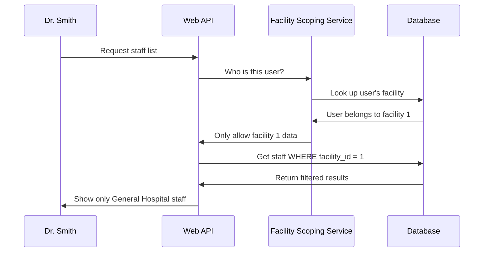

# Chapter 1: Multi-Tenant Facility Scoping

Welcome to the first chapter of our testing demo tutorial! We're going to start with one of the most important security concepts in healthcare software: Multi-Tenant Facility Scoping.

## The Problem: Keeping Hospital Data Separate

Imagine you're building software for multiple hospitals. General Hospital has 500 patients, while City Medical Center has 300 patients. Here's the critical question: **How do you make sure doctors at General Hospital can't accidentally (or intentionally) access patient records from City Medical Center?**

This is exactly like an apartment building - you want residents to only access their own apartment, not their neighbors'. In our case, each "apartment" is a healthcare facility, and we need a digital "security guard" to check every request.

Let's say Dr. Smith works at General Hospital (Facility ID: 1) and tries to view a patient list. Our system needs to automatically ensure she only sees patients from her facility, never from City Medical Center (Facility ID: 2).

## Key Concepts: The Building Blocks

### 1. Facility Identity
Every healthcare facility gets a unique number (ID) - think of it as an apartment number:

```java
// Each facility has a unique identifier
private Long facilityId;  // Example: 1 for General Hospital, 2 for City Medical
```

This simple number becomes the "key" that unlocks only the right data for each facility.

### 2. User-Facility Association
Every user account is tied to exactly one facility:

```java
// Every user belongs to one facility
@ManyToOne(fetch = FetchType.LAZY)
private Facility facility;  // Dr. Smith → General Hospital
```

This creates an unbreakable link - Dr. Smith is permanently associated with General Hospital and can't access data from other facilities.

### 3. Data Scoping
Every piece of data (patients, staff, schedules) includes the facility ID:

```java
// All data includes which facility it belongs to
@Column(name = "facility_id", nullable = false)
private Long facilityId;  // This patient belongs to facility 1
```

This stamps every record with its "apartment number" so we always know which facility owns what data.

## How It Solves Our Use Case

Let's walk through what happens when Dr. Smith tries to view the staff list:

### Step 1: User Makes Request
```java
// Dr. Smith clicks "View Staff" in the web interface
// Request: GET /api/staff
```

The system receives a request to show staff members, but it doesn't know which facility yet.

### Step 2: Check User's Facility
```java
// System checks: Which facility does Dr. Smith belong to?
Long userFacilityId = getCurrentUserFacilityId();  // Returns: 1 (General Hospital)
```

The security service looks up Dr. Smith's account and finds she belongs to facility 1.

### Step 3: Filter Data Automatically
```java
// Only return staff from Dr. Smith's facility
SELECT * FROM staff_member WHERE facility_id = 1;
```

The database query automatically includes a filter - only staff from facility 1 (General Hospital) are returned. Staff from facility 2 (City Medical Center) are completely invisible.

### Expected Output:
- ✅ Dr. Smith sees: "John Doe (Nurse), Jane Wilson (Technician)" - both from General Hospital
- ❌ Dr. Smith never sees: "Mike Johnson (Doctor)" - who works at City Medical Center

## Under the Hood: How the Security Guard Works

Let's see what happens step-by-step when our "security guard" checks a request:



### The Security Check Process

Here's the core security validation that happens on every request:

```java
public void validateFacilityAccess(Long requestedFacilityId) {
    Long userFacilityId = getCurrentUserFacilityId();  // Get user's facility
    
    if (!userFacilityId.equals(requestedFacilityId)) {
        throw new ForbiddenAccessException("Access denied");  // Block the request
    }
}
```

This simple check compares two numbers: the facility the user belongs to vs. the facility they're trying to access. If they don't match, the request is immediately blocked.

### Getting the User's Facility

The system determines which facility a user belongs to by checking their account:

```java
public Long getCurrentUserFacilityId() {
    // Get the logged-in user
    Authentication auth = SecurityContextHolder.getContext().getAuthentication();
    Long userId = (Long) auth.getPrincipal();
    
    // Look up their facility
    UserAccount user = userAccountRepository.findById(userId);
    return user.getFacility().getFacilityId();  // Return facility ID
}
```

This method is the "single source of truth" - it's used everywhere in the system to determine which facility the current user belongs to.

### Automatic Data Filtering

Every database query automatically includes the facility filter:

```java
// Instead of: SELECT * FROM staff_member
// We always do: SELECT * FROM staff_member WHERE facility_id = ?
@Query("SELECT s FROM StaffMember s WHERE s.facilityId = :facilityId")
List<StaffMember> findByFacilityId(@Param("facilityId") Long facilityId);
```

This ensures that even if a developer forgets to add security checks, the database queries themselves are already restricted to the user's facility.

## Real-World Example: The StaffMember Entity

Let's look at how this works in practice with our staff management:

```java
@Entity
@Table(name = "staff_member")
public class StaffMember {
    @Id
    private Long id;
    
    private String name;
    private String role;
    
    // The magic field that enforces facility scoping
    @Column(name = "facility_id", nullable = false)
    private Long facilityId;  // This is our "apartment number"
}
```

Every staff member record includes `facilityId`. When Dr. Smith (facility 1) requests staff data, the system automatically filters to only show staff where `facilityId = 1`. Staff from facility 2 are completely invisible - as if they don't exist.

## Why This Matters

This facility scoping system prevents serious problems:

- **Data Breaches**: Doctors can't accidentally see patients from other hospitals
- **Privacy Violations**: Patient information stays within the correct facility
- **Compliance**: Meets healthcare regulations like HIPAA
- **Business Logic**: Ensures staff scheduling only uses staff from the correct location

Think of it as an automatic privacy shield that works 24/7, checking every single request to make sure data stays in the right "apartment."

## What We've Learned

In this chapter, we've seen how Multi-Tenant Facility Scoping acts like a security guard for healthcare data:

1. **Every facility gets a unique ID** - like apartment numbers
2. **Every user belongs to one facility** - creating permanent associations  
3. **Every data record includes facility ID** - stamping ownership
4. **Every request is automatically filtered** - showing only relevant data

This creates an invisible but powerful barrier that keeps each facility's data completely separate, just like how apartment building residents can only access their own units.

In our next chapter, [Authentication & Session Management](02_authentication___session_management_.md), we'll explore how users prove who they are and how the system remembers them across requests - the foundation that makes facility scoping possible.

