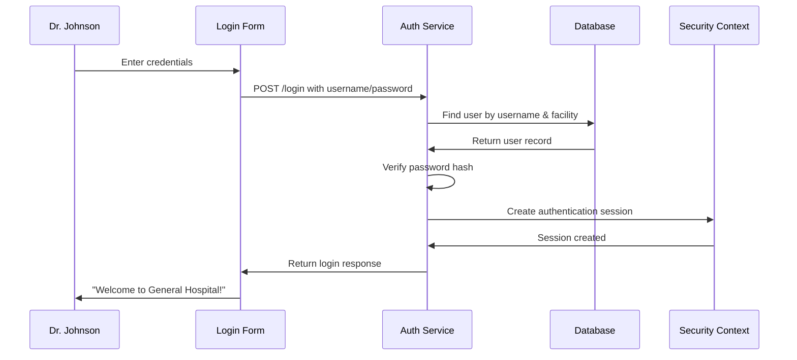

# Chapter 2: Authentication & Session Management

Welcome back! In [Chapter 1: Multi-Tenant Facility Scoping](01_multi_tenant_facility_scoping_.md), we learned how to keep each hospital's data completely separate - like apartments in a building. But there's one crucial question we didn't answer: **How does the system know who you are in the first place?**

## The Problem: Proving Your Identity

Imagine you're a doctor arriving at the hospital. Before you can access any patient records, you need to prove two things:
1. **Who you are** (authentication) - like showing your ID badge
2. **That you should stay logged in** (session management) - like getting a visitor wristband that works all day

Let's say Dr. Sarah Johnson arrives at General Hospital. She needs to:
- Enter her username (`sarah.johnson`) and password (`SecurePass123`)
- Prove she belongs to General Hospital (facility ID 1)
- Stay logged in while she works, without re-entering her password every 5 minutes

This is exactly like a club bouncer checking IDs and giving out wristbands - once you're verified, you can move around freely until you leave.

## Key Concepts: The Identity System

### 1. Login Credentials
Every user has a unique combination that proves their identity:

```java
// What the user provides to log in
String username = "sarah.johnson";
String password = "SecurePass123";
Long facilityId = 1;  // General Hospital
```

These three pieces work together - the username and password prove identity, while the facility ID determines which hospital's data they can access.

### 2. Password Hashing
We never store actual passwords - instead, we store scrambled versions:

```java
// Instead of storing: "SecurePass123"
// We store something like: "$2a$10$N9qo8uLOickgx2ZMRZoMye..."
String hashedPassword = passwordEncoder.encode("SecurePass123");
```

This is like having a safe that can only verify your combination is correct, but can't tell anyone what the combination actually is.

### 3. Authentication Session
Once verified, the system creates an invisible "session" that remembers you:

```java
// System creates a session token
Authentication session = new UsernamePasswordAuthenticationToken(
    userId,    // Who you are
    null,      // No password stored
    roles      // What you can do
);
```

This session is like a temporary ID card that proves you've already been verified - you don't need to show your password again.

## How It Solves Our Use Case

Let's follow Dr. Johnson through the complete login process:

### Step 1: User Submits Login Form
```java
// Dr. Johnson enters her credentials
POST /api/v1/auth/login
{
  "username": "sarah.johnson",
  "password": "SecurePass123",
  "facilityId": 1
}
```

The frontend sends these credentials securely to our authentication service.

### Step 2: System Verifies Identity
```java
// Look up user in database
UserAccount user = findByUsernameAndFacilityId("sarah.johnson", 1);

// Check if password matches
if (passwordEncoder.matches("SecurePass123", user.getPasswordHash())) {
    // Success! Create session
}
```

The system finds Dr. Johnson's account and verifies her password matches what we have stored.

### Step 3: Create Session and Respond
```java
// Create authentication session
SecurityContextHolder.getContext().setAuthentication(session);

// Return user information
return LoginResponse.builder()
    .userId(123)
    .username("sarah.johnson")
    .role("DOCTOR")
    .facilityId(1)
    .facilityName("General Hospital")
    .build();
```

**Expected Output:**
- ✅ Dr. Johnson sees: "Login successful - Welcome to General Hospital"  
- ✅ System remembers: Dr. Johnson (ID: 123) is logged in at facility 1
- ✅ Future requests automatically know: This is Dr. Johnson from General Hospital

## Under the Hood: The Authentication Flow

Let's see what happens step-by-step when Dr. Johnson logs in:



### The Login Verification Process

Here's what happens when the system checks Dr. Johnson's credentials:

```java
public LoginResponse login(String username, String password, Long facilityId) {
    // Step 1: Find the user account
    UserAccount user = userAccountRepository.findByUsernameAndFacilityId(username, facilityId);
    
    // Step 2: Verify password
    if (!passwordEncoder.matches(password, user.getPasswordHash())) {
        throw new InvalidCredentialsException("Wrong password");
    }
    
    // Step 3: Create session
    Authentication auth = new UsernamePasswordAuthenticationToken(user.getUserAccountId(), null, roles);
    SecurityContextHolder.getContext().setAuthentication(auth);
}
```

This process is like a three-step security check: find the person's record, verify their password, then create their temporary access pass.

### Session Management

Once logged in, the system automatically remembers Dr. Johnson on every request:

```java
public UserProfile getCurrentUser() {
    // Get the current session
    Authentication auth = SecurityContextHolder.getContext().getAuthentication();
    
    // Extract user ID from session
    Long userId = (Long) auth.getPrincipal();
    
    // Look up current user details
    return userAccountRepository.findById(userId);
}
```

This is like having a security guard who recognizes your wristband and automatically knows who you are without asking for ID again.

### Password Security

We never store actual passwords - here's how the security works:

```java
// When creating account: hash the password
String plainPassword = "SecurePass123";
String hashedPassword = passwordEncoder.encode(plainPassword);
// Result: "$2a$10$N9qo8uLOickgx2ZMRZoMye..."

// When logging in: compare hashes
boolean isValid = passwordEncoder.matches("SecurePass123", hashedPassword);
```

Even if someone steals our database, they can't see actual passwords - only scrambled versions that can't be unscrambled.

## Real-World Example: The Login Controller

Let's see how this works in practice with our authentication endpoint:

```java
@PostMapping("/login")
public ResponseEntity<LoginResponse> login(@RequestBody LoginRequest request) {
    // Log the login attempt (security monitoring)
    securityLogger.info("Login attempt for user: {}", request.getUsername());
    
    try {
        // Verify credentials and create session
        LoginResponse response = authService.login(
            request.getUsername(),
            request.getPassword(),
            request.getFacilityId()
        );
        
        // Log successful login
        securityLogger.info("Login successful for user: {}", response.getUsername());
        return ResponseEntity.ok(response);
        
    } catch (InvalidCredentialsException ex) {
        // Log failed attempt (for security monitoring)
        securityLogger.warn("Login failed for user: {}", request.getUsername());
        throw ex;
    }
}
```

This controller acts like a receptionist - it takes login requests, processes them through our security system, and responds with either success or failure.

### Frontend Session Handling

The React frontend works with our authentication system seamlessly:

```typescript
// Custom hook that manages login state
const { user, login, logout } = useAuth();

// Login function
const handleLogin = async (username: string, password: string) => {
    const response = await authApi.login({ username, password, facilityId: 1 });
    setUser(response);  // Store user info in React state
};

// Check if user is logged in
if (user) {
    return <Dashboard user={user} />;
} else {
    return <LoginForm onLogin={handleLogin} />;
}
```

The frontend automatically shows different screens based on whether someone is logged in - like automatic doors that open when they recognize your badge.

## Session Validation

Every time Dr. Johnson makes a request, the system checks her session:

```java
public SessionResponse getCurrentSession() {
    // Get current authentication
    Authentication auth = SecurityContextHolder.getContext().getAuthentication();
    
    if (auth == null || !auth.isAuthenticated()) {
        throw new InvalidCredentialsException("Not logged in");
    }
    
    // Return current user info
    Long userId = (Long) auth.getPrincipal();
    UserAccount user = userAccountRepository.findById(userId);
    
    return SessionResponse.builder()
        .userId(user.getId())
        .username(user.getUsername())
        .role(user.getRole())
        .facilityId(user.getFacility().getId())
        .build();
}
```

This is like having a security checkpoint that automatically validates your wristband on every floor of the building.

## Why This Matters

This authentication and session system prevents serious security issues:

- **Unauthorized Access**: Only people with valid accounts can log in
- **Password Protection**: Actual passwords are never stored or transmitted
- **Session Security**: Users stay logged in safely without re-entering passwords
- **Audit Trail**: All login attempts are logged for security monitoring
- **Facility Isolation**: Users can only access their designated facility's data

Think of it as a comprehensive security system that handles the "front door" of our application - making sure only the right people get in, and tracking who's inside.

## What We've Learned

In this chapter, we've explored how Authentication & Session Management works like a sophisticated security checkpoint:

1. **Users prove identity** with username/password combinations
2. **Passwords are securely hashed** - never stored in plain text
3. **Sessions remember users** - no need to log in repeatedly
4. **Every request is validated** - ensuring continued security
5. **All attempts are logged** - for security monitoring and compliance

This creates a secure but user-friendly system where people can prove who they are once and then work normally throughout their session, just like getting a visitor badge at a real hospital.

In our next chapter, [Role-Based Authorization](03_role_based_authorization_.md), we'll explore how the system determines what each authenticated user is allowed to do - because knowing who someone is is only half the battle; we also need to know what they're permitted to access.

