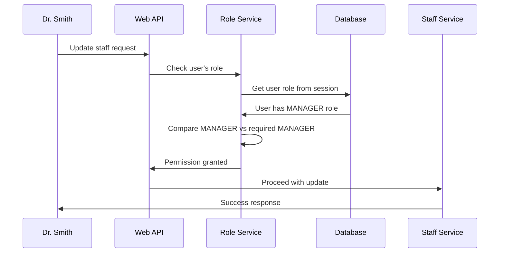

# Chapter 3: Role-Based Authorization

Welcome back! In [Chapter 2: Authentication & Session Management](02_authentication___session_management_.md), we learned how users prove who they are and stay logged in. But here's a critical question we haven't answered yet: **Just because you can log into the hospital system doesn't mean you should be able to do everything, right?**

## The Problem: Different People, Different Permissions

Imagine you're in a hospital where everyone has a key card to get through the front door. But once inside, should everyone have the same access? Should a receptionist be able to access the surgery schedule? Should a nurse be able to hire and fire doctors?

Let's say we have three people at General Hospital:
- **Dr. Smith** (Manager) - should be able to hire staff, update schedules, and view all information
- **Nurse Johnson** (Staff) - should be able to view schedules and patient assignments, but not hire people
- **Intern Wilson** (Staff) - should only be able to view basic information

This is exactly like how different employees have different levels of key card access in a real building - some can enter executive floors, others can only access common areas.

## Key Concepts: The Permission System

### 1. User Roles
Every user account has a specific role that defines their permission level:

```java
// Each user has exactly one role
String userRole = "MANAGER";  // or "STAFF" or "SUPERVISOR"
```

Think of this like job titles - your role determines what you're allowed to do, just like how a manager has different responsibilities than an intern.

### 2. Role Requirements
Every sensitive operation specifies which role is required to perform it:

```java
// Only managers can update staff information
@RequiredRole("MANAGER")
public void updateStaffMember() {
    // This method can only be called by managers
}
```

This is like putting "Managers Only" signs on certain doors - the system automatically checks if you have the right role before letting you in.

### 3. Permission Validation
Before any operation, the system checks if your role matches what's required:

```java
// System checks: Does this user have the right role?
if (!userRole.equals("MANAGER")) {
    throw new ForbiddenAccessException("Access denied");
}
```

This acts like a security guard who checks your badge before letting you into restricted areas.

## How It Solves Our Use Case

Let's follow what happens when Dr. Smith (Manager) and Nurse Johnson (Staff) both try to update a staff member's information:

### Scenario 1: Manager Updates Staff
```java
// Dr. Smith (role: MANAGER) tries to update staff
PUT /api/staff/123
{
  "firstName": "Updated Name",
  "role": "Senior Nurse"
}
```

**System Response:**
- ✅ Check role: Dr. Smith is a MANAGER
- ✅ Permission granted: Managers can update staff
- ✅ **Result:** Staff information updated successfully

### Scenario 2: Staff Tries to Update Staff
```java
// Nurse Johnson (role: STAFF) tries the same operation
PUT /api/staff/123
{
  "firstName": "Updated Name",
  "role": "Senior Nurse"
}
```

**System Response:**
- ❌ Check role: Nurse Johnson is STAFF
- ❌ Permission denied: Only MANAGERS can update staff
- ❌ **Result:** "Access denied - Manager role required"

### Scenario 3: Anyone Views Staff List
```java
// Both users try to view staff list
GET /api/staff
```

**System Response for both:**
- ✅ Check role: Both MANAGER and STAFF can view
- ✅ Permission granted: Viewing is allowed for both roles
- ✅ **Result:** Staff list displayed

## Under the Hood: The Permission Check Process

Let's see what happens step-by-step when someone tries to perform a restricted action:



### The Role Validation Process

Here's the core security check that happens before any restricted operation:

```java
public void validateRole(String requiredRole, String operation) {
    // Get current user's role from their session
    String userRole = getCurrentUserRole();
    
    // Compare user's role with what's required
    if (!userRole.equals(requiredRole)) {
        throw new ForbiddenAccessException("Access denied");
    }
}
```

This simple comparison is like checking if someone's job title matches what's needed for a specific task.

### Getting the User's Role

The system determines what role a user has by checking their authenticated session:

```java
public String getCurrentUserRole() {
    // Get the logged-in user's session
    Authentication auth = SecurityContextHolder.getContext().getAuthentication();
    
    // Extract their role from the session
    return auth.getAuthorities().stream()
        .map(authority -> authority.getAuthority())
        .filter(auth -> auth.startsWith("ROLE_"))
        .map(role -> role.substring(5))  // Remove "ROLE_" prefix
        .findFirst()
        .orElse(null);
}
```

This method looks up the user's role that was stored when they logged in, like checking the job title on their employee badge.

### Enforcing Manager-Only Operations

Critical operations like updating staff require manager approval:

```java
public void requireManagerRole() {
    // Get current user's role
    String userRole = getCurrentUserRole();
    
    // Only allow if user is a manager
    if (!"MANAGER".equals(userRole)) {
        throw new ForbiddenAccessException("Manager role required");
    }
}
```

This is like having a policy that only supervisors can approve certain decisions - the system automatically enforces this rule.

## Real-World Example: The Staff Update Operation

Let's see how role-based authorization protects our staff management:

```java
@Transactional
public StaffResponse updateStaff(Long staffId, StaffUpdateRequest request) {
    // Step 1: Check if user has manager role
    roleAuthorizationService.requireManagerRole();
    
    // Step 2: Find the staff member
    Staff staff = staffRepository.findById(staffId);
    
    // Step 3: Update the information (only if role check passed)
    staff.setFirstName(request.getFirstName());
    return staffRepository.save(staff);
}
```

The role check happens **first** - if the user isn't a manager, they never even get to see or modify the staff data.

### Different Permissions for Different Operations

Our system has different permission levels for different actions:

```java
// Viewing staff - both managers and regular staff can do this
public List<StaffResponse> listStaff() {
    // No role check needed - anyone authenticated can view
    return staffRepository.findAll();
}

// Updating staff - only managers can do this
public StaffResponse updateStaff(Long staffId, StaffUpdateRequest request) {
    roleAuthorizationService.requireManagerRole();  // Manager required
    // ... update logic
}

// Deactivating staff - only managers can do this
public void deactivateStaff(Long staffId) {
    roleAuthorizationService.requireManagerRole();  // Manager required
    // ... deactivation logic
}
```

This creates a tiered system where everyone can read information, but only managers can make changes.

### Frontend Role Checking

The React frontend also respects user roles to show/hide features:

```typescript
// Custom hook that provides user role information
const { user, hasRole } = useAuth();

// Conditionally show manager-only buttons
return (
  <div>
    <StaffList />  {/* Everyone can see the list */}
    
    {hasRole('MANAGER') && (
      <button onClick={updateStaff}>Update Staff</button>  /* Only managers see this */
    )}
    
    {hasRole('MANAGER') && (
      <button onClick={deactivateStaff}>Deactivate Staff</button>  /* Only managers see this */
    )}
  </div>
);
```

The frontend automatically hides buttons and features that the user doesn't have permission to use - like having different interfaces for different job levels.

## Security Configuration

Our Spring Security configuration enforces these rules at the API level:

```java
@Configuration
public class SecurityConfig {
    
    @Bean
    public SecurityFilterChain securityFilterChain(HttpSecurity http) {
        return http
            .authorizeHttpRequests(auth -> auth
                // Anyone can view staff
                .requestMatchers(HttpMethod.GET, "/api/staff/**").hasAnyRole("MANAGER", "STAFF")
                
                // Only managers can update staff  
                .requestMatchers(HttpMethod.PUT, "/api/staff/**").hasRole("MANAGER")
                
                // Only managers can deactivate staff
                .requestMatchers(HttpMethod.POST, "/api/staff/*/deactivate").hasRole("MANAGER")
            )
            .build();
    }
}
```

This configuration acts like a security policy document - it defines exactly which roles can access which operations, and Spring Security enforces these rules automatically.

## Role Hierarchy

Our system currently recognizes three main roles with different permission levels:

```java
// Role hierarchy (from most to least permissions)
MANAGER    // Can do everything: view, update, deactivate staff
STAFF      // Can view information but not modify it
SUPERVISOR // Role capabilities not yet defined (access denied for now)
```

This hierarchy is like a corporate structure - higher roles inherit the permissions of lower roles, plus additional privileges.

### Handling Undefined Roles

If someone has a role that we haven't fully implemented yet:

```java
public void validateRole(String requiredRole, String operation) {
    String userRole = getCurrentUserRole();
    
    // Special handling for undefined roles
    if ("SUPERVISOR".equals(userRole)) {
        throw new ForbiddenAccessException("SUPERVISOR capabilities not yet defined");
    }
    
    // Normal role validation
    if (!userRole.equals(requiredRole)) {
        throw new ForbiddenAccessException("Access denied");
    }
}
```

This ensures that users with incomplete role definitions can't accidentally access things they shouldn't - like having a "temporary access card" that's clearly marked as limited.

## Why This Matters

Role-based authorization prevents serious security and operational issues:

- **Data Protection**: Sensitive operations are restricted to authorized personnel
- **Operational Safety**: Only qualified users can make critical changes
- **Compliance**: Meets healthcare regulations requiring access controls
- **Audit Requirements**: Clear separation of who can do what for audit trails
- **User Experience**: People only see features relevant to their job role

Think of it as a comprehensive permission system that ensures everyone can do their job effectively while preventing unauthorized actions - just like how a real hospital has different access levels for different staff members.

## What We've Learned

In this chapter, we've explored how Role-Based Authorization works like a sophisticated permission system:

1. **Every user has a role** - defining their permission level
2. **Operations require specific roles** - like "managers only" policies
3. **System validates permissions** - before allowing any action
4. **Frontend respects roles** - showing only relevant features
5. **Security is enforced at multiple levels** - API, service, and UI layers

This creates a secure but flexible system where users can perform their job functions while being automatically prevented from actions outside their authority level, just like having different key card access levels in a real office building.

In our next chapter, [Staff Management Operations](04_staff_management_operations_.md), we'll explore how these authorization controls work in practice when managers perform specific tasks like updating staff information, deactivating accounts, and managing facility assignments.

