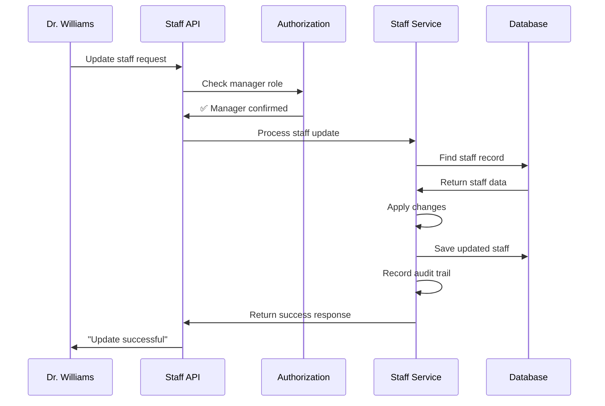

# Chapter 4: Staff Management Operations

Welcome back! In [Chapter 3: Role-Based Authorization](03_role_based_authorization_.md), we learned how the system controls what different users can do based on their roles - like having different key card access levels. Now we need to explore the actual work that managers do: **How does the system handle the day-to-day business of managing hospital staff?**

## The Problem: Running the HR Department

Imagine you're the head of HR at General Hospital. Every day, you need to handle real employee situations:

- **New hire:** Dr. Martinez just got hired - you need to update her role from "Resident" to "Senior Doctor"
- **Department transfer:** Nurse Johnson is moving from Emergency to Pediatrics - you need to change his assignment
- **Staff leaving:** Technician Smith's last day is Friday - you need to deactivate her account
- **Monthly reports:** The board wants to see all current active staff members

These are the core "business operations" that keep a healthcare facility running smoothly. Just like how a real HR department has filing systems and procedures, our software needs organized ways to handle these common tasks.

Let's say Dr. Williams (a manager) needs to update Nurse Johnson's information after he transferred departments. The system should:
- Verify Dr. Williams has manager permissions
- Update only Nurse Johnson's information (not accidentally change someone else)
- Track what changed for compliance records
- Ensure the change only affects staff from Dr. Williams' facility

## Key Concepts: The Digital HR Office

### 1. Business Operations
Each HR task becomes a specific operation the system can perform:

```java
// Core HR operations
updateStaff()      // Change employee information
deactivateStaff()  // Handle employee departures
getStaffById()     // Look up specific employee
listActiveStaff()  // Generate current employee roster
```

These are like having different forms and procedures for different HR tasks - each one handles a specific type of work.

### 2. Data Validation
Every change goes through safety checks before being applied:

```java
// Safety checks before making changes
validateManagerPermissions();     // Can this person make changes?
validateFacilityAccess();        // Are they changing the right facility's data?
validateDataIntegrity();         // Is the new information valid?
```

This is like having a checklist that HR must complete before processing any employee change - ensuring nothing gets missed.

### 3. Change Tracking
The system automatically records what changed, when, and who did it:

```java
// Automatic record keeping
Map<String, Object> changes = new HashMap<>();
changes.put("role", Map.of("old", "Nurse", "new", "Senior Nurse"));
auditEmitter.emitStaffUpdateEvent(staffId, managerId, changes);
```

This creates a permanent paper trail, just like how real HR departments keep detailed records of all employee changes for legal and compliance purposes.

## How It Solves Our Use Case

Let's follow Dr. Williams through updating Nurse Johnson's department transfer:

### Step 1: Manager Initiates Update
```java
// Dr. Williams submits update through web interface
PUT /api/staff/456
{
  "role": "Pediatric Nurse",
  "email": "johnson.pediatrics@hospital.com"
}
```

The manager fills out a digital form with the new information - just like filling out a paper form in a traditional HR office.

### Step 2: System Validates Authority
```java
// System checks: Is Dr. Williams allowed to make changes?
roleAuthorizationService.requireManagerRole();  // ✅ Dr. Williams is a manager
facilityScopingService.validateFacilityAccess(facilityId);  // ✅ Same facility
```

**Security Check Results:**
- ✅ User role: Dr. Williams is a MANAGER
- ✅ Facility access: Updating staff from his own facility (General Hospital)
- ✅ **Proceed with update**

### Step 3: Apply Changes and Track
```java
// Update the information
staff.setRole("Pediatric Nurse");
staff.setEmail("johnson.pediatrics@hospital.com");

// Record what changed
auditEmitter.emitStaffUpdateEvent(456, managerId, changeMap);
```

**Expected Results:**
- ✅ Nurse Johnson's role updated to "Pediatric Nurse"
- ✅ Email changed to reflect new department
- ✅ Change automatically recorded in audit log
- ✅ Dr. Williams sees: "Staff information updated successfully"

## Under the Hood: The HR Processing System

Let's see what happens step-by-step when a manager performs a staff operation:



### The Complete Update Process

Here's what happens when the system processes a staff update:

```java
public StaffResponse updateStaff(Long staffId, StaffUpdateRequest request, Long requestingUserId) {
    // Step 1: Check permissions
    roleAuthorizationService.requireManagerRole();
    
    // Step 2: Find the employee record
    Staff staff = staffRepository.findById(staffId);
    
    // Step 3: Apply the changes
    staff.setRole(request.getRole());
    return staffRepository.save(staff);
}
```

This three-step process ensures every update follows the same safe procedure: check authority, find record, make changes.

### Security and Validation

Every operation includes comprehensive safety checks:

```java
// Security validation before any changes
try {
    roleAuthorizationService.requireManagerRole();        // Must be manager
    facilityScopingService.validateFacilityAccess(facilityId);  // Must own facility
} catch (ForbiddenAccessException e) {
    throw e;  // Block unauthorized access
}
```

These checks act like security guards who verify ID badges before allowing anyone into restricted areas.

### Automatic Change Detection

The system intelligently tracks only actual changes:

```java
// Only record what actually changed
Map<String, Object> changeMap = new HashMap<>();

if (!request.getRole().equals(staff.getRole())) {
    changeMap.put("role", Map.of("old", staff.getRole(), "new", request.getRole()));
    staff.setRole(request.getRole());
}
```

This is like having smart forms that only document the fields that actually got modified, keeping audit records clean and meaningful.

## Real-World Example: Staff Deactivation

Let's see how the system handles a common HR scenario - an employee's last day:

```java
public void deactivateStaff(Long staffId, Long requestingUserId) {
    // Step 1: Security check
    roleAuthorizationService.requireManagerRole();
    
    // Step 2: Find employee
    Staff staff = staffRepository.findById(staffId);
    
    // Step 3: Handle already-deactivated gracefully
    if (!staff.isActive()) {
        return;  // Already done - no error needed
    }
    
    // Step 4: Deactivate and record
    staff.deactivate(LocalDate.now());
    auditEmitter.emitStaffDeactivateEvent(staffId, requestingUserId, "Manager-initiated");
}
```

This deactivation process is designed to be "idempotent" - running it multiple times has the same result, preventing accidental double-processing.

### Employee Status Management

The system tracks employee status clearly:

```java
// Simple status checking
public boolean isActive() {
    return "ACTIVE".equals(employmentStatus);
}

// Clean deactivation process
public void deactivate(LocalDate endDate) {
    this.employmentStatus = "INACTIVE";
    this.endDate = endDate;
}
```

This creates clear "active" vs. "inactive" states, just like how employee badges are activated and deactivated in real workplaces.

### Email Uniqueness Validation

The system prevents duplicate email addresses:

```java
// Check if email already exists for someone else
if (staffRepository.existsByEmailAndIdNot(request.getEmail(), staffId)) {
    throw new IllegalArgumentException("Email already exists");
}
```

This is like checking that no two employees have the same email address - preventing confusion and delivery problems.

## Staff Listing Operations

Managers can generate reports of current staff:

```java
public List<StaffResponse> listActiveStaff(Long facilityId, Long requestingUserId) {
    // Security: Only show staff from user's facility
    facilityScopingService.validateFacilityAccess(facilityId);
    
    // Get active staff only
    List<Staff> activeStaff = staffRepository.findByFacilityIdAndEmploymentStatus(facilityId, "ACTIVE");
    
    // Convert to response format
    return activeStaff.stream()
        .map(StaffResponse::fromEntity)
        .collect(Collectors.toList());
}
```

This creates filtered employee rosters showing only current, active employees from the manager's facility - like generating a current employee directory.

### Data Transfer and Response Formatting

Raw database records get converted into clean, formatted responses:

```java
// Convert internal data to external format
public static StaffResponse fromEntity(Staff staff) {
    return StaffResponse.builder()
        .id(staff.getId())
        .firstName(staff.getFirstName())
        .lastName(staff.getLastName())
        .email(staff.getEmail())
        .role(staff.getRole())
        .employmentStatus(staff.getEmploymentStatus())
        .facilityId(staff.getFacility().getFacilityId())
        .build();
}
```

This transformation ensures external users see clean, formatted data while protecting internal database structure - like having different forms for internal records vs. public-facing reports.

## Error Handling and User Experience

The system provides clear feedback for different situations:

```java
// Different error types for different problems
if (staff == null) {
    throw new ResourceNotFoundException("Staff", staffId);  // Employee not found
}

if (!hasManagerRole()) {
    throw new ForbiddenAccessException("Manager role required");  // Permission denied
}

if (emailExists()) {
    throw new IllegalArgumentException("Email already exists");  // Data validation
}
```

Each error type provides specific, helpful messages - like having different forms to explain different types of problems to users.

### Transaction Safety

All changes happen within database transactions:

```java
@Transactional
public StaffResponse updateStaff(Long staffId, StaffUpdateRequest request) {
    // All changes happen together or not at all
    // If anything fails, everything gets rolled back
}
```

This ensures that partial updates can't happen - either the entire change succeeds, or nothing changes at all, preventing data corruption.

## Why This Matters

Staff management operations provide essential business capabilities while maintaining security:

- **Business Continuity**: HR operations continue smoothly with digital processes
- **Data Integrity**: All changes are validated and tracked automatically  
- **Regulatory Compliance**: Comprehensive audit trails meet healthcare requirements
- **User Safety**: Multiple security layers prevent unauthorized access or changes
- **Operational Efficiency**: Managers can handle staff changes quickly and safely

Think of it as a complete digital HR department that handles all the paperwork, security checks, and record-keeping automatically while letting managers focus on their actual work.

## What We've Learned

In this chapter, we've explored how Staff Management Operations work like a sophisticated HR system:

1. **Core business operations** - updateStaff, deactivateStaff, listStaff handle daily HR work
2. **Layered security validation** - role and facility checks protect every operation
3. **Automatic change tracking** - comprehensive audit trails for compliance
4. **Data integrity protection** - validation prevents conflicts and corruption
5. **User-friendly error handling** - clear feedback for different problem types

This creates a robust system where managers can perform their HR responsibilities efficiently while the system automatically handles all the security, validation, and compliance requirements - just like having a highly trained HR assistant that never makes mistakes.

In our next chapter, [Data Transfer Objects (DTOs)](05_data_transfer_objects__dtos__.md), we'll explore how the system packages and formats data when sending it between different parts of the application - the digital equivalent of having different forms for different purposes.

