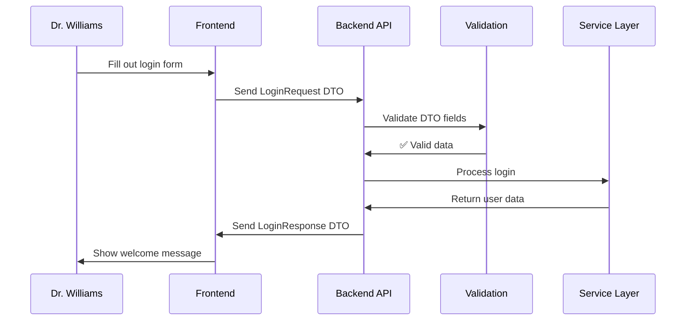

# Chapter 5: Data Transfer Objects (DTOs)

Welcome back! In [Chapter 4: Staff Management Operations](04_staff_management_operations_.md), we learned how managers perform HR tasks like updating employee information and deactivating accounts. But there's something important we glossed over: **How does the system organize and format all the different types of information being sent back and forth?**

## The Problem: Different Forms for Different Purposes

Imagine you're working at a hospital's front desk. Throughout the day, you use different paper forms for different purposes:

- **Patient Registration Form** - asks for name, insurance, medical history
- **Visitor Badge Form** - only needs name, who they're visiting, and time
- **Emergency Contact Form** - requires name, phone number, relationship

Each form is designed for a specific purpose and only includes the information needed for that task. You wouldn't use a 20-page patient registration form just to give someone a visitor badge!

Let's say Dr. Williams wants to log into the system. The login process only needs three pieces of information:
- Username: "sarah.johnson"  
- Password: "SecurePass123"
- Facility ID: 1

But when Dr. Williams updates a staff member's information, she needs completely different data:
- Employee name, email, role, employment status

Our software needs the digital equivalent of having different forms for different purposes - that's exactly what Data Transfer Objects (DTOs) provide.

## Key Concepts: The Digital Forms System

### 1. Purpose-Built Data Containers
Each DTO is like a specialized form designed for one specific task:

```java
// Login form - only what's needed to sign in
class LoginRequest {
    String username;
    String password; 
    Long facilityId;
}
```

This is like having a simple "Sign In" sheet that only asks for the essentials - no unnecessary fields cluttering up the process.

### 2. Data Validation Rules
Each form includes built-in rules to catch mistakes:

```java
// Automatic validation - like having smart forms
@NotBlank(message = "Username is required")
private String username;

@Email(message = "Email must be valid")  
private String email;
```

This is like having forms that automatically highlight missing fields or invalid entries - preventing common errors before they cause problems.

### 3. Conversion Between Formats
DTOs can transform data between different representations:

```java
// Convert DTO to database entity
StaffMember entity = request.toEntity(facilityId);

// Convert database entity to response DTO  
StaffResponse response = StaffResponse.fromEntity(staff);
```

This is like having a translator who takes information from one type of form and properly fills out a different type of form - ensuring nothing gets lost in translation.

## How It Solves Our Use Case

Let's follow what happens when Dr. Williams logs in and then updates a staff member's information:

### Step 1: Login with LoginRequest DTO
```java
// Dr. Williams fills out the "login form"
LoginRequest loginData = {
    "username": "sarah.johnson",
    "password": "SecurePass123", 
    "facilityId": 1
}
```

The system receives exactly the three pieces of information needed for login - nothing more, nothing less.

### Step 2: System Responds with LoginResponse DTO
```java
// System sends back "welcome packet" 
LoginResponse welcome = {
    "userId": 123,
    "username": "sarah.johnson",
    "role": "MANAGER", 
    "facilityId": 1,
    "facilityName": "General Hospital"
}
```

**Expected Result:**
- ✅ Dr. Williams sees: "Welcome to General Hospital!"
- ✅ System knows: User 123 is a manager at facility 1

### Step 3: Update Staff with StaffUpdateRequest DTO  
```java
// Dr. Williams fills out "employee update form"
StaffUpdateRequest updateData = {
    "firstName": "John",
    "lastName": "Smith", 
    "email": "john.smith@hospital.com",
    "role": "Senior Nurse"
}
```

This is a completely different form with completely different fields - designed specifically for updating employee information.

### Step 4: System Responds with StaffResponse DTO
```java
// System confirms changes with "updated employee record"
StaffResponse confirmation = {
    "id": 456,
    "firstName": "John", 
    "lastName": "Smith",
    "email": "john.smith@hospital.com",
    "role": "Senior Nurse",
    "facilityName": "General Hospital"
}
```

**Expected Result:**
- ✅ Dr. Williams sees: "Employee information updated successfully"
- ✅ Updated information displayed in clean, formatted layout

## Under the Hood: The Form Processing System

Let's see what happens step-by-step when the system processes DTOs:



### The DTO Validation Process

Here's how the system automatically checks form data for errors:

```java
// Built-in validation happens automatically
@NotBlank(message = "Username is required")
private String username;

@Email(message = "Email must be valid") 
private String email;
```

When data arrives, the system checks every field against its rules - like having a checklist that verifies each form is filled out correctly.

### Converting Between DTOs and Entities

DTOs act as translators between external forms and internal database records:

```java
// Transform DTO data into database format
public StaffMember toEntity(Long facilityId) {
    StaffMember staff = new StaffMember();
    staff.setName(this.name);
    staff.setContact(this.contact);
    staff.setFacilityId(facilityId);  // Injected by system
    return staff;
}
```

This conversion ensures that external data gets properly formatted for internal storage - like having a clerk who takes information from paper forms and enters it correctly into computer systems.

### Protecting Sensitive Information

DTOs control exactly what information gets shared:

```java
// Password never included in responses
public class LoginResponse {
    private String username;  // ✅ Safe to share
    private String role;      // ✅ Safe to share
    // private String password;  ❌ Never included!
}
```

This is like having forms that automatically omit sensitive information when creating copies - ensuring passwords and other secrets never accidentally get displayed.

## Real-World Example: Staff Creation Process

Let's see how DTOs work in practice when creating a new employee:

```java
// Step 1: Frontend sends CreateStaffRequest DTO
CreateStaffRequest newEmployee = {
    "name": "Jane Doe",
    "contact": "jane.doe@hospital.com", 
    "role": "Registered Nurse",
    "employmentStatus": "ACTIVE"
}
```

This DTO contains exactly the information needed to create a new employee - no more, no less.

### DTO to Entity Conversion

The system transforms the DTO into a database record:

```java
// Convert DTO to database entity
public StaffMember toEntity(Long facilityId) {
    StaffMember staff = new StaffMember();
    staff.setFacilityId(facilityId);  // Automatically assigned
    staff.setName(this.name);
    staff.setContact(this.contact); 
    staff.setRole(this.role);
    return staff;
}
```

Notice how the facility ID gets automatically injected - the DTO doesn't need to worry about this security detail, it's handled by the system.

### Entity to Response DTO Conversion  

When sending data back to the frontend, entities get converted to response DTOs:

```java
// Convert database entity to response DTO
public static StaffResponse fromEntity(Staff staff) {
    StaffResponse response = new StaffResponse();
    response.setId(staff.getId());
    response.setFirstName(staff.getFirstName());
    response.setFacilityName(staff.getFacility().getName());
    return response;
}
```

This conversion creates a clean, formatted response that includes helpful information like the facility name (looked up from the database relationship).

## Validation and Error Prevention

DTOs include smart validation that catches common mistakes:

```java
// Automatic validation rules
@NotBlank(message = "Name is required")
private String name;

@Email(message = "Email must be valid")
private String email;

@Size(max = 100, message = "Name too long")
private String firstName;
```

These rules work like having a smart assistant who checks every form for common errors before processing - preventing bad data from ever entering the system.

### Handling Validation Errors

When validation fails, the system provides clear, helpful error messages:

```java
// If validation fails:
{
    "error": "Validation failed",
    "details": [
        "Email must be valid",
        "First name is required"
    ]
}
```

This gives users specific guidance on how to fix their forms - like having helpful error messages that explain exactly what needs to be corrected.

## Frontend DTO Integration

The React frontend uses TypeScript interfaces that mirror the backend DTOs:

```typescript
// Frontend version of LoginRequest
interface LoginRequest {
    username: string;
    password: string;  
    facilityId?: number;
}

// Frontend version of UserProfile
interface UserProfile {
    userId: number;
    username: string;
    role: string;
    facilityName: string;
}
```

These frontend types ensure that the web interface and backend API always use consistent data structures - like having matching forms on both sides of a transaction.

### Type Safety in Action

TypeScript prevents common mistakes at development time:

```typescript
// Compiler catches errors automatically
const loginData: LoginRequest = {
    username: "sarah.johnson",
    password: "SecurePass123",
    // facilityId: "1"  ❌ Compiler error: string not allowed
    facilityId: 1       ✅ Correct: number type
};
```

This is like having spell-check for code - the development tools catch errors before they can cause problems for users.

## Different DTOs for Different Purposes

Our system uses specialized DTOs for different operations:

```java
// Login - minimal information needed
LoginRequest: username, password, facilityId

// Staff creation - everything needed for new employee  
CreateStaffRequest: name, contact, role, employment status

// Staff update - fields that can be changed
StaffUpdateRequest: firstName, lastName, email, role

// Response - safe information to display
StaffResponse: id, name, role, facility name (no sensitive data)
```

Each DTO is like a purpose-built form - containing exactly the fields needed for its specific job, nothing more or less.

### DTO Design Principles

Good DTOs follow simple principles:

- **Single Purpose**: Each DTO handles one specific operation
- **Minimal Data**: Include only what's actually needed  
- **Clear Validation**: Built-in rules prevent common errors
- **Security Aware**: Never expose sensitive information
- **Conversion Ready**: Easy to transform to/from entities

This is like having a well-organized filing system where each type of form has a specific purpose and location.

## Why This Matters

DTOs provide essential benefits for application organization and security:

- **Data Organization**: Clean separation between different types of operations
- **Validation**: Automatic error checking prevents bad data from entering the system
- **Security**: Control exactly what information gets exposed to external clients
- **Maintainability**: Changes to internal data structures don't break external APIs
- **Type Safety**: Development tools can catch errors before deployment

Think of DTOs as a comprehensive forms management system that ensures data flows cleanly and safely between different parts of the application - just like how a well-run office uses different forms for different purposes.

## What We've Learned

In this chapter, we've explored how Data Transfer Objects work like a sophisticated forms system:

1. **Purpose-built containers** - each DTO designed for one specific operation
2. **Built-in validation** - automatic error checking prevents common mistakes  
3. **Data transformation** - clean conversion between external and internal formats
4. **Security protection** - careful control over what information gets exposed
5. **Type safety** - development tools catch errors before they reach users

This creates a robust system where data flows cleanly and safely between the frontend, backend, and database - with automatic validation and security protection built into every step, just like having a perfectly organized office with exactly the right forms for every situation.

In our next chapter, [Frontend State Management](06_frontend_state_management_.md), we'll explore how the React frontend organizes and manages all this DTO data to create a smooth, responsive user experience.

