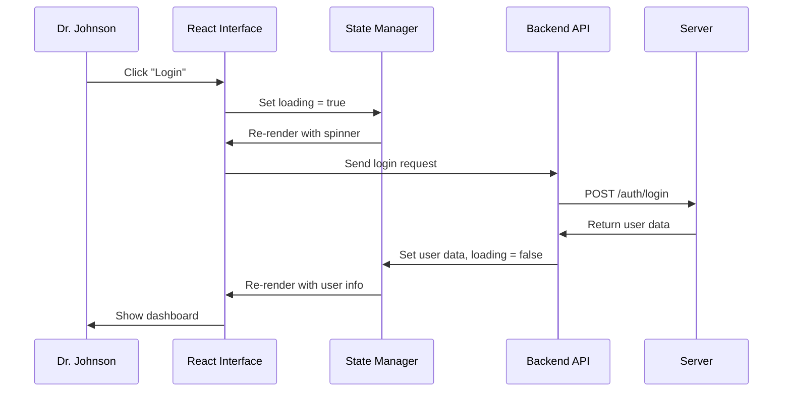

# Chapter 6: Frontend State Management

Welcome back! In [Chapter 5: Data Transfer Objects (DTOs)](05_data_transfer_objects__dtos__.md), we learned how the system organizes data into different forms for different purposes - like having specialized paperwork for login vs. employee updates. Now we need to explore something equally important: **How does the web interface keep track of all this information and respond to user actions?**

## The Problem: Managing What Users See and Do

Imagine you're sitting at the reception desk of General Hospital. Throughout your shift, you need to keep track of many things at once:

- **Who's currently logged in** - is it Dr. Smith or Nurse Johnson at this computer?
- **What they're allowed to see** - should the "Update Staff" button be visible?
- **Error messages** - if something goes wrong, show a helpful message
- **Loading states** - when waiting for the server, show "Please wait..."
- **Form data** - remember what the user typed while they fill out forms

Let's say Dr. Sarah Johnson sits down at a computer. The screen needs to:
1. **Remember her login** - show "Welcome, Dr. Johnson" instead of asking her to log in again
2. **Show appropriate features** - display manager buttons since she's a manager
3. **Handle her actions** - when she clicks "Update Staff," send the request and show progress
4. **Display results** - show success messages or error details based on what happens

This is exactly like having a smart dashboard in your car - it shows your current speed, fuel level, warning lights, and responds when you press different controls. Frontend state management is the "dashboard system" for our web application.

## Key Concepts: The Digital Dashboard System

### 1. Application State
The frontend keeps track of all the important information in one central place:

```javascript
// The "dashboard" showing current status
const appState = {
  user: { name: "Dr. Johnson", role: "MANAGER" },
  loading: false,
  error: null
}
```

This is like having a control panel that displays all the current information the user interface needs to know about.

### 2. State Updates
When things change, the state gets updated and the interface automatically refreshes:

```javascript
// When user logs in successfully
setUser({ name: "Dr. Johnson", role: "MANAGER" });
setError(null);  // Clear any previous errors
```

This is like how your car dashboard automatically updates the speed when you press the gas pedal - the interface reflects the current reality.

### 3. User Interaction Handling
The system responds to user actions by updating state and making API calls:

```javascript
// When user clicks "Login" button
const handleLogin = async (username, password) => {
  setLoading(true);           // Show "please wait"
  const response = await api.login(username, password);
  setUser(response.user);     // Remember who logged in
  setLoading(false);          // Hide "please wait"
};
```

This creates a bridge between user actions (clicking buttons) and backend operations (API calls) while keeping the interface updated throughout the process.

## How It Solves Our Use Case

Let's follow Dr. Johnson through logging in and updating a staff member's information:

### Step 1: Initial Page Load
```javascript
// When page first loads - nobody logged in yet
const initialState = {
  user: null,           // No user logged in
  loading: false,       // Not doing anything yet
  error: null          // No errors yet
}
```

**What User Sees:**
- ✅ Login form displayed
- ✅ No protected features visible
- ✅ Clean slate - no error messages

### Step 2: User Submits Login
```javascript
// Dr. Johnson fills out login form and clicks "Login"
const loginData = {
  username: "sarah.johnson",
  password: "SecurePass123",
  facilityId: 1
}

// State changes to show progress
setState({
  user: null,
  loading: true,        // Show "Logging in..." 
  error: null
});
```

**What User Sees:**
- ✅ Login button changes to "Logging in..."
- ✅ Form fields become disabled
- ✅ Clear visual feedback that something is happening

### Step 3: Login Success Response
```javascript
// Server responds with user information
const loginResponse = {
  userId: 123,
  username: "sarah.johnson", 
  role: "MANAGER",
  facilityName: "General Hospital"
}

// State updates to reflect successful login
setState({
  user: loginResponse,   // Remember user details
  loading: false,        // Hide loading spinner
  error: null           // No errors
});
```

**What User Sees:**
- ✅ Redirected to main dashboard
- ✅ "Welcome, Dr. Johnson" message displayed
- ✅ Manager-only buttons now visible
- ✅ Loading spinner disappears

## Under the Hood: The State Management Flow

Let's see what happens step-by-step when Dr. Johnson interacts with the application:



### The Authentication State Hook

Here's how our React application manages user authentication state:

```javascript
// Custom hook that manages login/logout state
const useAuth = () => {
  const [user, setUser] = useState(null);
  const [loading, setLoading] = useState(true);
  
  // Function to handle login
  const login = async (username, password) => {
    setLoading(true);
    const response = await authApi.login({ username, password });
    setUser(response);
    setLoading(false);
  };
  
  return { user, login, loading };
};
```

This hook acts like a specialized assistant that handles all the details of tracking who's logged in and what they're allowed to do.

### Protecting Routes Based on State

The application uses state to show different screens for logged-in vs. logged-out users:

```javascript
// Show different content based on user state
function App() {
  const { user, loading } = useAuth();
  
  if (loading) {
    return <div>Loading...</div>;  // Show while checking login
  }
  
  if (user) {
    return <Dashboard user={user} />;  // Show main app
  } else {
    return <LoginForm />;  // Show login screen
  }
}
```

This is like having automatic doors that open different paths based on whether you're carrying the right key card - the interface automatically adapts to who's using it.

### Error State Management

The system tracks and displays errors in a user-friendly way:

```javascript
// Hook for managing error states
const [error, setError] = useState(null);

const handleLogin = async (username, password) => {
  try {
    setError(null);  // Clear previous errors
    const response = await authApi.login({ username, password });
    setUser(response);
  } catch (err) {
    setError(err.message);  // Store error for display
  }
};
```

When something goes wrong, the error gets stored in state and automatically displayed to the user - like having warning lights on a car dashboard that turn on when there's a problem.

## Real-World Example: Form State Management

Let's see how state management works when Dr. Johnson updates a staff member's information:

```javascript
// State for managing staff update form
const [formData, setFormData] = useState({
  firstName: '',
  lastName: '',
  email: '',
  role: ''
});
const [submitting, setSubmitting] = useState(false);
const [success, setSuccess] = useState(false);
```

The system tracks the form data, whether it's being submitted, and whether the operation succeeded - giving users clear feedback at every step.

### Form Submission with State Updates

Here's what happens when the form gets submitted:

```javascript
const handleSubmit = async (e) => {
  e.preventDefault();
  
  setSubmitting(true);    // Show "Updating..." 
  setSuccess(false);      // Clear previous success message
  
  try {
    await staffApi.updateStaff(staffId, formData);
    setSuccess(true);     // Show success message
    setFormData({...});   // Clear form
  } catch (error) {
    setError(error.message);  // Show error message
  } finally {
    setSubmitting(false);  // Hide "Updating..."
  }
};
```

This creates a smooth user experience where the interface provides feedback at every step of the process - the user always knows what's happening.

### Conditional Rendering Based on State

The interface shows different content based on the current state:

```javascript
// Show different content based on current state
return (
  <div>
    {error && <ErrorBanner message={error} />}
    
    {success && <div>Staff updated successfully!</div>}
    
    <form onSubmit={handleSubmit}>
      {/* Form fields */}
      
      <button disabled={submitting}>
        {submitting ? 'Updating...' : 'Update Staff'}
      </button>
    </form>
  </div>
);
```

This is like having a smart form that automatically shows the right messages and button states based on what's currently happening - users never have to guess what's going on.

## Role-Based Interface Features

The state management system works with [Role-Based Authorization](03_role_based_authorization_.md) to show appropriate features:

```javascript
// Show manager-only features based on user role
const { user } = useAuth();

const isManager = user?.role === 'MANAGER';

return (
  <div>
    <StaffList />  {/* Everyone can see this */}
    
    {isManager && (
      <button onClick={openUpdateForm}>
        Update Staff  {/* Only managers see this */}
      </button>
    )}
  </div>
);
```

The interface automatically adapts to show only the features that the current user is authorized to use - like having personalized menus that only show options you're allowed to access.

### Session Validation and Auto-Logout

The frontend continuously validates the user session:

```javascript
// Check if user session is still valid
useEffect(() => {
  const checkSession = async () => {
    try {
      const response = await authApi.getCurrentSession();
      setUser(response);
    } catch (error) {
      // Session expired - redirect to login
      setUser(null);
      navigate('/login');
    }
  };
  
  checkSession();
}, []);
```

This acts like an automatic security system that periodically checks if your access card is still valid - if your session expires, you're automatically redirected to log in again.

## Loading States and User Feedback

The system provides clear feedback during async operations:

```javascript
// Different loading states for different operations
const [loginLoading, setLoginLoading] = useState(false);
const [dataLoading, setDataLoading] = useState(false);
const [saveLoading, setSaveLoading] = useState(false);

// Show specific loading messages
if (loginLoading) return <div>Logging in...</div>;
if (dataLoading) return <div>Loading staff data...</div>;  
if (saveLoading) return <div>Saving changes...</div>;
```

This ensures users always know what's happening and never feel like the application has frozen or stopped working.

### Error Boundaries and Recovery

The application gracefully handles errors and provides recovery options:

```javascript
// Error boundary component that catches crashes
class ErrorBoundary extends Component {
  constructor(props) {
    super(props);
    this.state = { hasError: false };
  }
  
  static getDerivedStateFromError(error) {
    return { hasError: true };
  }
  
  render() {
    if (this.state.hasError) {
      return <div>Something went wrong. <button onClick={reload}>Reload</button></div>;
    }
    return this.props.children;
  }
}
```

This acts like a safety net that catches unexpected errors and provides users with a way to recover - instead of showing a blank white screen.

## Integration with Backend APIs

The frontend state management works seamlessly with the [Data Transfer Objects (DTOs)](05_data_transfer_objects__dtos__.md) from our backend:

```javascript
// API call that returns DTO data
const response = await fetch('/api/staff/123');
const staffData = await response.json();

// Store DTO data in state
setStaff({
  id: staffData.id,
  firstName: staffData.firstName,
  role: staffData.role,
  facilityName: staffData.facilityName
});
```

The frontend state acts as a temporary storage area for DTO data, making it instantly available to the user interface without requiring additional server requests.

### Optimistic Updates

For better user experience, the interface sometimes updates immediately and then syncs with the server:

```javascript
const handleToggleActive = async (staffId) => {
  // Update UI immediately (optimistic)
  setStaff(prev => ({ ...prev, active: !prev.active }));
  
  try {
    // Sync with server
    await staffApi.toggleActive(staffId);
  } catch (error) {
    // Revert if server request failed
    setStaff(prev => ({ ...prev, active: !prev.active }));
    setError('Failed to update status');
  }
};
```

This makes the interface feel fast and responsive - like pressing a light switch that turns on immediately, even though it takes time for the electrical signal to reach the bulb.

## Why This Matters

Frontend state management provides essential user experience benefits:

- **Responsive Interface**: Users get immediate feedback for every action
- **Security Integration**: Features automatically adapt to user permissions  
- **Error Handling**: Problems are communicated clearly with recovery options
- **Session Management**: Automatic login/logout handling for security
- **Performance**: Cached data means fewer server requests and faster responses

Think of it as a sophisticated control system that bridges the gap between user actions and backend operations - ensuring users always know what's happening and can accomplish their tasks efficiently.

## What We've Learned

In this chapter, we've explored how Frontend State Management works like a car's dashboard system:

1. **Central state tracking** - one place that knows everything about current status
2. **Automatic interface updates** - screens change when state changes
3. **User action handling** - bridges between clicking buttons and API calls
4. **Loading and error feedback** - users always know what's happening
5. **Security integration** - features automatically adapt to user permissions

This creates a smooth, responsive user experience where the interface feels alive and helpful - automatically showing the right information and options based on who's logged in and what they're trying to do, just like how a good car dashboard shows exactly what the driver needs to know.

In our next chapter, [Request Correlation & Logging](07_request_correlation___logging_.md), we'll explore how the system tracks requests as they flow between the frontend and backend - like having a detailed shipping tracking system that follows every package through the entire delivery process.

