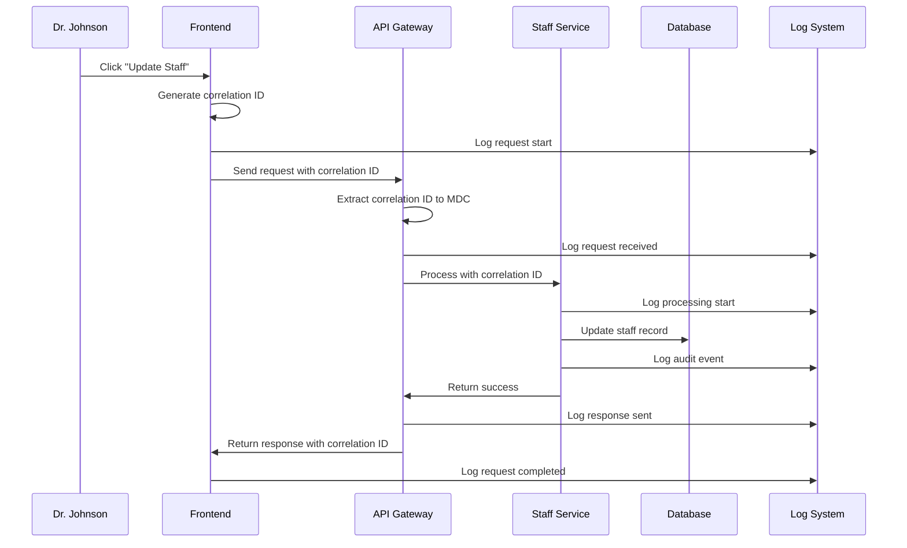

# Chapter 7: Request Correlation & Logging

Welcome back! In [Chapter 6: Frontend State Management](06_frontend_state_management_.md), we learned how the React frontend keeps track of user information and provides smooth, responsive interactions. But here's a crucial question for any real-world application: **When something goes wrong, how do you figure out what happened?**

## The Problem: Tracking Requests Through the System

Imagine you're managing the mail system for a large hospital. Every day, hundreds of packages flow through different departments - from the loading dock to various floors to final delivery. When someone calls asking "Where's my important lab results package?", you need to trace its exact path through the building.

Let's say Dr. Sarah Johnson clicks "Update Staff" at 2:15 PM, but the operation fails with an error message "Server Error - Please Try Again." As the system administrator, you need to answer questions like:
- **Which exact request failed?** There might be dozens happening at the same time
- **What path did it take?** Frontend → API → Database → and back
- **Where exactly did it break?** Was it authentication? Database? Network?
- **Who was involved?** Which user, which staff member being updated?

This is exactly like putting a tracking number on every package in our hospital mail system. Each request gets a unique ID that follows it through every step of its journey - from when Dr. Johnson clicks the button until she sees the result on her screen.

## Key Concepts: The Digital Tracking System

### 1. Correlation ID
Every request gets a unique tracking number that follows it everywhere:

```javascript
// Each request gets a unique ID like a package tracking number
const correlationId = "fe-1734567890-1-abc123";
```

This is like putting a barcode on every package that gets scanned at each checkpoint - you can trace exactly where it went and when.

### 2. Request Logging
At every step, the system records what's happening with that correlation ID:

```java
// Every important step gets logged with the tracking ID
logger.info("Processing staff update request", {
  correlationId: "fe-1734567890-1-abc123",
  userId: 123,
  action: "update_staff"
});
```

This creates a detailed trail showing exactly what happened during each request - like having security cameras at every checkpoint in our mail system.

### 3. Cross-System Tracking
The same correlation ID flows from frontend to backend and back:

```javascript
// Frontend sends request with tracking ID
headers: { "X-Correlation-ID": "fe-1734567890-1-abc123" }

// Backend processes with same tracking ID
MDC.put("correlationId", "fe-1734567890-1-abc123");
```

This ensures that all parts of the system are talking about the same request - like having the same package number on every delivery receipt.

## How It Solves Our Use Case

Let's follow what happens when Dr. Johnson updates a staff member and we need to trace the request:

### Step 1: Frontend Generates Correlation ID
```javascript
// When Dr. Johnson clicks "Update Staff"
const correlationId = generateCorrelationId();  // Creates: "fe-1734567890-1-abc123"
const headers = { "X-Correlation-ID": correlationId };

logger.info("User initiated staff update", {
  correlationId: correlationId,
  user: "sarah.johnson",
  action: "update_staff"
});
```

**What Gets Logged:**
- ✅ Frontend: "User sarah.johnson started staff update [fe-1734567890-1-abc123]"
- ✅ Request gets unique tracking number for its entire journey

### Step 2: Backend Receives and Processes Request
```java
// Backend automatically extracts correlation ID from header
String correlationId = request.getHeader("X-Correlation-ID");
MDC.put("correlationId", correlationId);

logger.info("Received staff update request for user: {}", userId);
```

**What Gets Logged:**
- ✅ Backend: "Received staff update request for user: 123 [fe-1734567890-1-abc123]"
- ✅ All subsequent backend operations include this tracking ID

### Step 3: Database Operation and Audit Trail
```java
// When updating staff record
auditEmitter.emitStaffUpdateEvent(staffId, userId, changes);

// Audit system automatically includes correlation ID
logger.info("AUDIT: Staff update completed", {
  correlationId: "fe-1734567890-1-abc123",
  eventType: "STAFF_UPDATE",
  userId: 123,
  staffId: 456
});
```

**Expected Log Trail:**
```
[Frontend] User sarah.johnson started staff update [fe-1734567890-1-abc123]
[API] Received staff update request for user: 123 [fe-1734567890-1-abc123] 
[Service] Processing staff update [fe-1734567890-1-abc123]
[Audit] Staff update completed [fe-1734567890-1-abc123]
[API] Staff update response sent [fe-1734567890-1-abc123]
```

Now when something goes wrong, administrators can search logs for "fe-1734567890-1-abc123" and see the complete journey!

## Under the Hood: The Tracking System Flow

Let's see what happens step-by-step when a request flows through our correlation tracking system:



### The Correlation ID Generation Process

Here's how the frontend creates unique tracking IDs for each request:

```javascript
// Generate unique correlation ID for each request
function generateCorrelationId() {
  const timestamp = Date.now();           // Current time: 1734567890
  const counter = ++correlationIdCounter; // Request number: 1, 2, 3...
  const random = Math.random().toString(36).substring(2, 9); // Random: abc123
  
  return `fe-${timestamp}-${counter}-${random}`;  // Result: fe-1734567890-1-abc123
}
```

This creates IDs that are guaranteed to be unique and include useful information - the timestamp tells you when it happened, the counter shows the order, and the random part prevents collisions.

### Automatic Header Injection

Every API request automatically gets the correlation ID added:

```javascript
// Axios interceptor adds correlation ID to every request
axiosInstance.interceptors.request.use((config) => {
  if (!config.headers['X-Correlation-ID']) {
    const correlationId = generateCorrelationId();
    config.headers['X-Correlation-ID'] = correlationId;
    
    logger.info('Generated correlation ID for request', {
      correlationId: correlationId,
      path: config.url
    });
  }
  return config;
});
```

This is like having an automatic stamping machine that puts tracking numbers on every package before it enters the mail system - no manual work required.

### Backend MDC Integration

The backend automatically makes the correlation ID available for all logging:

```java
// Filter extracts correlation ID and makes it available everywhere
@Component
public class CorrelationIdFilter implements Filter {
  
  public void doFilter(ServletRequest request, ServletResponse response, FilterChain chain) {
    String correlationId = httpRequest.getHeader("X-Correlation-ID");
    
    // Store in MDC so all logging automatically includes it
    MDC.put("correlationId", correlationId);
    
    try {
      chain.doFilter(request, response);  // Continue processing
    } finally {
      MDC.clear();  // Clean up when request completes
    }
  }
}
```

MDC (Mapped Diagnostic Context) is like having a clipboard that follows every worker through their shift - whatever they write down automatically includes the current package number they're working on.

## Real-World Example: Tracing a Failed Request

Let's see how correlation logging helps us debug a real problem:

### Problem Scenario
```javascript
// Dr. Johnson tries to update staff but gets an error
PUT /api/staff/456
{
  "firstName": "John",
  "email": "invalid-email"  // This will cause a validation error
}
```

The frontend shows: "Server Error - Please try again" but what really happened?

### The Complete Log Trail

Here's what gets logged with correlation ID "fe-1734567890-1-abc123":

```
[2024-12-18 14:15:30] [Frontend] User sarah.johnson started staff update [fe-1734567890-1-abc123]
[2024-12-18 14:15:30] [API] Received staff update request for user: 123 [fe-1734567890-1-abc123]
[2024-12-18 14:15:30] [Validation] Email validation failed: invalid format [fe-1734567890-1-abc123]
[2024-12-18 14:15:30] [API] Validation error response sent [fe-1734567890-1-abc123]
[2024-12-18 14:15:30] [Frontend] Request failed with 400 error [fe-1734567890-1-abc123]
```

Now administrators can see exactly what happened: the email validation failed, which caused a 400 error response.

### Error Response Correlation

Even error responses include the correlation ID:

```javascript
// When request fails, frontend logs with same correlation ID  
axiosInstance.interceptors.response.use(
  (response) => response,
  (error) => {
    const correlationId = error.config?.headers?.['X-Correlation-ID'];
    
    logger.error('HTTP error intercepted', {
      correlationId: correlationId,
      status: error.response?.status,
      message: error.message
    });
    
    return Promise.reject(error);
  }
);
```

This ensures that even when things go wrong, we can still trace the complete path of the request through the system.

### Audit Trail Integration

The [Audit Trail System](08_audit_trail_system_.md) automatically includes correlation IDs:

```java
// Audit events include correlation ID for complete traceability
public void emitStaffUpdateEvent(Long staffId, Long userId, Map<String, Object> changes) {
  String correlationId = MDC.get("correlationId");  // Get current request's ID
  
  AuditEvent auditEvent = new AuditEvent();
  auditEvent.setCorrelationId(correlationId);  // Include in audit record
  auditEvent.setEventType("STAFF_UPDATE");
  
  logger.info("AUDIT: {}", objectMapper.writeValueAsString(auditEvent));
}
```

This creates audit records that can be traced back to the original user request - like having receipts that show the tracking number of the package that caused each audit event.

## Correlation with Role-Based Operations

When combined with [Role-Based Authorization](03_role_based_authorization_.md), correlation logging provides complete security audit trails:

```java
// Authorization checks include correlation ID for security monitoring
public void requireManagerRole() {
  String userRole = getCurrentUserRole();
  String correlationId = MDC.get("correlationId");
  
  if (!"MANAGER".equals(userRole)) {
    logger.warn("Authorization denied - Manager role required", {
      correlationId: correlationId,
      userRole: userRole,
      requiredRole: "MANAGER"
    });
    throw new ForbiddenAccessException("Manager role required");
  }
  
  logger.info("Authorization granted - Manager role confirmed", {
    correlationId: correlationId,
    userRole: userRole
  });
}
```

This creates a complete audit trail showing not just what happened, but who was authorized to do it and when.

### Multi-Tenant Correlation Tracking

Correlation IDs work seamlessly with [Multi-Tenant Facility Scoping](01_multi_tenant_facility_scoping_.md):

```java
// Facility scoping logs include correlation ID for multi-tenant debugging
public void validateFacilityAccess(Long requestedFacilityId) {
  Long userFacilityId = getCurrentUserFacilityId();
  String correlationId = MDC.get("correlationId");
  
  if (!userFacilityId.equals(requestedFacilityId)) {
    logger.warn("Facility access denied", {
      correlationId: correlationId,
      userFacilityId: userFacilityId,
      requestedFacilityId: requestedFacilityId
    });
    throw new ForbiddenAccessException("Access denied");
  }
}
```

This helps administrators quickly identify cross-facility access attempts and trace them back to specific user actions.

## Production Debugging Benefits

Correlation logging transforms debugging from guesswork into precise investigation:

### Before Correlation Logging:
```
ERROR: Staff update failed
ERROR: Database connection timeout  
ERROR: Validation failed
```
**Administrator thinks:** "Which of these errors are related? What user experienced the problem?"

### After Correlation Logging:
```
[fe-1734567890-1-abc123] User sarah.johnson started staff update
[fe-1734567890-1-abc123] Database connection timeout
[fe-1734567890-1-abc123] Staff update failed
[fe-1734567890-2-def456] User john.doe started staff update  
[fe-1734567890-2-def456] Validation failed
```
**Administrator knows:** "Dr. Johnson's request failed due to database timeout, Dr. Doe's failed due to validation - two separate issues."

### Performance Monitoring

Correlation IDs enable end-to-end performance tracking:

```java
// Track request timing across the entire system
logger.info("Request processing started", { correlationId: id, timestamp: start });
// ... processing happens ...
logger.info("Request processing completed", { 
  correlationId: id, 
  timestamp: end, 
  duration: end - start 
});
```

This helps identify slow requests and trace performance bottlenecks back to specific user actions.

## Log Aggregation and Search

In production environments, correlation IDs enable powerful log analysis:

```bash
# Search all logs for a specific request
grep "fe-1734567890-1-abc123" application.log

# Find all failed requests from a specific user
grep "sarah.johnson" application.log | grep "ERROR"

# Analyze request patterns over time
awk '/correlation_id/ {print $1, $5}' application.log | sort
```

This turns raw log files into organized, searchable audit trails - like having a smart filing system that can instantly find all documents related to a specific case.

## Why This Matters

Request correlation and logging provide essential operational capabilities:

- **Rapid Problem Resolution**: Trace any user issue back to its root cause quickly
- **Security Auditing**: Complete trails for compliance and security investigations  
- **Performance Analysis**: Identify and fix slow operations affecting users
- **User Support**: Provide specific, helpful responses to user-reported problems
- **System Monitoring**: Detect patterns and prevent issues before users encounter them

Think of it as having a comprehensive tracking system that follows every package (request) through your entire facility - when something goes wrong, you can trace exactly what happened and fix it quickly.

## What We've Learned

In this chapter, we've explored how Request Correlation & Logging works like a sophisticated package tracking system:

1. **Unique tracking IDs** - every request gets a correlation ID that follows it everywhere
2. **Comprehensive logging** - every important step gets recorded with the tracking ID
3. **Cross-system tracing** - the same ID flows from frontend to backend and back
4. **Error investigation** - failed requests can be traced back to their root causes
5. **Audit integration** - compliance records include complete request traceability

This creates a powerful debugging and monitoring system where administrators can trace any user action through the entire system - from the moment someone clicks a button until they see the result, just like having perfect visibility into every package's journey through a complex delivery network.

In our next chapter, [Audit Trail System](08_audit_trail_system_.md), we'll explore how the system creates permanent, tamper-proof records of all important business events - building on the correlation tracking we learned here to create comprehensive compliance and security audit capabilities.

