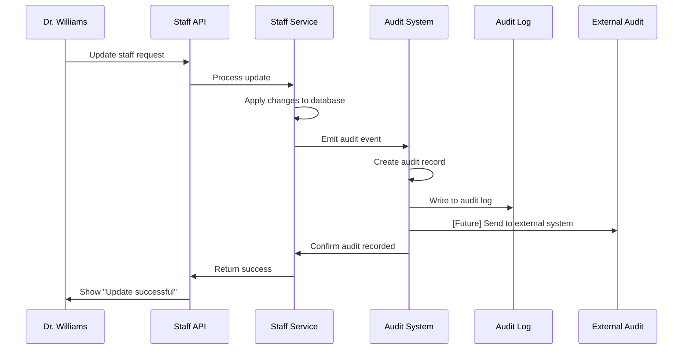

# Chapter 8: Audit Trail System

Welcome back! In [Chapter 7: Request Correlation & Logging](07_request_correlation___logging_.md), we learned how to track requests as they flow through the system - like having package tracking numbers that follow every delivery. Now we need to explore something equally crucial for healthcare software: **How do we create permanent, tamper-proof records of everything important that happens?**

## The Problem: Creating a Digital Paper Trail

Imagine you're working at a bank where every transaction must be recorded permanently. When someone deposits $500, you don't just update their balance - you create a permanent record that shows:
- **Who** made the deposit (John Smith)
- **What** they did (deposited money)
- **When** it happened (December 18, 2024 at 2:15 PM)
- **How much** was involved ($500)
- **Why** it was authorized (valid ID provided)

Healthcare facilities have the same requirement, but even more strict. When Dr. Williams updates Nurse Johnson's role from "Staff Nurse" to "Senior Nurse," the system must create an unchangeable record showing:
- **Who:** Dr. Williams (Manager at General Hospital)
- **What:** Changed employee role 
- **When:** December 18, 2024 at 2:15:30 PM
- **Which employee:** Nurse Johnson (ID: 456)
- **What changed:** Role "Staff Nurse" → "Senior Nurse"
- **Request tracking:** Correlation ID fe-1734567890-1-abc123

This is exactly like a security camera system that records everything important - but instead of video, we're recording business events in a format that auditors and regulators can review years later.

## Key Concepts: The Digital Security Camera System

### 1. Audit Events
Every important business action becomes a permanent audit record:

```java
// Each audit event is like a security camera snapshot
AuditEvent event = {
  "eventType": "STAFF_UPDATE",
  "who": "Dr. Williams (ID: 123)",
  "what": "Updated staff member role",
  "when": "2024-12-18T14:15:30"
}
```

This is like having a detailed logbook entry that captures exactly what happened at a specific moment in time.

### 2. Change Tracking
The system records not just that something changed, but exactly what the change was:

```java
// Record what specifically changed
Map<String, Object> changes = {
  "role": {"old": "Staff Nurse", "new": "Senior Nurse"},
  "email": {"old": "johnson@old.com", "new": "johnson@new.com"}
}
```

This is like having "before and after" photos that show exactly what was different - crucial for understanding the impact of each change.

### 3. Correlation Tracking
Every audit record includes the correlation ID from the original request:

```java
// Connect audit records back to user actions
auditEvent.setCorrelationId("fe-1734567890-1-abc123");
```

This links the audit record back to the specific user session and request that caused it - like having receipt numbers that trace back to the original transaction.

## How It Solves Our Use Case

Let's follow what happens when Dr. Williams updates Nurse Johnson's information and see how the audit trail captures everything:

### Step 1: Manager Updates Staff Information
```java
// Dr. Williams submits update through web interface
PUT /api/staff/456
{
  "firstName": "Johnson", 
  "role": "Senior Nurse",
  "email": "johnson.senior@hospital.com"
}
```

This is the business action that needs to be recorded - a manager making changes to an employee's information.

### Step 2: System Records the Change
```java
// Audit system automatically captures the event
auditEmitter.emitStaffUpdateEvent(456, 123, changes);

// Creates permanent audit record
AuditEvent record = {
  "eventType": "STAFF_UPDATE",
  "entityType": "STAFF", 
  "entityId": 456,
  "userId": 123,
  "timestamp": "2024-12-18T14:15:30",
  "correlationId": "fe-1734567890-1-abc123",
  "changes": {
    "role": {"old": "Staff Nurse", "new": "Senior Nurse"},
    "email": {"old": "johnson@old.com", "new": "johnson.senior@hospital.com"}
  }
}
```

**Expected Audit Record:**
- ✅ **Who:** User ID 123 (Dr. Williams)
- ✅ **What:** Updated staff member role and email
- ✅ **When:** December 18, 2024 at 2:15:30 PM
- ✅ **Which:** Staff member ID 456 (Nurse Johnson)
- ✅ **Changes:** Detailed before/after values
- ✅ **Tracing:** Linked to correlation ID for complete request trail

### Step 3: Permanent Storage and Compliance
```java
// Audit record gets permanently logged
logger.info("AUDIT: {}", jsonString);

// Future: Also sent to external audit system
// auditPublisher.send(auditEvent);
```

**Expected Result:**
- ✅ Permanent log entry created that can't be modified
- ✅ Record includes all details needed for compliance audits
- ✅ Administrators can trace any change back to its source
- ✅ Regulatory auditors can verify all employee changes

## Under the Hood: The Audit Recording System

Let's see what happens step-by-step when the system creates an audit trail:



### The Audit Event Creation Process

Here's how the system automatically creates audit records for staff updates:

```java
// When staff information gets updated
public void emitStaffUpdateEvent(Long staffId, Long userId, Map<String, Object> changes) {
    String correlationId = MDC.get("correlationId");  // Get request tracking ID
    
    AuditEvent event = new AuditEvent();
    event.setEventType("STAFF_UPDATE");
    event.setEntityId(staffId);
    event.setUserId(userId);
    event.setCorrelationId(correlationId);
}
```

This method acts like a court reporter who automatically transcribes every important event - capturing who, what, when, and why without requiring manual effort.

### Automatic Change Detection

The system intelligently captures only the fields that actually changed:

```java
// Compare old values with new values
Map<String, Object> changes = new HashMap<>();

if (!newRole.equals(oldRole)) {
    changes.put("role", Map.of("old", oldRole, "new", newRole));
}

if (!newEmail.equals(oldEmail)) {
    changes.put("email", Map.of("old", oldEmail, "new", newEmail));
}
```

This ensures audit records only include meaningful changes - like having smart security cameras that only record when something actually happens, not during quiet periods.

### Correlation ID Integration

Every audit event automatically includes the correlation ID from [Chapter 7: Request Correlation & Logging](07_request_correlation___logging_.md):

```java
// Automatically capture request correlation ID
String correlationId = MDC.get("correlationId");
auditEvent.setCorrelationId(correlationId);
```

This creates an unbreakable link between user actions and audit records - like having receipt numbers that connect every audit entry back to the original transaction.

## Real-World Example: Staff Deactivation Audit

Let's see how the audit system captures a different type of event - when an employee leaves:

```java
// When manager deactivates a staff member
public void deactivateStaff(Long staffId, Long requestingUserId) {
    // Perform the deactivation
    staff.deactivate(LocalDate.now());
    
    // Create audit record
    auditEmitter.emitStaffDeactivateEvent(staffId, requestingUserId, "Manager-initiated");
}
```

The system automatically records this sensitive HR action with full details.

### Deactivation Audit Event Structure

Here's what gets permanently recorded when someone deactivates an employee:

```java
// Audit record for staff deactivation
{
  "eventType": "STAFF_DEACTIVATE",
  "entityType": "STAFF",
  "entityId": 456,
  "userId": 123,
  "timestamp": "2024-12-18T16:30:00",
  "correlationId": "fe-1734567890-2-xyz789",
  "metadata": {
    "reason": "Manager-initiated",
    "effectiveDate": "2024-12-18"
  }
}
```

This creates a permanent record showing exactly when and why each employee's access was terminated - crucial for security and compliance audits.

### JSON Structured Logging

All audit events get converted to structured JSON format for easy processing:

```java
// Convert audit event to JSON for permanent storage
String jsonString = objectMapper.writeValueAsString(event);
logger.info("AUDIT: {}", jsonString);
```

This creates machine-readable audit records that can be automatically analyzed, searched, and reported on - like having digital forms instead of handwritten notes.

## Integration with Security Controls

The audit system works seamlessly with our security layers from previous chapters:

### Role-Based Audit Events

When combined with [Chapter 3: Role-Based Authorization](03_role_based_authorization_.md), audit records include role information:

```java
// Audit events include user role for security analysis
auditEvent.setMetadata(Map.of(
    "userRole", "MANAGER",
    "requiredRole", "MANAGER",
    "authorizationResult", "GRANTED"
));
```

This helps security teams understand not just what happened, but whether the person was authorized to do it.

### Multi-Tenant Audit Isolation

Working with [Chapter 1: Multi-Tenant Facility Scoping](01_multi_tenant_facility_scoping_.md), audit records are automatically scoped to facilities:

```java
// Audit records automatically include facility context
auditEvent.setMetadata(Map.of(
    "facilityId", 1,
    "facilityName", "General Hospital"
));
```

This ensures that audit reports can be filtered by facility - each hospital only sees audit records for their own operations.

### Session and Request Tracking

Building on [Chapter 2: Authentication & Session Management](02_authentication___session_management_.md), audit events capture complete session context:

```java
// Full user context in audit records
{
  "userId": 123,
  "username": "sarah.johnson", 
  "sessionId": "sess_abc123",
  "correlationId": "fe-1734567890-1-abc123",
  "ipAddress": "192.168.1.100"
}
```

This creates comprehensive audit trails that can trace any change back to the specific user session that caused it.

## Audit Event Types and Standards

The system supports different types of audit events for different business operations:

### Staff Management Events
```java
// Different event types for different HR actions
"STAFF_UPDATE"     - Employee information changed
"STAFF_DEACTIVATE" - Employee access terminated  
"STAFF_CREATE"     - New employee added
"STAFF_REACTIVATE" - Former employee restored
```

Each event type has its own metadata structure optimized for that specific type of business action.

### Generic Audit Events

For flexibility, the system also supports custom audit events:

```java
// Generic audit event for any business action
auditEmitter.emitAuditEvent(
    "LOGIN_SUCCESS",           // What happened
    "USER_SESSION",            // What type of thing
    userId,                    // Which specific thing
    userId,                    // Who did it
    Map.of("ipAddress", ip)    // Additional context
);
```

This allows the audit system to grow and adapt to new business requirements without code changes.

### Compliance and Regulatory Support

Audit events are designed to meet healthcare compliance requirements:

```java
// Audit structure meets regulatory standards
{
  "timestamp": "2024-12-18T14:15:30.123Z",  // Precise timing
  "eventType": "STAFF_UPDATE",              // Action classification
  "userId": 123,                            // Actor identification
  "entityId": 456,                          // Subject identification
  "changes": {...},                         // Detailed change record
  "correlationId": "...",                   // Request traceability
  "facilityId": 1                          // Organizational context
}
```

This structured format ensures auditors can easily verify compliance with healthcare regulations like HIPAA.

## Future External Integration

The current system logs audit events locally, but it's designed for future integration with external audit systems:

```java
// Placeholder for future external audit integration
private void publishAuditEvent(AuditEvent event) {
    // TODO: Send to Kafka topic for real-time audit processing
    // TODO: Send to AWS CloudTrail for long-term storage  
    // TODO: Send to SIEM system for security monitoring
}
```

This architecture allows the audit system to evolve from simple logging to enterprise-grade audit infrastructure without changing application code.

### Audit Data Analytics

Structured audit logs enable powerful analysis and reporting:

```bash
# Example audit log analysis commands

# Find all staff changes by a specific manager
grep "STAFF_UPDATE" audit.log | grep "userId\":123"

# Analyze audit patterns over time  
grep "eventType" audit.log | awk '{print $1, $5}' | sort

# Generate compliance report for specific time period
grep "2024-12-18" audit.log | jq '.eventType' | sort | uniq -c
```

This transforms raw audit data into actionable business intelligence - like having smart reports that automatically analyze all security camera footage.

## Error Handling and Audit Reliability

The audit system is designed to be extremely reliable - audit records must never be lost:

```java
// Audit recording with error handling
try {
    String jsonString = objectMapper.writeValueAsString(event);
    logger.info("AUDIT: {}", jsonString);
} catch (Exception e) {
    logger.error("Failed to serialize audit event - CRITICAL", e);
    // Could implement fallback audit storage here
}
```

If audit recording fails, it's treated as a critical system error - like having backup security cameras in case the primary ones fail.

### Audit Integrity Protection

In production environments, audit logs often have special protection:

- **Write-only access** - audit records can be created but never modified
- **Tamper detection** - checksums or digital signatures verify integrity
- **Retention policies** - audit records preserved for required compliance periods
- **Access controls** - only authorized personnel can view audit data

This ensures audit trails maintain their legal and regulatory value over time.

## Why This Matters

The audit trail system provides essential business and compliance capabilities:

- **Regulatory Compliance**: Meets healthcare audit requirements like HIPAA and HITECH
- **Security Monitoring**: Enables detection of unauthorized access or suspicious activities  
- **Accountability**: Creates permanent records linking actions to specific users
- **Business Intelligence**: Provides data for analyzing operational patterns and trends
- **Legal Protection**: Maintains evidence for potential disputes or investigations

Think of it as a comprehensive security and compliance system that automatically documents everything important - like having a perfect memory that never forgets and can't be fooled.

## What We've Learned

In this chapter, we've explored how the Audit Trail System works like a sophisticated security camera and record-keeping system:

1. **Automatic event capture** - every important business action gets permanently recorded
2. **Detailed change tracking** - before/after values show exactly what changed
3. **Complete traceability** - correlation IDs link audit records back to user requests  
4. **Structured data format** - JSON records enable automated analysis and reporting
5. **Compliance ready** - audit structure meets healthcare regulatory requirements

This creates a comprehensive audit infrastructure that automatically maintains permanent, tamper-proof records of all business activities - ensuring accountability, enabling compliance, and providing the detailed history needed for security monitoring and business analysis, just like having a perfect digital witness to every important event.

In our next chapter, [Centralized Error Handling](09_centralized_error_handling_.md), we'll explore how the system manages errors and exceptions gracefully - ensuring that when something goes wrong, users get helpful feedback and administrators get the information they need to fix problems quickly.

