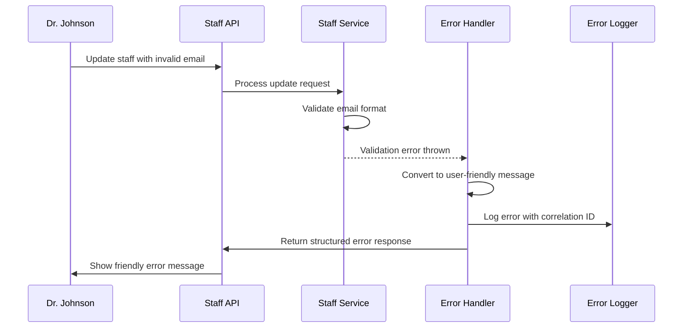

# Chapter 9: Centralized Error Handling

Welcome back! In [Chapter 8: Audit Trail System](08_audit_trail_system_.md), we learned how to create permanent, tamper-proof records of all important business events - like having a perfect digital witness to everything that happens. But here's a critical question we haven't addressed yet: **What happens when something goes wrong, and how do we handle it gracefully?**

## The Problem: Making Errors Helpful Instead of Scary

Imagine you're working at the customer service desk of a large department store. Throughout the day, customers come to you with all sorts of problems:

- **"My credit card was declined"** - you need to explain what went wrong and how to fix it
- **"I can't find the product I'm looking for"** - you need to help them locate it or suggest alternatives  
- **"The website crashed when I tried to check out"** - you need to apologize and help them complete their purchase

Now imagine if instead of trained customer service representatives, the store just had a robot that said "ERROR 500: INTERNAL SYSTEM FAILURE" to every customer complaint. That would be terrible customer service!

Let's say Dr. Sarah Johnson tries to update a staff member's information, but she accidentally enters an invalid email address like "not-an-email". Without proper error handling, she might see a scary technical message like:

```
com.fasterxml.jackson.databind.exc.InvalidFormatException: Cannot deserialize value of type `java.lang.String` from JSON string "not-an-email": not a valid representation
```

But with centralized error handling, she sees a friendly message like:

```
"Email must be a valid email address. Please check the format and try again."
```

This is exactly like having a customer service department that handles all complaints and problems in a consistent, helpful way.

## Key Concepts: The Digital Customer Service System

### 1. Error Translation
The system converts scary technical errors into friendly, helpful messages:

```java
// Technical error gets converted to user-friendly message
"Email must be a valid email address"
```

This is like having a translator who takes confusing technical jargon and explains it in plain English that anyone can understand.

### 2. Consistent Error Format
All errors follow the same structure, making them predictable and useful:

```java
// Every error response has the same helpful format
{
  "message": "Email must be valid",
  "correlationId": "fe-1234567890-1-abc123",
  "remediation": "Please check the email format and try again"
}
```

This is like having standardized complaint forms that always include the same helpful information - what went wrong, how to track it, and what to do next.

### 3. Automatic Error Logging
When errors happen, they automatically get logged with full context for debugging:

```java
// System automatically logs errors for administrators
logger.warn("Validation error - correlationId: {}, details: {}", correlationId, details);
```

This creates a permanent record for administrators to fix problems while showing users only what they need to know - like having customer service agents who document issues in their internal system while giving customers helpful responses.

## How It Solves Our Use Case

Let's follow what happens when Dr. Johnson makes different types of mistakes and see how the error handling system responds helpfully:

### Scenario 1: Invalid Email Format
```java
// Dr. Johnson tries to update staff with invalid email
PUT /api/staff/456
{
  "firstName": "John",
  "email": "not-an-email"  // This will trigger validation error
}
```

**System Response:**
- ❌ Validation fails: Email format is invalid
- ✅ Error handler converts to friendly message
- ✅ **User sees:** "Email must be valid - Please check the email format and try again"

### Scenario 2: Trying to Access Unauthorized Resource
```java
// Nurse Johnson (STAFF role) tries to update staff information
PUT /api/staff/456
{
  "firstName": "Updated Name"
}
```

**System Response:**
- ❌ Authorization fails: Only managers can update staff
- ✅ Error handler provides clear explanation
- ✅ **User sees:** "Access denied - You do not have permission to access this resource"

### Scenario 3: Resource Not Found
```java
// Dr. Johnson tries to update non-existent staff member
PUT /api/staff/99999
{
  "firstName": "John"
}
```

**System Response:**
- ❌ Staff member doesn't exist in database
- ✅ Error handler explains the problem clearly
- ✅ **User sees:** "Staff with ID 99999 not found - Please verify the resource identifier and try again"

All three scenarios show different problems, but each gets handled by the same centralized error system that provides consistent, helpful responses.

## Under the Hood: The Customer Service Flow

Let's see what happens step-by-step when an error occurs and gets handled by our centralized system:



### The Error Interception Process

Here's how the system automatically catches and handles different types of errors:

```java
// Central error handler catches all exceptions automatically
@ExceptionHandler(MethodArgumentNotValidException.class)
public ResponseEntity<ErrorResponse> handleValidationException(MethodArgumentNotValidException ex) {
    // Convert technical validation error to friendly message
    String friendlyMessage = "Request validation failed";
    return ResponseEntity.status(400).body(createErrorResponse(friendlyMessage));
}
```

This method acts like a customer service representative who's trained to handle validation complaints - they automatically know how to respond helpfully when customers have form-filling problems.

### Error Response Structure

Every error gets converted into a consistent, helpful format:

```java
// Standard error response format
ErrorResponse errorResponse = ErrorResponse.builder()
    .correlationId("fe-1234567890-1-abc123")  // For tracking
    .message("Email must be valid")            // What went wrong
    .remediation("Please check the format")    // How to fix it
    .timestamp(LocalDateTime.now())            // When it happened
    .build();
```

This creates a standardized "complaint resolution form" that always includes the same helpful information - making it easy for users to understand what happened and what to do next.

### Automatic Correlation ID Tracking

The error system integrates with [Chapter 7: Request Correlation & Logging](07_request_correlation___logging_.md) to provide complete traceability:

```java
// Error responses automatically include correlation ID
String correlationId = getOrGenerateCorrelationId();
errorResponse.setCorrelationId(correlationId);
```

This ensures that every error can be traced back to the original user request - like having receipt numbers that connect customer complaints back to their original transactions.

## Real-World Example: Validation Error Handling

Let's see how the system handles a common problem - form validation errors:

```java
// When user submits form with multiple validation problems
{
  "firstName": "",           // Missing required field
  "email": "not-an-email", // Invalid format
  "role": null              // Missing required field
}
```

The system catches all validation problems and presents them clearly.

### Multiple Field Errors

The error handler collects all validation problems and presents them together:

```java
// Collect all field validation errors
Map<String, String> fieldErrors = new HashMap<>();
fieldErrors.put("firstName", "First name is required");
fieldErrors.put("email", "Email must be valid");
fieldErrors.put("role", "Role is required");
```

This gives users a complete picture of what needs to be fixed - like having a helpful checklist instead of fixing problems one at a time.

### User-Friendly Error Messages

Each validation error gets converted to plain English:

```java
// Error response with helpful details
{
  "message": "Request validation failed",
  "details": "firstName: First name is required; email: Email must be valid; role: Role is required",
  "remediation": "Please check the request body and ensure all required fields are provided with valid values",
  "fieldErrors": {
    "firstName": "First name is required",
    "email": "Email must be valid", 
    "role": "Role is required"
  }
}
```

This provides both a summary and specific field-by-field guidance - like having a helpful customer service agent who explains exactly what forms need to be filled out correctly.

## Security Error Handling

The error system works seamlessly with our security layers from previous chapters:

### Authentication Errors

When login fails, users get clear feedback without revealing security details:

```java
// Convert authentication failure to helpful message
@ExceptionHandler(InvalidCredentialsException.class)
public ResponseEntity<ErrorResponse> handleInvalidCredentialsException(InvalidCredentialsException ex) {
    return createErrorResponse("Invalid username or password", 
                             "Please verify your credentials and try again");
}
```

This protects security by not revealing whether the username or password was wrong - like how ATMs don't tell you which part of your PIN was incorrect.

### Authorization Errors

When users try to access things they're not allowed to, they get helpful guidance:

```java
// Handle role-based authorization failures
@ExceptionHandler(ForbiddenAccessException.class)
public ResponseEntity<ErrorResponse> handleForbiddenAccessException(ForbiddenAccessException ex) {
    return createErrorResponse("Access denied",
                             "Please contact your system administrator if you believe you should have access");
}
```

This gives users a clear path forward - they know they don't have access and who to contact about it, like having clear escalation procedures for customer service issues.

### Multi-Tenant Access Errors

Building on [Chapter 1: Multi-Tenant Facility Scoping](01_multi_tenant_facility_scoping_.md), facility access errors are handled gracefully:

```java
// When user tries to access data from wrong facility
logger.warn("Forbidden access - correlationId: {}, userId: {}, facilityId: {}", 
           correlationId, ex.getUserId(), ex.getFacilityId());

return createErrorResponse("Access denied", 
                         "You can only access resources from your assigned facility");
```

Users get clear feedback about facility restrictions while administrators get detailed logging for security monitoring.

## Resource Not Found Handling

The system provides helpful responses when users look for things that don't exist:

```java
// Handle missing staff members, facilities, etc.
@ExceptionHandler(ResourceNotFoundException.class)
public ResponseEntity<ErrorResponse> handleResourceNotFoundException(ResourceNotFoundException ex) {
    String resourceType = ex.getResourceType() != null ? ex.getResourceType() : "Resource";
    String message = String.format("%s with ID %s not found", resourceType, ex.getResourceId());
    
    return createErrorResponse(message, "Please verify the resource identifier and try again");
}
```

This tells users exactly what couldn't be found and gives them guidance on how to fix it - like helpful store employees who explain that a product is out of stock and suggest alternatives.

### Structured Not Found Responses

Not found errors include specific details to help users understand what happened:

```java
// Detailed not found response
{
  "correlationId": "fe-1234567890-1-abc123",
  "message": "Staff with ID 99999 not found", 
  "remediation": "Please verify the resource identifier and try again",
  "status": 404
}
```

This gives users enough information to understand and fix the problem without overwhelming them with technical details.

## Database and System Errors

The error handler protects users from scary technical errors while giving administrators the information they need:

### Generic Exception Handling

Unexpected errors get converted to helpful messages:

```java
// Handle unexpected system errors
@ExceptionHandler(Exception.class)
public ResponseEntity<ErrorResponse> handleGenericException(Exception ex) {
    logger.error("Unexpected error - correlationId: {}, exception: {}", 
                correlationId, ex.getClass().getName(), ex);
    
    return createErrorResponse("An unexpected error occurred",
                             "Please try again later or contact support with the correlation ID");
}
```

Users see a helpful message while administrators get detailed logs for debugging - like having customer service representatives who can escalate complex problems to technical support.

### Error Logging for Debugging

All errors automatically get logged with full context for administrators:

```java
// Comprehensive error logging
logger.error("Validation error - correlationId: {}, details: {}, user: {}", 
           correlationId, validationDetails, userId);
```

This creates detailed audit trails for debugging while keeping user-facing messages simple and helpful.

## Frontend Error Integration

The error handling system works seamlessly with [Chapter 6: Frontend State Management](06_frontend_state_management_.md):

```typescript
// Frontend automatically handles error responses
try {
  const response = await staffApi.updateStaff(staffId, formData);
  setSuccess(true);
} catch (error) {
  // Error response is already formatted helpfully by backend
  setError(error.response.data.message);
  setRemediation(error.response.data.remediation);
}
```

The frontend receives pre-formatted, user-friendly error messages that can be displayed directly to users - like having customer service scripts that are ready to read to customers.

### Error Display Components

The React frontend can display errors consistently across the application:

```typescript
// Reusable error display component
function ErrorBanner({ error, remediation, correlationId }) {
  return (
    <div className="error-banner">
      <p>{error}</p>
      <p><small>{remediation}</small></p>
      {correlationId && <p><small>Reference: {correlationId}</small></p>}
    </div>
  );
}
```

This ensures that all errors look and feel consistent throughout the application - like having standardized customer service procedures that work the same way everywhere.

## Error Recovery and User Experience

The centralized error handling system is designed to help users recover from problems quickly:

### Clear Recovery Guidance

Every error includes specific instructions on what to do next:

```java
// Error messages include recovery guidance
.remediation("Please check the email format and try again")
.remediation("Please contact your system administrator for access")
.remediation("Please verify the resource identifier and try again")
```

This turns every error into a helpful guide that tells users exactly what to do - like having solution-focused customer service that always provides next steps.

### Correlation IDs for Support

When users need help, they can provide the correlation ID for quick problem resolution:

```java
// Every error includes correlation ID for support tracking
.remediation("Please try again later or contact support with the correlation ID: " + correlationId)
```

This gives support teams a direct path to find the exact error in the logs - like having case numbers that instantly bring up all the details of a customer's problem.

## Why This Matters

Centralized error handling provides essential benefits for both users and administrators:

- **Better User Experience**: Technical errors become helpful, actionable messages
- **Faster Problem Resolution**: Correlation IDs enable quick debugging and support
- **Consistent Communication**: All errors follow the same helpful format
- **Security Protection**: Error messages don't reveal sensitive system information
- **Operational Visibility**: Comprehensive error logging enables proactive problem-solving

Think of it as having a world-class customer service department that handles all problems professionally - turning every error into an opportunity to help users succeed rather than frustrate them.

## What We've Learned

In this chapter, we've explored how Centralized Error Handling works like a sophisticated customer service system:

1. **Error translation** - technical problems become user-friendly messages
2. **Consistent format** - all errors provide the same helpful structure
3. **Automatic logging** - administrators get detailed information for debugging
4. **Security awareness** - error messages protect sensitive system details
5. **Recovery guidance** - every error includes specific next steps for users

This creates a robust system that turns inevitable problems into helpful, manageable experiences - ensuring that when something goes wrong, users know exactly what happened and how to fix it, while administrators get the detailed information they need to prevent similar issues in the future, just like having a perfect customer service department that never has a bad day.

With centralized error handling, we've completed our comprehensive tour of the testing demo system - from multi-tenant facility scoping through audit trails to user-friendly error management. Together, these components create a robust, secure, and user-friendly healthcare management system that handles both normal operations and exceptional situations with equal professionalism.

