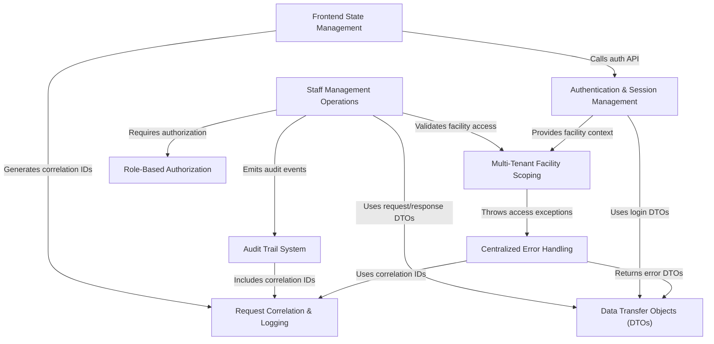

# Tutorial: testing_demo

This is a **multi-tenant healthcare staff management system** that allows different hospitals and clinics to securely manage their employees. 
The system acts like a *digital HR department* where managers can update staff information, deactivate employees, and view staff lists, 
while ensuring that each facility can only see and modify their own data. It includes secure login functionality, detailed audit logging 
of all changes for compliance, and a web interface that protects sensitive pages from unauthorized access.

**Source Repository:** [https://github.com/Girniwale16/testing_demo/tree/main](https://github.com/Girniwale16/testing_demo/tree/main)

## Chapters

1. [Multi-Tenant Facility Scoping
](01_multi_tenant_facility_scoping_.md)
2. [Authentication & Session Management
](02_authentication___session_management_.md)
3. [Role-Based Authorization
](03_role_based_authorization_.md)
4. [Staff Management Operations
](04_staff_management_operations_.md)
5. [Data Transfer Objects (DTOs)
](05_data_transfer_objects__dtos__.md)
6. [Frontend State Management
](06_frontend_state_management_.md)
7. [Request Correlation & Logging
](07_request_correlation___logging_.md)
8. [Audit Trail System
](08_audit_trail_system_.md)
9. [Centralized Error Handling
](09_centralized_error_handling_.md)
