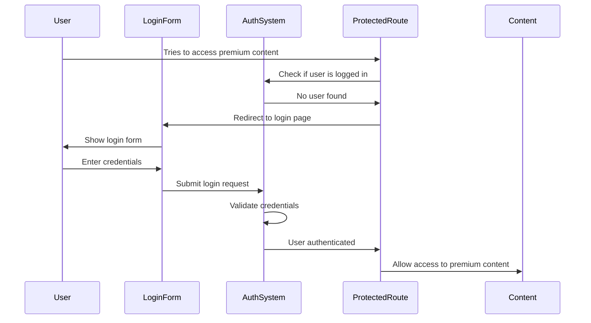

# Chapter 1: Frontend Authentication Flow

Welcome to your first step in understanding web application security! In this chapter, we'll explore the **Frontend Authentication Flow** - the part of our application that handles user login and keeps unauthorized users from accessing protected content.

## What Problem Does This Solve?

Imagine you're running a digital library. You want some books to be available to everyone, but premium content should only be accessible to registered members. You need a system that:

- Shows a friendly login form to visitors
- Remembers who's logged in as they browse around
- Automatically redirects unauthorized users to the login page
- Protects premium content from unauthorized access

This is exactly what the Frontend Authentication Flow does for web applications!

## Key Concepts Breakdown

Let's break down this system into three main parts that work together:

### 1. The Login Form - Your Digital Reception Desk

The login form is like a reception desk where visitors check in. It collects credentials and handles the initial authentication request.

```typescript
// Simple login form that collects username and password
const handleLogin = async (username: string, password: string) => {
  // Validate inputs first
  if (!username || !password) {
    showError("Please fill in all fields");
    return;
  }
  // Send login request...
};
```

This code shows how we validate user input before sending it anywhere. Just like a receptionist would ask for proper ID, we make sure both username and password are provided.

### 2. Protected Routes - Your Security Guards

Protected routes are like security guards that check if you have permission to enter certain areas.

```typescript
// Check if user is authenticated before showing content
function ProtectedRoute({ children }) {
  const { user, loading } = useAuth();
  
  if (!user) {
    return <Navigate to="/login" />;
  }
  
  return children; // Show the protected content
}
```

This guard checks if there's a logged-in user. If not, it automatically sends them to the login page - just like a security guard redirecting unauthorized visitors to the front desk.

### 3. Authentication State Management - Your Memory System

The authentication system remembers who's logged in and manages their session throughout their visit.

```typescript
// Keep track of current user and their login status
const [user, setUser] = useState(null);
const [loading, setLoading] = useState(true);
```

This is like the building's memory system that remembers which visitors have checked in and are authorized to be there.

## How It All Works Together

Let's walk through what happens when someone tries to access our digital library:



## Step-by-Step Implementation

### Step 1: Creating the Login Form

Our login form handles user input and validation:

```typescript
// Collect user credentials with validation
const [username, setUsername] = useState('');
const [password, setPassword] = useState('');
```

The form stores what the user types and validates it before sending the login request.

```typescript
// Handle form submission with error checking
const handleSubmit = async (e) => {
  e.preventDefault();
  
  if (!username.trim()) {
    setValidationError('Username is required');
    return;
  }
  // Continue with login...
};
```

This prevents empty submissions and gives users helpful feedback, just like a receptionist would politely ask for missing information.

### Step 2: Setting Up Route Protection

Protected routes act as checkpoints throughout our application:

```typescript
// Protect sensitive content from unauthorized access
function ProtectedRoute({ children }) {
  const { user } = useAuth();
  
  if (!user) {
    return <Navigate to="/login" />;
  }
  
  return <>{children}</>;
}
```

Any content wrapped in `ProtectedRoute` automatically becomes restricted to logged-in users only.

### Step 3: Managing Authentication State

The authentication system coordinates everything:

```typescript
// Centralized place to manage login status
const useAuth = () => {
  const [user, setUser] = useState(null);
  
  const login = async (username, password) => {
    // Send credentials to server
    // Store user info if successful
    setUser(userData);
  };
  
  return { user, login };
};
```

This hook provides a single source of truth about who's currently logged in.

## Under the Hood: The Complete Flow

When a user tries to access protected content, here's the detailed process:

1. **Route Guard Check**: The `ProtectedRoute` component immediately checks if there's a current user
2. **Redirect Decision**: If no user is found, it redirects to `/login`  
3. **Form Display**: The login page shows the `LoginForm` component
4. **Input Validation**: The form validates credentials before submission
5. **Authentication Request**: Valid credentials are sent to the authentication system
6. **State Update**: On success, the user information is stored in the application state
7. **Automatic Navigation**: The user is redirected back to their original destination

This entire process happens seamlessly, creating a smooth user experience while maintaining security.

## Real-World Example

Let's see how this works with our `LoginPage` component:

```typescript
// Complete login page that handles the full flow
function LoginPage() {
  const { user, login } = useAuth();
  const navigate = useNavigate();
  
  // Redirect if already logged in
  useEffect(() => {
    if (user) {
      navigate('/dashboard');
    }
  }, [user, navigate]);
  
  return <LoginForm onSubmit={login} />;
}
```

This page automatically redirects logged-in users away from the login form - no need to log in twice!

## Key Benefits

The Frontend Authentication Flow provides:

- **User-Friendly Experience**: Clean forms with helpful validation messages
- **Automatic Protection**: No need to manually check authentication on every page
- **Seamless Navigation**: Users are smoothly guided through the login process
- **Centralized Management**: All authentication logic is organized in one place

## Conclusion

The Frontend Authentication Flow acts as your application's friendly but secure reception system. It provides an intuitive way for users to authenticate while automatically protecting sensitive content from unauthorized access.

In our next chapter, [Data Models](02_data_models_.md), we'll explore how we structure and organize the data that flows through our authentication system, including user profiles and login requests.

