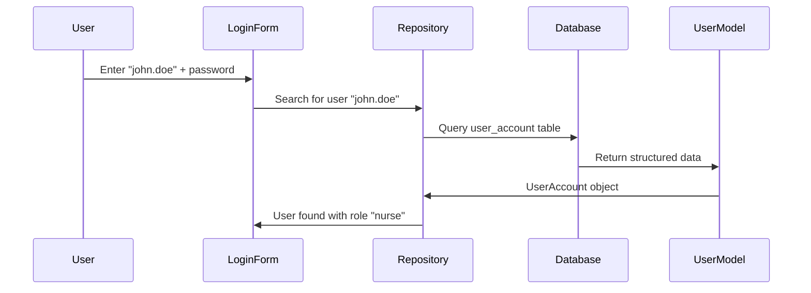

# Chapter 2: Data Models

Now that we understand how the [Frontend Authentication Flow](01_frontend_authentication_flow_.md) handles user login, let's explore what happens to the data behind the scenes. In this chapter, we'll learn about **Data Models** - the digital blueprints that define how our application stores and organizes information.

## What Problem Does This Solve?

Imagine you're organizing a physical filing cabinet for a healthcare facility. You need separate folders for:
- Employee information (names, roles, login credentials)
- Facility details (location names, time zones, regions)

Without a consistent filing system, documents would be scattered everywhere, making it impossible to find what you need. You'd want standardized forms where everyone fills out information in the same format and same fields.

This is exactly what Data Models do for our application! They create consistent "digital forms" that ensure all user accounts and facility information is stored in an organized, predictable way.

## Key Concepts Breakdown

Let's break down our two main data models that work together to support our authentication system:

### 1. UserAccount - Your Digital Employee File

The `UserAccount` model is like a standardized employee file that contains everything needed to identify and authenticate a person in the system.

```java
@Entity
@Table(name = "user_account")
public class UserAccount {
    private Long userAccountId;
    private String username;
    private String passwordHash;
    private String role;
}
```

Think of this as a digital employee badge that contains their ID number, username for logging in, encrypted password, and their job role (like "nurse" or "administrator").

### 2. Facility - Your Location Information Card

The `Facility` model represents each healthcare location with all its essential details.

```java
@Entity  
@Table(name = "facility")
public class Facility {
    private Long facilityId;
    private String name;
    private String timezone;
    private String regionCode;
}
```

This is like a location card that stores the facility's unique ID, name (like "Downtown Medical Center"), timezone, and region code for organizing multiple locations.

### 3. The Connection Between Them

Here's the key insight: every user account belongs to a specific facility. It's like saying "John Doe works at Downtown Medical Center."

```java
@ManyToOne
@JoinColumn(name = "facility_id")
private Facility facility;
```

This creates a relationship where many users can work at one facility, but each user account is tied to exactly one facility.

## How to Use Data Models

Let's see how these models solve our filing cabinet problem with a real example:

### Creating a New User Account

When someone joins the healthcare facility, we create their digital file:

```java
UserAccount newUser = new UserAccount();
newUser.setUsername("john.doe");
newUser.setRole("nurse");
newUser.setFacility(downtownMedical);
```

This code creates a new employee file for John Doe, assigns him the nurse role, and connects him to the Downtown Medical facility. It's like filling out a standardized employee form.

### Finding a User During Login

When someone tries to log in, we look up their file:

```java
Optional<UserAccount> user = repository
    .findByUsernameAndFacilityId("john.doe", facilityId);
```

This searches our organized filing system to find John Doe's file at the specific facility. The system knows exactly where to look because of our standardized structure.

## Under the Hood: How Data Models Work

Let's walk through what happens when someone logs in and the system needs to find their information:



Here's the step-by-step process:

1. **User Input**: The person enters their username "john.doe"
2. **Repository Query**: The system searches the organized data storage
3. **Database Lookup**: The database finds the matching record
4. **Model Creation**: The raw data gets structured into a UserAccount object
5. **Information Return**: The system now knows this is a nurse at Downtown Medical

## Deep Dive: The Complete Data Structure

### UserAccount Model - The Complete Employee File

Our UserAccount model contains several important sections:

```java
// Basic identification
private Long userAccountId;
private String username;

// Security information  
private String passwordHash;
private String role;
```

The first section handles identification - who this person is and their unique username. The second section manages security - their encrypted password and their role in the facility.

```java
// Facility connection
@ManyToOne(fetch = FetchType.LAZY)
@JoinColumn(name = "facility_id")
private Facility facility;

// Additional tracking
private LocalDateTime lastLoginAt;
private Boolean isActive;
```

This section creates the connection to their workplace and tracks important details like when they last logged in and whether their account is still active.

### Facility Model - The Location Blueprint

The Facility model organizes location information systematically:

```java
// Basic facility information
private String name;
private String timezone;  
private String regionCode;
private Boolean isActive;
```

This stores essential facility details like "Downtown Medical Center" in the "Eastern" timezone with region code "EAST", and whether the facility is currently operational.

### Automatic Data Management

Both models include automatic housekeeping features:

```java
@PrePersist
protected void onCreate() {
    createdAt = LocalDateTime.now();
    if (createdBy == null) {
        createdBy = "system";
    }
}
```

This is like an automatic timestamp and signature system that records when each file was created and who created it, without requiring manual tracking.

## Real-World Example: User Repository

The UserAccountRepository acts like a specialized filing clerk who knows exactly how to find information:

```java
@Query("SELECT u FROM UserAccount u JOIN FETCH u.facility 
        WHERE u.username = :username AND u.facility.facilityId = :facilityId")
Optional<UserAccount> findByUsernameAndFacilityId(
    @Param("username") String username, 
    @Param("facilityId") Long facilityId);
```

This query is like asking the filing clerk: "Please find me the employee file for john.doe who works at facility #123, and also bring me their facility information." The clerk knows exactly which filing cabinets to check and returns everything in one organized package.

## Key Benefits of Data Models

Data Models provide our application with:

- **Consistency**: Every user account contains the same types of information in the same format
- **Organization**: Information is structured logically with clear relationships between users and facilities  
- **Reliability**: The database ensures data integrity and prevents incomplete records
- **Efficiency**: Standardized queries make finding information fast and predictable
- **Security**: Sensitive information like passwords are properly handled and never exposed

## Validation and Safety Features

Our models include built-in safety features:

```java
@Column(name = "username", nullable = false, length = 100)
@NotNull
private String username;

@JsonIgnore
@Column(name = "password_hash", nullable = false, length = 255)  
@NotNull
private String passwordHash;
```

This ensures that critical fields like username and password are always present (never empty) and that passwords are never accidentally exposed in data transfers. It's like having mandatory fields on our employee forms that can't be left blank.

## Conclusion

Data Models serve as the organized foundation that makes our authentication system reliable and efficient. They provide standardized blueprints for storing user accounts and facility information, ensuring that our application can quickly and securely find the right information when someone tries to log in.

Just like a well-organized filing cabinet makes an office run smoothly, these data models make our authentication system fast, secure, and maintainable. They transform chaotic data into structured, reliable information that powers the login process we explored in the previous chapter.

In our next chapter, [Data Transfer Objects (DTOs)](03_data_transfer_objects__dtos__.md), we'll explore how we safely package and transfer this organized data between different parts of our application while keeping sensitive information secure.

