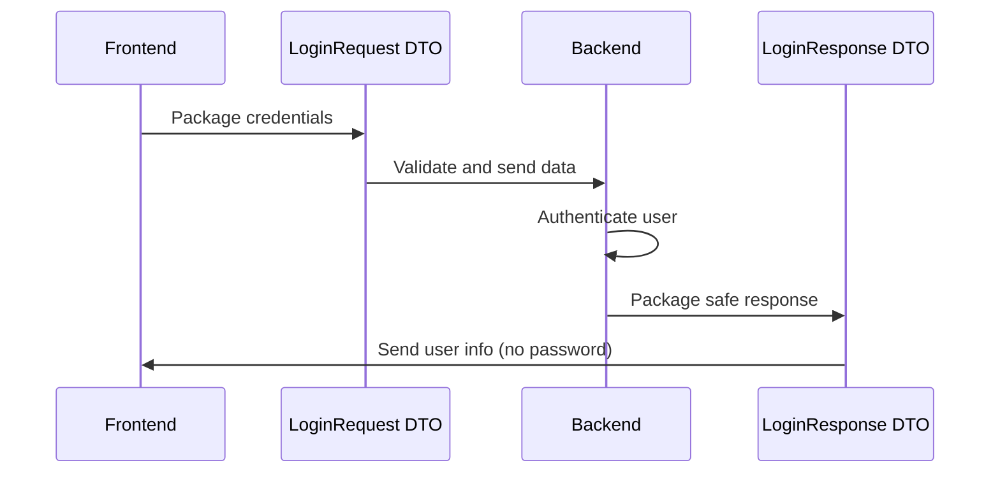

# Chapter 3: Data Transfer Objects (DTOs)

After learning about [Data Models](02_data_models_.md) and how they organize information in our database, we now need to understand how to safely move this information around our application. This chapter explores **Data Transfer Objects (DTOs)** - the specialized envelopes we use to package and transfer data between different parts of our system.

## What Problem Does This Solve?

Imagine you're a bank teller, and customers need to make different types of transactions. You wouldn't use the same form for a loan application and a simple deposit, right? Each transaction needs its own specialized form that asks for exactly the right information - no more, no less.

Similarly, when someone logs into our healthcare application, we need different "forms" for different purposes:
- A **login form** that collects username, password, and facility ID
- A **login response** that sends back user information (but never the password!)
- A **session info packet** that tells the frontend who's currently logged in

DTOs are like these specialized forms - they define exactly what information travels between our frontend and backend for each specific purpose, ensuring secure and organized communication.

## Key Concepts Breakdown

Let's explore our three main DTOs that handle the login process:

### 1. LoginRequest - The Login Application Form

The `LoginRequest` DTO is like a login application form that collects exactly what we need to authenticate someone:

```java
public class LoginRequest {
    @NotBlank(message = "Username is required")
    private String username;
    
    @NotBlank(message = "Password is required") 
    private String password;
    
    @NotNull(message = "Facility ID is required")
    private Long facilityId;
}
```

This form has three required fields with built-in validation. It's like a paper form that won't be accepted unless all sections are filled out properly.

### 2. LoginResponse - The Welcome Package

The `LoginResponse` DTO is like a welcome package sent back after successful login:

```java
public class LoginResponse {
    private Long userId;
    private String username;
    private String role;
    private String facilityName;
    private String message;
}
```

Notice what's NOT here - no password! This package only contains safe information that the frontend needs to welcome the user and set up their session.

### 3. SessionResponse - The Identity Badge

The `SessionResponse` DTO acts like a digital identity badge that tells the frontend who's currently logged in:

```java
public class SessionResponse {
    private Long userId;
    private String username;
    private String role;
    private Boolean isActive;
}
```

This badge contains just enough information for the frontend to display the user's name, show appropriate menus based on their role, and confirm they have an active session.

## How DTOs Protect Our System

DTOs act as security filters, ensuring only appropriate information travels between system components. Here's how they provide protection:

### Safe Information Transfer

```java
// This DTO only exposes safe user information
LoginResponse response = LoginResponse.builder()
    .userId(user.getUserAccountId())
    .username(user.getUsername())
    .role(user.getRole())
    .build();
```

The password from our `UserAccount` model never appears in the response. The DTO acts like a privacy filter, only showing what the frontend actually needs.

### Built-in Validation

```java
@NotBlank(message = "Username is required")
private String username;
```

Each DTO field can have validation rules. This means invalid data gets caught immediately, like a bouncer checking IDs at a club entrance.

## Step-by-Step Login Flow with DTOs

Let's see how these DTOs work together during a typical login process:



### Step 1: Packaging the Login Request

When a user submits the login form, the frontend creates a `LoginRequest` DTO:

```java
LoginRequest request = new LoginRequest();
request.setUsername("john.doe");
request.setPassword("secretPassword");
request.setFacilityId(123L);
```

This packages the user's credentials into a standardized format that the backend expects. It's like filling out a standard loan application that the bank can process automatically.

### Step 2: Backend Processing

The backend receives the DTO and validates it automatically:

```java
public LoginResponse authenticate(LoginRequest request) {
    // Validation happens automatically
    // Find user in database
    UserAccount user = findUser(request.getUsername(), 
                               request.getFacilityId());
    // Return safe response
    return createLoginResponse(user);
}
```

The validation annotations ensure all required fields are present before any processing begins.

### Step 3: Creating the Safe Response

After successful authentication, the backend creates a response DTO:

```java
LoginResponse response = LoginResponse.builder()
    .userId(user.getUserAccountId())
    .username(user.getUsername())
    .role(user.getRole())
    .facilityName(user.getFacility().getName())
    .message("Login successful")
    .build();
```

This response contains everything the frontend needs to welcome the user and set up their session, but nothing sensitive.

## Under the Hood: DTO Validation

DTOs include powerful validation features that automatically check data quality:

### Required Field Validation

```java
@NotBlank(message = "Username is required")
private String username;
```

This annotation ensures the username field is not empty, null, or just whitespace. If validation fails, the user gets a helpful error message.

### Custom Validation Rules

```java
@NotNull(message = "Facility ID is required")
private Long facilityId;
```

This ensures the facility ID is provided and is a valid number. The system won't even attempt authentication without a proper facility ID.

## Real-World Example: Session Management

Let's see how the `SessionResponse` DTO helps manage user sessions:

```java
public SessionResponse getCurrentSession(Long userId) {
    UserAccount user = userRepository.findById(userId);
    
    return SessionResponse.builder()
        .userId(user.getUserAccountId())
        .username(user.getUsername())
        .role(user.getRole())
        .isActive(user.getIsActive())
        .build();
}
```

This method creates a session DTO that the frontend can use to:
- Display the user's name in the header
- Show appropriate navigation menus based on their role  
- Verify their session is still active

### Frontend Usage

The frontend receives this DTO and uses it to configure the user interface:

```typescript
// Frontend receives the SessionResponse DTO
const sessionData = {
    userId: 123,
    username: "john.doe",
    role: "nurse",
    isActive: true
};

// Use the data to customize the interface
if (sessionData.role === "nurse") {
    showNurseMenu();
}
```

The frontend knows exactly what fields to expect because the DTO provides a clear contract.

## Advanced DTO Features

### Builder Pattern for Easy Creation

```java
LoginResponse response = LoginResponse.builder()
    .userId(123L)
    .username("john.doe")
    .role("nurse")
    .message("Welcome back!")
    .build();
```

The builder pattern makes creating DTOs easy and readable. You can set exactly the fields you need without complicated constructors.

### Automatic JSON Conversion

```java
@Data
@NoArgsConstructor
@AllArgsConstructor
public class LoginRequest {
    // Fields automatically convert to/from JSON
}
```

These annotations automatically handle converting DTOs to and from JSON for web requests. The frontend can send JSON, and it automatically becomes a DTO object on the backend.

## Security Benefits of DTOs

DTOs provide several layers of security:

### 1. Information Filtering
Only safe, relevant data is transferred between system components. Sensitive database details never leak to the frontend.

### 2. Input Validation
Invalid or malicious data is caught at the DTO level before it can reach business logic or the database.

### 3. Clear Contracts
Each DTO defines exactly what data is expected, preventing confusion and reducing bugs.

### 4. Type Safety
DTOs ensure data has the correct types (strings, numbers, etc.) preventing type-related errors.

## Key Benefits

Data Transfer Objects provide our application with:

- **Security**: Sensitive information like passwords never appear in response DTOs
- **Validation**: Built-in checks ensure data quality before processing
- **Clarity**: Each DTO has a specific purpose and clear structure
- **Maintainability**: Changes to database models don't affect API contracts
- **Type Safety**: Strong typing prevents common data-related bugs

## Conclusion

Data Transfer Objects act like specialized envelopes that safely package information for specific purposes. They ensure our login system transfers exactly the right information at each step - collecting credentials securely, validating input automatically, and responding with safe user data.

DTOs bridge the gap between our organized [Data Models](02_data_models_.md) and the secure communication our application needs. They transform database information into safe, purpose-built packages that different parts of our system can confidently exchange.

In our next chapter, [Error Handling Framework](04_error_handling_framework_.md), we'll explore how our application gracefully handles problems that can occur during the authentication process, providing helpful feedback when things don't go as expected.

