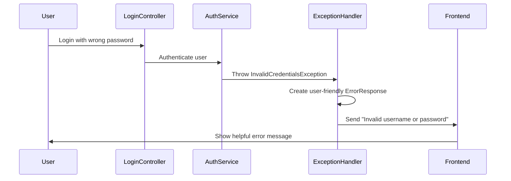

# Chapter 4: Error Handling Framework

After learning about [Data Transfer Objects (DTOs)](03_data_transfer_objects__dtos__.md) and how they safely package information, we need to address what happens when things don't go according to plan. This chapter explores the **Error Handling Framework** - our application's comprehensive customer service system that catches problems and provides helpful, user-friendly responses.

## What Problem Does This Solve?

Imagine you're running a hotel front desk. Throughout the day, various problems occur:
- A guest tries to check in with invalid reservation details
- Someone attempts to access a room they don't have permission for
- The hotel's booking system temporarily goes down

Without a proper system, each staff member might handle these problems differently. Some might give cryptic responses like "Error 401" or "System failure," while others might not log the incidents for later review. Guests would be confused and frustrated.

This is exactly what happens in web applications without proper error handling! Users might see technical error codes instead of helpful messages, and developers have no way to track and fix problems. Our Error Handling Framework solves this by acting like a professional customer service system that:

- Catches all problems automatically
- Translates technical errors into friendly messages
- Logs incidents for debugging and improvement
- Provides consistent, helpful responses to users

## Key Concepts Breakdown

Let's break down our error handling system into three main components that work together:

### 1. Custom Exceptions - Problem Identification Cards

Custom exceptions are like specific incident report cards that clearly identify what went wrong:

```java
public class InvalidCredentialsException extends RuntimeException {
    public InvalidCredentialsException(String message) {
        super(message);
    }
}
```

This creates a specific type of problem card for login failures. When someone enters wrong credentials, the system creates this exception instead of a generic "something went wrong" message.

### 2. Global Exception Handler - The Customer Service Manager

The `GlobalExceptionHandler` is like a customer service manager who knows exactly how to respond to each type of problem:

```java
@RestControllerAdvice
public class GlobalExceptionHandler {
    @ExceptionHandler(InvalidCredentialsException.class)
    public ResponseEntity<ErrorResponse> handleInvalidCredentials() {
        // Transform technical error into friendly response
    }
}
```

This manager intercepts all problems automatically and provides appropriate, consistent responses based on the type of issue.

### 3. Error Response DTO - The Professional Reply

The `ErrorResponse` DTO is like a standardized customer service reply that always includes helpful information:

```java
public class ErrorResponse {
    private String correlationId;
    private String errorCode;
    private String message;
    private String remediation;
}
```

Every error response includes a tracking ID, a clear message about what happened, and suggestions for how to fix the problem.

## How It All Works Together

Let's walk through what happens when someone tries to log in with incorrect credentials:



## Step-by-Step Implementation

### Step 1: Creating Specific Problem Types

Our system defines specific exceptions for different types of problems:

```java
public class InactiveAccountException extends RuntimeException {
    private final Long userId;
    
    public InactiveAccountException(String message, Long userId) {
        super(message);
        this.userId = userId;
    }
}
```

This creates a specific exception for when someone tries to log in with a deactivated account. The exception includes the user ID for logging purposes, like writing down the guest's name on an incident report.

### Step 2: Throwing Meaningful Exceptions

When problems occur in our authentication service, we throw specific exceptions:

```java
public LoginResponse authenticate(LoginRequest request) {
    UserAccount user = findUser(request.getUsername());
    
    if (!user.getIsActive()) {
        throw new InactiveAccountException("Account is inactive", user.getId());
    }
}
```

Instead of returning a generic error, we throw a specific `InactiveAccountException` that clearly identifies the problem. This is like a hotel clerk immediately identifying "this guest's membership has been suspended" rather than just saying "access denied."

### Step 3: Handling Problems Gracefully

The Global Exception Handler catches these specific problems and creates helpful responses:

```java
@ExceptionHandler(InactiveAccountException.class)
public ResponseEntity<ErrorResponse> handleInactiveAccount(InactiveAccountException ex) {
    
    ErrorResponse response = ErrorResponse.builder()
        .errorCode("ACCOUNT_INACTIVE")
        .message("Account is inactive")
        .remediation("Please contact your system administrator")
        .build();
        
    return ResponseEntity.status(HttpStatus.FORBIDDEN).body(response);
}
```

This handler creates a professional, helpful response that tells the user exactly what's wrong and what they should do about it.

## Under the Hood: The Complete Error Flow

When an error occurs, here's the detailed process our framework follows:

1. **Problem Detection**: The authentication service identifies a specific issue (wrong password, inactive account, etc.)
2. **Exception Creation**: A custom exception is thrown with relevant details
3. **Automatic Interception**: The Global Exception Handler automatically catches the exception
4. **Response Creation**: A user-friendly ErrorResponse DTO is built with helpful information
5. **Logging**: The incident is logged with tracking information for debugging
6. **User Notification**: The frontend receives a clear, actionable error message

### Deep Dive: Exception Handler Processing

Let's examine how the exception handler transforms technical problems into user-friendly responses:

```java
@ExceptionHandler(InvalidCredentialsException.class)
public ResponseEntity<ErrorResponse> handleInvalidCredentials() {
    String correlationId = getOrGenerateCorrelationId();
    
    logger.warn("Invalid credentials - correlationId: {}", correlationId);
    
    ErrorResponse response = ErrorResponse.builder()
        .correlationId(correlationId)
        .errorCode("INVALID_CREDENTIALS")
        .message("Invalid username or password")
        .remediation("Please verify your credentials and try again")
        .timestamp(LocalDateTime.now())
        .build();
        
    return ResponseEntity.status(HttpStatus.UNAUTHORIZED).body(response);
}
```

This handler does several important things:
1. **Generates a tracking ID** so support staff can find this specific incident in logs
2. **Logs the problem** for developers to analyze patterns and fix issues
3. **Creates a helpful message** that doesn't reveal sensitive information
4. **Provides remediation steps** so users know what to do next
5. **Returns appropriate HTTP status** for proper browser/API client handling

## Advanced Features: Validation Error Handling

Our framework also handles validation errors automatically:

```java
@ExceptionHandler(MethodArgumentNotValidException.class)
public ResponseEntity<ErrorResponse> handleValidation(MethodArgumentNotValidException ex) {
    
    String details = ex.getBindingResult().getFieldErrors().stream()
        .map(FieldError::getDefaultMessage)
        .collect(Collectors.joining("; "));
        
    ErrorResponse response = ErrorResponse.builder()
        .errorCode("VALIDATION_ERROR")
        .message("Request validation failed")
        .details(details)
        .build();
        
    return ResponseEntity.status(HttpStatus.BAD_REQUEST).body(response);
}
```

This handler automatically catches validation problems from our [DTOs](03_data_transfer_objects__dtos__.md) and combines all the validation error messages into one helpful response. It's like a form checker that points out all the missing or incorrect fields at once.

## Real-World Example: Forbidden Access Handling

Let's see how our framework handles authorization problems:

```java
public class ForbiddenAccessException extends RuntimeException {
    private final Long userId;
    private final Long facilityId;
    private final String resource;
    
    public ForbiddenAccessException(String message, Long userId, Long facilityId, String resource) {
        super(message);
        this.userId = userId;
        this.facilityId = facilityId;
        this.resource = resource;
    }
}
```

This exception captures detailed information about what access was denied, like recording that "User #123 from Facility #456 tried to access the admin panel."

The handler transforms this into a user-friendly response:

```java
@ExceptionHandler(ForbiddenAccessException.class)
public ResponseEntity<ErrorResponse> handleForbiddenAccess(ForbiddenAccessException ex) {
    
    logger.warn("Forbidden access - userId: {}, facilityId: {}, resource: {}", 
               ex.getUserId(), ex.getFacilityId(), ex.getResource());
               
    ErrorResponse response = ErrorResponse.builder()
        .errorCode("FORBIDDEN_ACCESS")
        .message("Access denied")
        .remediation("Contact your administrator if you need access")
        .build();
        
    return ResponseEntity.status(HttpStatus.FORBIDDEN).body(response);
}
```

Users see a clear message, while detailed logging helps administrators understand access patterns and potential security issues.

## Correlation IDs: Tracking System

Every error gets a unique correlation ID for tracking:

```java
private String getOrGenerateCorrelationId() {
    String correlationId = MDC.get("correlationId");
    if (correlationId == null) {
        correlationId = UUID.randomUUID().toString();
    }
    return correlationId;
}
```

This is like giving every incident report a unique case number. When users contact support, they can reference this ID, and support staff can immediately find the exact problem in the logs.

## Security Considerations

Our error framework includes important security features:

### 1. Information Protection
Error messages never reveal sensitive information like whether a username exists in the system:

```java
// Always returns the same generic message
.message("Invalid username or password")
```

### 2. Detailed Logging
While users see generic messages, detailed information is logged for administrators:

```java
logger.warn("Invalid credentials - correlationId: {}, username: {}", 
           correlationId, request.getUsername());
```

### 3. Rate Limiting Integration
The framework works with security systems to detect suspicious patterns like repeated login failures.

## Key Benefits

The Error Handling Framework provides our application with:

- **User-Friendly Experience**: Technical errors become helpful, actionable messages
- **Consistent Responses**: All errors follow the same format and tone
- **Debugging Support**: Detailed logging with correlation IDs for tracking issues
- **Security**: Sensitive information is protected while still providing useful feedback
- **Maintainability**: Adding new error types is straightforward and systematic

## Frontend Integration

The frontend receives consistently structured error responses:

```typescript
// Frontend always knows what to expect
interface ErrorResponse {
  correlationId: string;
  errorCode: string;
  message: string;
  remediation?: string;
}
```

This allows the frontend to display errors consistently and even provide specialized handling for specific error codes.

## Conclusion

The Error Handling Framework acts as our application's professional customer service system, transforming technical problems into helpful, user-friendly responses. It ensures that when things go wrong during the authentication process we learned about in previous chapters, users receive clear guidance instead of confusing error codes.

Just like a well-trained customer service team makes customers feel supported even when problems occur, our error handling framework maintains user confidence by providing clear, actionable feedback while protecting sensitive information and helping developers improve the system.

In our next chapter, [Authentication System](05_authentication_system_.md), we'll explore how our application verifies user credentials and creates secure sessions, building upon the solid foundation of error handling we've established here.

