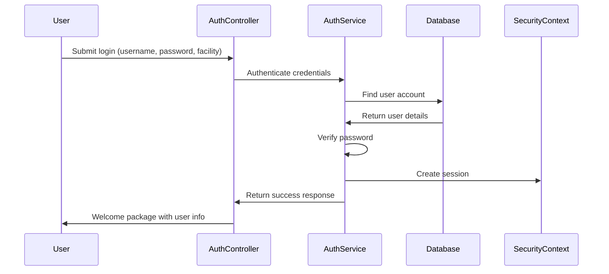

# Chapter 5: Authentication System

After learning about the [Error Handling Framework](04_error_handling_framework_.md) and how it gracefully manages problems, we're now ready to explore the heart of our security system - the **Authentication System**. This is the digital security checkpoint that verifies who users are and grants them access to our healthcare application.

## What Problem Does This Solve?

Imagine you're managing security for a hospital. Every day, dozens of doctors, nurses, and administrators need access to different areas and patient information. You need a system that:

- Checks each person's ID badge and password at the entrance
- Remembers who's inside the building so they don't have to show ID at every door
- Tracks when people arrive and leave for security logs
- Only allows active employees to enter (not former employees)
- Protects sensitive patient data from unauthorized access

This is exactly what our Authentication System does for web applications! It acts like a sophisticated digital security checkpoint that verifies user credentials, creates secure sessions, and ensures only authorized healthcare staff can access the system.

## Key Concepts Breakdown

Let's break down our authentication system into three main components that work together like a complete security operation:

### 1. The Login Process - Your Digital Security Guard

The login process is like a security guard at the hospital entrance who checks credentials and decides whether to grant access:

```java
public LoginResponse login(String username, String password, Long facilityId) {
    UserAccount user = findUser(username, facilityId);
    validatePassword(password, user);
    createSession(user);
    return welcomePackage(user);
}
```

This code shows the four main steps: find the person's record, verify their password, create a security session, and send back a welcome package with their information.

### 2. Session Management - Your Digital Security Badge

Once someone logs in successfully, they receive a digital security badge (session) that lets them move around the application without re-entering their password:

```java
Authentication authentication = new UsernamePasswordAuthenticationToken(
    user.getUserAccountId(),
    null,
    Collections.singletonList(new SimpleGrantedAuthority("ROLE_" + user.getRole()))
);
SecurityContextHolder.getContext().setAuthentication(authentication);
```

This creates a digital badge that contains their user ID, no password (for security), and their role (like "nurse" or "doctor"). The system remembers this badge for their entire visit.

### 3. Session Validation - Your Ongoing Security Monitoring

Throughout their visit, the system can check if someone is still authorized to be there:

```java
public SessionResponse getCurrentSession() {
    Authentication auth = SecurityContextHolder.getContext().getAuthentication();
    Long userId = (Long) auth.getPrincipal();
    UserAccount user = findCurrentUser(userId);
    return createSessionInfo(user);
}
```

This is like a security system that can instantly tell you "Yes, John Doe is currently authorized and his badge is valid" or "No, this person is not currently logged in."

## How It All Works Together

Let's walk through what happens when a healthcare worker tries to log into our system:



## Step-by-Step Implementation

### Step 1: Processing the Login Request

When someone submits their credentials, our AuthController acts like the reception desk:

```java
@PostMapping("/login")
public ResponseEntity<LoginResponse> login(@Valid @RequestBody LoginRequest request) {
    securityLogger.info("Login attempt - username: {}, facility: {}", 
                       request.getUsername(), request.getFacilityId());
    
    LoginResponse response = authService.login(
        request.getUsername(),
        request.getPassword(), 
        request.getFacilityId()
    );
    
    return ResponseEntity.ok(response);
}
```

This controller logs the login attempt (for security monitoring), passes the credentials to the authentication service, and returns the response. It's like a receptionist taking someone's ID, calling security to verify it, and then either welcoming them or explaining why access was denied.

### Step 2: Verifying User Credentials

The AuthService performs the actual security verification:

```java
UserAccount user = userAccountRepository.findByUsernameAndFacilityId(username, facilityId)
    .orElseThrow(() -> new InvalidCredentialsException("Invalid username or password"));

if (!passwordEncoder.matches(password, user.getPasswordHash())) {
    throw new InvalidCredentialsException("Invalid username or password");
}
```

This code first looks up the person's employee record in the specific facility, then verifies their password. Notice it gives the same error message whether the username doesn't exist or the password is wrong - this prevents hackers from figuring out which usernames are valid.

### Step 3: Checking Account Status

Before granting access, the system verifies the account is still active:

```java
if (!user.getIsActive()) {
    throw new InactiveAccountException("Account is inactive", user.getUserAccountId());
}
```

This is like checking if someone's employee badge is still valid or if they've been terminated. Only active employees can log in.

### Step 4: Creating the Security Session

Once everything checks out, the system creates a secure session:

```java
user.setLastLoginAt(LocalDateTime.now());
userAccountRepository.save(user);

Authentication authentication = new UsernamePasswordAuthenticationToken(
    user.getUserAccountId(),
    null,
    Collections.singletonList(new SimpleGrantedAuthority("ROLE_" + user.getRole()))
);
SecurityContextHolder.getContext().setAuthentication(authentication);
```

This code updates their last login time (for security tracking) and creates a digital security badge that contains their ID and role. The badge is stored in the SecurityContext where the application can access it.

## Under the Hood: The Complete Authentication Flow

When a user submits their login credentials, here's the detailed process our system follows:

1. **Request Reception**: The AuthController receives the login request with username, password, and facility ID
2. **Security Logging**: The system logs the login attempt for security monitoring
3. **User Lookup**: The service searches for a user account matching the username and facility
4. **Password Verification**: The submitted password is securely compared with the stored password hash
5. **Account Validation**: The system checks if the account is active and authorized
6. **Session Creation**: A secure authentication token is created and stored in the security context
7. **Activity Tracking**: The user's last login time is updated in the database
8. **Response Building**: A safe response package is created with user information (no sensitive data)

### Deep Dive: Password Security

Our system uses advanced password security measures:

```java
if (!passwordEncoder.matches(password, user.getPasswordHash())) {
    securityLogger.warn("Login failed - password mismatch - userId: {}", user.getUserAccountId());
    throw new InvalidCredentialsException("Invalid username or password");
}
```

The `passwordEncoder.matches()` method securely compares passwords without ever storing the actual password in memory or logs. It's like having a security system that can verify someone's fingerprint without storing the actual fingerprint image.

### Session Information Management

When the frontend needs to know who's currently logged in, it calls the session endpoint:

```java
@GetMapping("/session")
public ResponseEntity<SessionResponse> getSession() {
    SessionResponse response = authService.getCurrentSession();
    return ResponseEntity.ok(response);
}
```

This returns current user information so the frontend can display their name, show appropriate menus based on their role, and verify they're still logged in.

## Real-World Example: Complete Login Process

Let's see how all these pieces work together when Dr. Sarah Johnson tries to log into the system:

### Frontend Login Request

The frontend creates a login request:

```typescript
const loginCredentials = {
    username: "sarah.johnson",
    password: "securePassword123",
    facilityId: 1
};

const response = await authApi.login(loginCredentials);
```

This packages Dr. Johnson's credentials using our [Data Transfer Objects (DTOs)](03_data_transfer_objects__dtos__.md) and sends them securely to the backend.

### Backend Authentication Process

The backend receives and processes the request:

```java
// Find Dr. Johnson's account
UserAccount user = userAccountRepository.findByUsernameAndFacilityId("sarah.johnson", 1L);

// Verify her password
passwordEncoder.matches("securePassword123", user.getPasswordHash()); // true

// Check if account is active
user.getIsActive(); // true

// Create session and welcome package
LoginResponse.builder()
    .userId(user.getUserAccountId())
    .username("sarah.johnson")
    .role("doctor")
    .facilityName("Downtown Medical Center")
    .message("Login successful")
    .build();
```

Dr. Johnson's credentials check out, so the system creates her session and sends back a welcome package with her information.

## Advanced Features: Security Logging

Our authentication system includes comprehensive security logging:

```java
securityLogger.info("Login successful - correlationId: {}, userId: {}, facilityId: {}, role: {}",
        correlationId, user.getUserAccountId(), user.getFacility().getFacilityId(), user.getRole());
```

This creates detailed audit trails that help administrators:
- Monitor who's accessing the system
- Detect suspicious login patterns
- Track access across different facilities
- Investigate security incidents using correlation IDs

### Logout Process

When users finish their work, they can securely log out:

```java
public void logout() {
    Authentication authentication = SecurityContextHolder.getContext().getAuthentication();
    if (authentication != null && authentication.isAuthenticated()) {
        Long userId = (Long) authentication.getPrincipal();
        securityLogger.info("Logout successful - userId: {}", userId);
    }
    SecurityContextHolder.clearContext();
}
```

This removes their security session and logs the logout event, like returning their visitor badge when leaving the building.

## Integration with Error Handling

Our authentication system seamlessly integrates with the [Error Handling Framework](04_error_handling_framework_.md) we learned about:

```java
try {
    UserAccount user = userAccountRepository.findByUsernameAndFacilityId(username, facilityId)
        .orElseThrow(() -> new InvalidCredentialsException("Invalid username or password"));
} catch (InvalidCredentialsException ex) {
    // Error framework automatically converts this to user-friendly message
    throw ex;
}
```

When authentication fails, our custom exceptions are automatically caught by the error handling system and converted into helpful user messages.

## Session Persistence and Security

The authentication system creates persistent sessions that survive page refreshes:

```java
Authentication authentication = new UsernamePasswordAuthenticationToken(
    user.getUserAccountId(),  // The user's ID
    null,                    // No password stored in session
    Collections.singletonList(new SimpleGrantedAuthority("ROLE_" + user.getRole()))
);
```

The session stores the user ID and role but never the password. This way, even if someone gains access to session data, they can't discover the user's actual password.

## Key Benefits

The Authentication System provides our application with:

- **Secure Access Control**: Only authorized users with valid credentials can access the system
- **Session Management**: Users stay logged in across page navigation without re-entering passwords
- **Audit Trail**: Comprehensive logging tracks all authentication activity for security monitoring
- **Role-Based Access**: Different user roles (doctor, nurse, admin) get appropriate system access
- **Multi-Facility Support**: Healthcare workers can access their specific facility's data
- **Security Best Practices**: Password hashing, session tokens, and secure logout procedures

## Frontend Integration

The frontend uses our authentication system through simple API calls:

```typescript
// Login process
const { user, login } = useAuth();
await login("sarah.johnson", "password");

// Check current session
const currentUser = await authApi.getCurrentUser();

// Logout process
await authApi.logout();
```

This provides a seamless user experience where healthcare workers can focus on their important work rather than dealing with complex security procedures.

## Conclusion

The Authentication System serves as our application's comprehensive security checkpoint, combining credential verification, session management, and security logging into a seamless experience. It transforms the complex process of user authentication into a simple, secure workflow that protects sensitive healthcare information while providing healthcare workers with easy access to the tools they need.

Just like a well-organized hospital security system keeps patients safe while allowing staff to work efficiently, our authentication system protects our application data while providing a smooth user experience. It builds upon the solid foundation of [Data Models](02_data_models_.md), [DTOs](03_data_transfer_objects__dtos__.md), and [Error Handling](04_error_handling_framework_.md) we've learned about in previous chapters.

In our next chapter, [Authorization Infrastructure](06_authorization_infrastructure_.md), we'll explore how our application determines what authenticated users are allowed to do once they're inside the system - like deciding whether a nurse can access patient records or whether an administrator can modify system settings.

