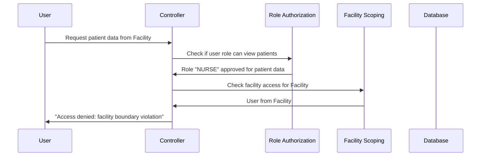

# Chapter 6: Authorization Infrastructure

After learning about the [Authentication System](05_authentication_system_.md) and how it verifies who users are, we now need to explore what happens next - determining what authenticated users are allowed to do. This chapter covers the **Authorization Infrastructure** - a sophisticated access control system that acts like a combination of job-based permissions and building security cards to ensure users can only access what they're supposed to.

## What Problem Does This Solve?

Imagine you're managing a large hospital complex with multiple buildings. You have different types of staff:
- Doctors who can access patient records and treatment areas
- Nurses who can view patient information but can't modify certain records
- Administrators who can manage system settings but shouldn't see patient data

Additionally, each staff member should only access information from their specific building. A nurse from Building A shouldn't be able to view patient records from Building B, even if they have the right job title.

You need a security system that checks two things:
1. **Job-based permissions**: "Is this person's role allowed to perform this action?"
2. **Building access rights**: "Is this person allowed to access data from this specific building?"

This is exactly what our Authorization Infrastructure does! It provides a two-layer security system that ensures healthcare workers can only perform actions they're qualified for and only access data from their assigned facility.

## Key Concepts Breakdown

Our authorization system has two main security layers that work together:

### 1. Role-Based Authorization - Your Job Title Permissions

Role-based authorization is like checking if someone's job title gives them permission to perform specific tasks:

```java
public void validateRole(String requiredRole, String operation) {
    String userRole = getCurrentUserRole();
    
    if (!userRole.equals(requiredRole)) {
        throw new ForbiddenAccessException("Insufficient privileges");
    }
}
```

This code checks if the current user's role (like "ADMIN") matches what's required for the operation (like accessing system settings). It's like asking "Is this person an administrator?" before letting them change system configurations.

### 2. Facility Scoping - Your Building Access Card

Facility scoping ensures users can only access data from their assigned facility:

```java
public void validateFacilityAccess(Long requestedFacilityId, String resourceType) {
    Long userFacilityId = getCurrentUserFacilityId();
    
    if (!userFacilityId.equals(requestedFacilityId)) {
        throw new ForbiddenAccessException("Facility boundary violation");
    }
}
```

This code checks if the user is trying to access data from their own facility. It's like ensuring a key card for Building A can't open doors in Building B.

## How the Two Layers Work Together

Let's see how both authorization layers protect our system when someone tries to access patient records:



## Step-by-Step Implementation

### Step 1: Checking Role-Based Permissions

When someone tries to perform an action, we first check their job-based permissions:

```java
@Service
public class RoleAuthorizationService {
    public void validateRole(String requiredRole, String operation) {
        String userRole = getCurrentUserRole();
        
        if (!userRole.equals(requiredRole)) {
            logger.warn("Role check failed - user: {}, required: {}", 
                       userRole, requiredRole);
            throw new ForbiddenAccessException("Insufficient privileges");
        }
    }
}
```

This service acts like a security guard who checks if someone's job badge gives them permission for specific tasks. If a nurse tries to access administrator functions, this check will deny the request.

### Step 2: Validating Facility Access

After confirming the user has the right job permissions, we check if they can access data from the requested facility:

```java
@Service  
public class FacilityScopingService {
    public void validateFacilityAccess(Long requestedFacilityId, String resourceType) {
        Long userFacilityId = getCurrentUserFacilityId();
        
        if (!userFacilityId.equals(requestedFacilityId)) {
            logger.warn("Facility boundary violation - user facility: {}, requested: {}", 
                       userFacilityId, requestedFacilityId);
            throw new ForbiddenAccessException("Facility boundary violation");
        }
    }
}
```

This service ensures that even if someone has the right job title, they can only access data from their own facility. It's like checking that their building key card matches the building they're trying to enter.

### Step 3: Combining Both Security Layers

In practice, both authorization layers work together to protect sensitive operations:

```java
public PatientData getPatientData(Long patientId, Long facilityId) {
    // Layer 1: Check if user's role can access patient data
    roleAuth.validateRole("NURSE", "view_patient_data");
    
    // Layer 2: Check if user can access this facility's data  
    facilityScoping.validateFacilityAccess(facilityId, "patient_data");
    
    // Both checks passed - proceed with request
    return patientRepository.findByIdAndFacilityId(patientId, facilityId);
}
```

This code demonstrates how both security layers must pass before granting access to sensitive patient information.

## Under the Hood: The Complete Authorization Flow

When a user makes a request that needs authorization, here's what happens step by step:

1. **Request Reception**: The system receives a request for a protected resource
2. **Authentication Check**: Verify the user is logged in (from our [Authentication System](05_authentication_system_.md))
3. **Role Validation**: Check if the user's job role has permission for this operation
4. **Facility Validation**: Verify the user can access data from the requested facility
5. **Access Decision**: Grant or deny access based on both security layers
6. **Security Logging**: Record the authorization decision for audit purposes
7. **Response**: Return the requested data or an appropriate error message

### Deep Dive: Role Authorization Implementation

Let's examine how the role authorization service determines if someone has the right job permissions:

```java
public void validateRole(String requiredRole, String operation) {
    Authentication auth = SecurityContextHolder.getContext().getAuthentication();
    
    String userRole = auth.getAuthorities().stream()
        .map(GrantedAuthority::getAuthority)
        .filter(authority -> authority.startsWith("ROLE_"))
        .map(authority -> authority.substring(5)) // Remove "ROLE_" prefix
        .findFirst()
        .orElse(null);
}
```

This code extracts the user's role from their security session (created during login in our [Authentication System](05_authentication_system_.md)). It looks for authorities that start with "ROLE_" (like "ROLE_NURSE") and extracts just the role name ("NURSE").

```java
if (!userRole.equals(requiredRole)) {
    throw new ForbiddenAccessException(
        "Access denied: insufficient role privileges",
        userId, null, operation, 
        "User role '" + userRole + "' does not match required role '" + requiredRole + "'"
    );
}
```

If the user's role doesn't match what's required, the system creates a detailed exception that our [Error Handling Framework](04_error_handling_framework_.md) will convert into a user-friendly message.

### Deep Dive: Facility Scoping Implementation

The facility scoping service ensures users stay within their assigned facility boundaries:

```java
public void validateFacilityAccess(Long requestedFacilityId, String resourceType) {
    UserAccount user = userAccountRepository.findById(userId)
        .orElseThrow(() -> new ForbiddenAccessException("User not found"));
    
    Long userFacilityId = user.getFacility().getFacilityId();
    
    if (!userFacilityId.equals(requestedFacilityId)) {
        throw new ForbiddenAccessException("Facility boundary violation");
    }
}
```

This code looks up the user's assigned facility from our [Data Models](02_data_models_.md) and compares it with the facility they're trying to access. It's like checking if someone's building access card matches the building they're trying to enter.

## Real-World Example: Patient Data Access

Let's see how our authorization infrastructure protects patient data in a realistic scenario:

### The Request

Dr. Smith (a doctor at Downtown Medical) tries to access patient records from Uptown Medical:

```java
@GetMapping("/patients/{patientId}")
public PatientData getPatient(@PathVariable Long patientId, 
                             @RequestParam Long facilityId) {
    
    // Authorization happens here
    return patientService.getPatientData(patientId, facilityId);
}
```

### Layer 1: Role Authorization

First, the system checks if Dr. Smith's role can access patient data:

```java
// Check: Does "DOCTOR" role have permission to view patient data?
roleAuth.validateRole("DOCTOR", "view_patient_data");
// Result: ✓ PASSED - Doctors can view patient data
```

Dr. Smith's job title gives him permission to view patient records, so the first security layer passes.

### Layer 2: Facility Scoping

Next, the system checks if Dr. Smith can access data from Uptown Medical:

```java
// Dr. Smith works at Downtown Medical (facility #1)
// But he's requesting data from Uptown Medical (facility #2)
facilityScoping.validateFacilityAccess(2L, "patient_data");
// Result: ✗ DENIED - Facility boundary violation
```

Even though Dr. Smith has the right job title, he's trying to access data from a different facility. The second security layer denies the request.

### The Security Response

The system logs the violation and returns an appropriate error:

```java
logger.warn("Facility boundary violation - userId: {}, userFacility: {}, requestedFacility: {}",
           userId, 1L, 2L);

throw new ForbiddenAccessException(
    "Access denied: facility boundary violation",
    userId, 2L, "patient_data",
    "User facility does not match requested resource facility"
);
```

Our [Error Handling Framework](04_error_handling_framework_.md) converts this technical exception into a user-friendly message like "Access denied. Please contact your administrator if you need access."

## Advanced Security Features

### Comprehensive Audit Logging

Our authorization infrastructure creates detailed security logs for compliance:

```java
logger.info("Authorization check - correlationId: {}, userId: {}, operation: {}, result: {}",
           correlationId, userId, operation, "ALLOWED");
```

This logging helps healthcare facilities:
- Track who accessed what patient data
- Investigate security incidents
- Meet healthcare compliance requirements
- Monitor access patterns across facilities

### Special Role Handling

The system includes special handling for roles that are still being defined:

```java
if ("SUPERVISOR".equals(userRole)) {
    throw new ForbiddenAccessException(
        "SUPERVISOR role capabilities not yet defined"
    );
}
```

This ensures that new or transitional roles don't accidentally get inappropriate access while their permissions are being configured.

## Integration with Other System Components

Our authorization infrastructure seamlessly integrates with other parts of our application:

### With Authentication System

Authorization builds directly on the session information created during login:

```java
// Authentication system stores this during login
Authentication auth = new UsernamePasswordAuthenticationToken(
    user.getUserAccountId(),
    null,
    Collections.singletonList(new SimpleGrantedAuthority("ROLE_" + user.getRole()))
);

// Authorization system reads this information
String userRole = auth.getAuthorities().stream()...
```

### With Error Handling Framework

Authorization exceptions are automatically handled by our error system:

```java
// Authorization throws specific exceptions
throw new ForbiddenAccessException("Access denied", userId, facilityId, resource, reason);

// Error framework converts to user-friendly response
{
    "errorCode": "FORBIDDEN_ACCESS",
    "message": "Access denied",
    "remediation": "Contact your administrator if you need access"
}
```

## Controller-Level Authorization

Controllers use both authorization services to protect endpoints:

```java
@PostMapping("/admin/settings")
public ResponseEntity<String> updateSettings(@RequestBody SettingsRequest request) {
    // Require ADMIN role for system settings
    roleAuth.validateRole("ADMIN", "update_system_settings");
    
    // Ensure admin can only modify their facility's settings
    facilityScoping.validateFacilityAccess(request.getFacilityId(), "system_settings");
    
    // Both authorization layers passed - proceed
    return ResponseEntity.ok("Settings updated");
}
```

This double-layer protection ensures that only facility administrators can modify settings, and they can only modify settings for their own facility.

## Key Benefits

The Authorization Infrastructure provides our application with:

- **Layered Security**: Two independent security layers provide defense in depth
- **Role-Based Access**: Users can only perform actions appropriate to their job function
- **Facility Isolation**: Prevents unauthorized cross-facility data access
- **Audit Compliance**: Comprehensive logging meets healthcare regulatory requirements
- **Error Integration**: Security violations become user-friendly error messages
- **Scalable Design**: Easy to add new roles or facilities without changing core logic

## Security Best Practices

Our authorization system follows security best practices:

### Deny by Default
If any authorization check fails, access is denied - there's no "maybe" or partial access.

### Detailed Logging
Every authorization decision is logged with correlation IDs for tracking and investigation.

### Clear Error Messages
Users receive helpful feedback without exposing sensitive system details.

### Separation of Concerns
Role-based and facility-based authorization are handled independently, making the system more maintainable and secure.

## Conclusion

The Authorization Infrastructure acts as our application's sophisticated security checkpoint system, combining job-based permissions with facility access controls to create comprehensive protection for sensitive healthcare data. It ensures that authenticated users from our [Authentication System](05_authentication_system_.md) can only access information they're authorized to see and only from their assigned facility.

Just like a well-designed hospital security system that checks both job credentials and building access cards, our authorization infrastructure provides multiple layers of protection while maintaining a smooth user experience for authorized healthcare workers.

This two-layer security model prevents common security problems like privilege escalation (users accessing functions beyond their job role) and data boundary violations (users accessing information from other facilities), making our healthcare application both secure and compliant with industry regulations.

In our next chapter, [API Communication Layer](07_api_communication_layer_.md), we'll explore how our frontend and backend communicate securely, building upon the authentication and authorization foundation we've established to create a complete, secure communication system.

