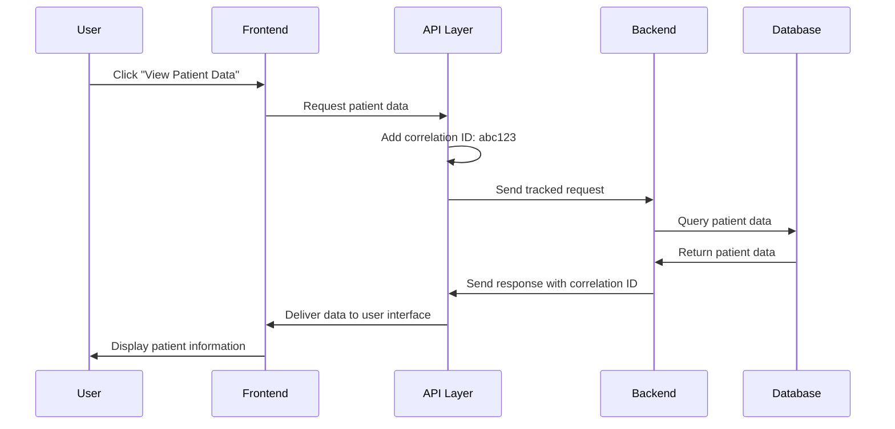

# Chapter 7: API Communication Layer

After mastering the [Authorization Infrastructure](06_authorization_infrastructure_.md) and how it controls access to our application, we now need to explore how the frontend and backend actually communicate with each other. This chapter introduces the **API Communication Layer** - a sophisticated postal service system that ensures reliable, trackable, and secure data exchange between different parts of our healthcare application.

## What Problem Does This Solve?

Imagine you're running a busy healthcare facility where doctors, nurses, and administrators constantly need to send important messages between different departments. Without a proper communication system, you might face these problems:

- Messages get lost in transit with no way to track them
- When the computer system goes down, nobody knows what to do
- Different departments handle errors inconsistently  
- When someone is denied access, they don't get redirected to the right place
- Important communications don't have tracking numbers for follow-up

You need a professional postal service that:
- Automatically adds tracking numbers to every message
- Handles delivery problems gracefully (like when a department is temporarily closed)
- Manages timeouts when messages take too long
- Provides detailed logs of all communication attempts
- Automatically redirects people to the right department when access is denied

This is exactly what our API Communication Layer does! It acts like a sophisticated postal service between our frontend (what users see) and backend (where data is processed), ensuring reliable and transparent communication even when problems occur.

## Key Concepts Breakdown

Let's break down our communication system into three main components that work like different parts of a postal service:

### 1. Correlation IDs - Your Package Tracking Numbers

Every request automatically gets a unique tracking number called a correlation ID:

```javascript
function generateCorrelationId() {
  const timestamp = Date.now();
  const counter = ++correlationIdCounter;
  const random = Math.random().toString(36).substring(2, 9);
  return `fe-${timestamp}-${counter}-${random}`;
}
```

This creates unique tracking numbers like `fe-1701234567-1-abc123d` for every request. Just like a package tracking number, this lets you follow exactly what happened to any specific communication between frontend and backend.

### 2. Request Interceptors - Your Automatic Mail Processing

Before any request leaves the frontend, our interceptor automatically adds tracking information and logging:

```javascript
axiosInstance.interceptors.request.use((config) => {
  if (!config.headers['X-Correlation-ID']) {
    const correlationId = generateCorrelationId();
    config.headers['X-Correlation-ID'] = correlationId;
  }
  return config;
});
```

This code automatically attaches a correlation ID to every outgoing request, like a postal worker automatically stamping every letter with a tracking number before it goes out for delivery.

### 3. Response Interceptors - Your Smart Error Handling Service

When responses come back (or when problems occur), our interceptor automatically handles them appropriately:

```javascript
axiosInstance.interceptors.response.use(
  (response) => response,  // Success - pass it through
  (error) => {
    if (error.response?.status === 401) {
      window.location.href = '/login';  // Auto-redirect to login
    }
    return Promise.reject(error);
  }
);
```

This interceptor acts like an intelligent mail sorting facility that automatically redirects undeliverable mail to the right department - in this case, sending users to login when they're not authorized.

## How It All Works Together

Let's walk through what happens when a nurse tries to access patient data through our communication system:



## Step-by-Step Implementation

### Step 1: Setting Up Automatic Tracking

Our communication layer automatically adds tracking to every request:

```javascript
axiosInstance.interceptors.request.use((config) => {
  const correlationId = generateCorrelationId();
  config.headers['X-Correlation-ID'] = correlationId;
  
  logger.info('Generated correlation ID for request', {
    correlation_id: correlationId,
    path: config.url
  });
  
  return config;
});
```

Every time the frontend sends a request to the backend, this code automatically generates a unique tracking ID and logs the event. It's like having a postal worker who automatically gives every package a tracking number and writes it in the logbook.

### Step 2: Handling Network Problems Gracefully

When network issues occur, our system provides helpful responses:

```javascript
if (error.code === 'ECONNABORTED' || error.message.includes('timeout')) {
  logger.error('Request timeout', {
    event: 'interceptor_timeout',
    correlation_id: correlationId,
    path: error.config?.url
  });
}
```

This code detects when requests take too long and logs detailed information about the timeout. Users get a friendly message instead of a confusing technical error, while developers get the tracking information they need to investigate the problem.

### Step 3: Automatic Authorization Handling

When users lose access or their session expires, the system automatically redirects them:

```javascript
if (status === 401) {
  logger.warn('401 Unauthorized - redirecting to login', {
    correlation_id: correlationId,
    path: error.config?.url
  });
  
  if (window.location.pathname !== '/login') {
    window.location.href = '/login';
  }
}
```

If someone tries to access something they're not authorized for (like what we learned about in [Authorization Infrastructure](06_authorization_infrastructure_.md)), they're automatically sent to the login page instead of seeing a confusing error message.

## Under the Hood: The Complete Communication Flow

When a healthcare worker makes a request through our application, here's the detailed process our communication layer follows:

1. **Request Preparation**: The frontend creates a request for data (like patient records)
2. **Automatic Tracking**: Our interceptor adds a correlation ID for tracking
3. **Security Headers**: Standard security headers are attached automatically
4. **Network Transmission**: The request travels to the backend with full tracking
5. **Response Processing**: The backend processes the request and sends back data
6. **Error Handling**: If problems occur, our interceptors provide appropriate responses
7. **Success Delivery**: Successful responses are delivered to the user interface
8. **Comprehensive Logging**: Every step is logged with correlation IDs for debugging

### Deep Dive: Correlation ID Generation

Let's examine how our tracking system creates unique IDs for every request:

```javascript
let correlationIdCounter = 0;

function generateCorrelationId() {
  const timestamp = Date.now();              // Current time: 1701234567890
  const counter = ++correlationIdCounter;    // Sequential number: 1, 2, 3...
  const random = Math.random().toString(36); // Random string: "abc123def"
  return `fe-${timestamp}-${counter}-${random}`;
}
```

This creates correlation IDs like `fe-1701234567890-1-abc123def` that include:
- `fe-` prefix identifying this came from the frontend
- Current timestamp for when the request was made  
- Sequential counter to ensure uniqueness even in rapid requests
- Random component for additional uniqueness

It's like a sophisticated package tracking system that ensures every communication can be uniquely identified and tracked through the entire system.

### Deep Dive: Error Response Processing

When problems occur, our communication layer transforms technical errors into helpful information:

```javascript
axiosInstance.interceptors.response.use(
  (response) => response,
  (error) => {
    const correlationId = error.config?.headers?.['X-Correlation-ID'];
    const status = error.response?.status;
    
    if (status === 403) {
      const errorMessage = error.response?.data?.message || 'Access forbidden';
      logger.error('403 Forbidden - authorization error', {
        correlation_id: correlationId,
        message: errorMessage
      });
    }
    
    return Promise.reject(error);
  }
);
```

This interceptor extracts the correlation ID from the failed request and logs detailed information about what went wrong. The correlation ID allows administrators to trace the exact request that failed, making debugging much easier.

## Real-World Example: Login Communication

Let's see how our communication layer handles the login process we learned about in the [Authentication System](05_authentication_system_.md):

### Frontend Login Request

When a user submits their credentials, the communication layer automatically handles the request:

```javascript
// User submits login form
const loginData = {
  username: "sarah.johnson",
  password: "securePassword",
  facilityId: 1
};

// Communication layer automatically adds tracking
const response = await axiosInstance.post('/api/auth/login', loginData);
// Correlation ID automatically added: "fe-1701234567890-1-xyz789"
```

The user just clicks "Login," but behind the scenes, our communication layer adds tracking, security headers, and logging to ensure the request is handled professionally.

### Handling Login Success

When login succeeds, the communication layer delivers the response cleanly:

```javascript
// Response comes back with user information
{
  userId: 123,
  username: "sarah.johnson",
  role: "doctor",
  facilityName: "Downtown Medical Center",
  message: "Login successful"
}
```

The frontend receives this clean response and can immediately update the user interface to show Dr. Johnson is logged in, while all the tracking and logging happened transparently.

### Handling Login Errors

If login fails, our communication layer provides helpful error handling:

```javascript
// Backend returns 401 Unauthorized
axiosInstance.interceptors.response.use(null, (error) => {
  if (error.response?.status === 401) {
    logger.warn('Login failed - invalid credentials', {
      correlation_id: 'fe-1701234567890-1-xyz789',
      event: 'login_failure'
    });
  }
});
```

The user sees a friendly "Invalid username or password" message, while administrators can use the correlation ID to track login failure patterns and investigate security issues.

## Advanced Features: Timeout Management

Our communication layer includes sophisticated timeout handling:

```javascript
const axiosInstance = axios.create({
  timeout: 30000,  // 30 second timeout
  withCredentials: true,
  headers: {
    'Content-Type': 'application/json'
  }
});
```

This configuration ensures that requests don't hang forever. If the backend takes longer than 30 seconds to respond (perhaps due to heavy load or network issues), the communication layer automatically cancels the request and provides a helpful timeout message to the user.

### Handling Different Types of Errors

Our interceptor recognizes and handles various types of communication problems:

```javascript
if (status === 401) {
  // Session expired - redirect to login
  window.location.href = '/login';
} else if (status === 403) {
  // Access denied - log security event
  logger.error('Access forbidden');
} else if (status && status >= 500) {
  // Server error - log for administrator attention
  logger.error('Server error occurred');
}
```

Each type of problem gets appropriate handling: authorization issues redirect to login, server errors are logged for administrators, and access violations are tracked for security monitoring.

## Integration with Error Display

Our communication layer works seamlessly with user interface components to show helpful error messages:

```javascript
// ErrorBanner component automatically receives error information
function ErrorBanner({ message, correlationId }) {
  useEffect(() => {
    logger.error('ErrorBanner displayed', {
      event: 'error_banner_display',
      message,
      correlation_id: correlationId
    });
  }, [message, correlationId]);
  
  return (
    <div role="alert">
      <span>{message}</span>
      {correlationId && (
        <span>Reference: {correlationId}</span>
      )}
    </div>
  );
}
```

When errors occur, users see friendly messages with reference numbers (correlation IDs) that support staff can use to investigate the specific incident.

## Comprehensive Logging System

Every communication event is logged with detailed context:

```javascript
class Logger {
  info(message, context) {
    const logEntry = {
      timestamp: new Date().toISOString(),
      level: 'info',
      message,
      ...context
    };
    console.info(`[${logEntry.timestamp}] ${message}`, context);
  }
}

// Usage throughout the communication layer
logger.info('Request sent successfully', {
  correlation_id: 'fe-1701234567890-1-xyz789',
  path: '/api/auth/login',
  method: 'POST'
});
```

This logging system creates a complete audit trail of all communication between frontend and backend, making it easy to troubleshoot problems and monitor system health.

## Security Features

The communication layer includes several security features:

### 1. Credential Handling
```javascript
const axiosInstance = axios.create({
  withCredentials: true  // Automatically includes authentication cookies
});
```

This ensures that authentication cookies from our [Authentication System](05_authentication_system_.md) are automatically included with every request.

### 2. Content Type Protection
```javascript
headers: {
  'Content-Type': 'application/json'  // Prevents certain types of attacks
}
```

By standardizing the content type, we prevent various security attacks that try to trick the server into processing unexpected data formats.

### 3. Correlation ID Security
Correlation IDs help with security monitoring by making it easy to track suspicious request patterns and investigate security incidents.

## Key Benefits

The API Communication Layer provides our application with:

- **Automatic Tracking**: Every request gets a unique correlation ID for debugging and audit purposes
- **Graceful Error Handling**: Network problems and authorization issues are handled consistently and helpfully
- **Security Integration**: Automatic authentication and authorization error handling
- **Comprehensive Logging**: Complete audit trail of all frontend-backend communication
- **User-Friendly Experience**: Technical errors are transformed into helpful messages
- **Developer Support**: Correlation IDs make debugging and support much easier

## Performance and Reliability

Our communication layer includes features that improve application performance:

### Request Optimization
```javascript
const axiosInstance = axios.create({
  timeout: 30000,        // Prevent hanging requests
  withCredentials: true  // Efficient cookie handling
});
```

### Smart Retry Logic
While not shown in the basic implementation, the communication layer can be extended to include automatic retry for transient network failures, making the application more reliable for healthcare workers.

## Frontend Integration

The communication layer is designed to be transparent to other parts of the frontend application:

```javascript
// Other components just use normal API calls
const userData = await authApi.getCurrentUser();
const patientData = await patientApi.getPatient(patientId);

// Communication layer automatically handles:
// - Adding correlation IDs
// - Error logging  
// - Authorization redirects
// - Timeout management
```

This allows frontend developers to focus on building user interfaces while the communication layer handles all the complex networking, tracking, and error handling behind the scenes.

## Conclusion

The API Communication Layer serves as our application's sophisticated postal service, ensuring reliable and trackable communication between the frontend and backend. It transforms the complex challenges of network communication into a seamless experience, automatically adding tracking numbers (correlation IDs) to every request, handling errors gracefully, and providing detailed logging for debugging and security monitoring.

Just like a professional postal service makes sending and receiving mail reliable and trackable, our communication layer makes the data exchange between frontend and backend transparent, reliable, and secure. It builds upon all the security foundations we've learned - from [Authentication System](05_authentication_system_.md) to [Authorization Infrastructure](06_authorization_infrastructure_.md) - to create a complete communication solution that keeps healthcare workers productive while maintaining system security and reliability.

When backend services say "access denied," the communication layer automatically redirects users to login. When network problems occur, it provides helpful feedback instead of confusing error codes. And through correlation IDs, it ensures that every communication can be tracked and debugged, making our healthcare application both user-friendly and maintainable.

In our next chapter, [Security Configuration](08_security_configuration_.md), we'll explore how all these security components are configured and coordinated to create a comprehensive security framework that protects our healthcare application from various threats while maintaining usability.

