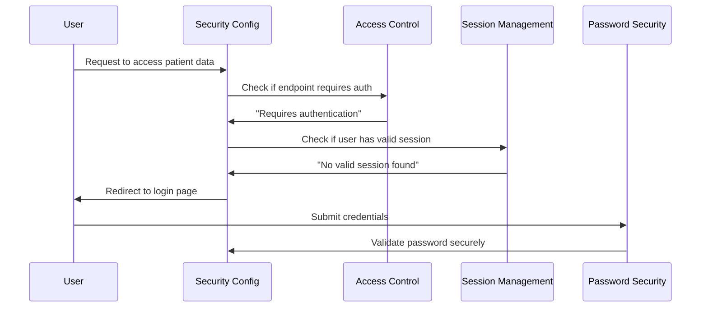

# Chapter 8: Security Configuration

After exploring the [API Communication Layer](07_api_communication_layer_.md) and how our frontend and backend communicate securely, we now need to understand how all our security components are configured and coordinated. This chapter introduces **Security Configuration** - the master security policy document that acts like a comprehensive rulebook, defining how our entire healthcare application should handle security from authentication to data protection.

## What Problem Does This Solve?

Imagine you're the chief security officer for a large hospital system with multiple buildings, hundreds of employees, and thousands of patients. You need to create a comprehensive security policy that addresses:

- Which areas require badge access and which are public (like the lobby vs. patient records room)
- How employee passwords should be stored and protected
- How long someone can stay logged into computer systems before re-authentication
- What security headers and protocols protect data transmission
- How the system should respond when unauthorized people try to access restricted areas

Without a centralized security policy, each department might implement security differently. The pharmacy might require passwords to be 8 characters while radiology requires 12. One building might allow unlimited login sessions while another expires them after 30 minutes. This inconsistency creates security gaps and user confusion.

This is exactly what happens in web applications without proper security configuration! Different parts of the system might have conflicting security rules, weak password policies, or inconsistent session management. Our Security Configuration solves this by serving as the master security rulebook that ensures all components follow the same comprehensive security standards.

## Key Concepts Breakdown

Let's break down our security configuration into three main areas that work together like different sections of a security manual:

### 1. Access Control Rules - Your Building Security Map

Access control rules define which areas of the application require authentication and which are public:

```java
.authorizeHttpRequests(auth -> auth
    .requestMatchers("/api/v1/auth/login").permitAll()
    .requestMatchers("/api/v1/auth/session").authenticated()
    .anyRequest().authenticated()
)
```

This code creates a security map that says "anyone can access the login page, but everything else requires authentication." It's like posting signs throughout the hospital: "Public Area - No Badge Required" vs. "Restricted Area - Employee Access Only."

### 2. Session Management Policy - Your Digital Badge Rules

Session management defines how long users stay logged in and how many concurrent sessions they can have:

```java
.sessionManagement(session -> session
    .sessionCreationPolicy(SessionCreationPolicy.IF_REQUIRED)
    .maximumSessions(1)
    .maxSessionsPreventsLogin(false)
)
```

This policy says "create sessions when needed, allow only one login per user, and if someone tries to log in again, end their previous session." It's like a badge policy that says "employees can only have one active badge at a time."

### 3. Password Security Standards - Your Credential Protection System

Password encoding configuration ensures all passwords are stored securely:

```java
@Bean
public PasswordEncoder passwordEncoder() {
    return new BCryptPasswordEncoder();
}
```

This creates a secure password encoder that transforms passwords like "myPassword123" into unreadable encrypted strings. It's like having a secure vault system that stores employee access codes in a way that even security staff can't read the original codes.

## How It All Works Together

Let's see how these security components coordinate when someone tries to access our healthcare application:



## Step-by-Step Implementation

### Step 1: Defining Public vs. Protected Areas

Our security configuration starts by mapping out which parts of the application are public and which require authentication:

```java
.authorizeHttpRequests(auth -> auth
    .requestMatchers("/api/v1/auth/login").permitAll()
    .anyRequest().authenticated()
)
```

This code creates two security zones:
- **Public Zone**: The login endpoint where anyone can submit credentials
- **Protected Zone**: Everything else requires valid authentication

It's like having a hospital lobby that's open to everyone, but requiring employee badges for all other areas.

### Step 2: Configuring Session Behavior

The configuration defines how user sessions should behave:

```java
.sessionManagement(session -> session
    .sessionCreationPolicy(SessionCreationPolicy.IF_REQUIRED)
    .maximumSessions(1)
    .maxSessionsPreventsLogin(false)
)
```

This session policy means:
- **Create sessions only when needed**: Don't waste resources on unnecessary sessions
- **One session per user**: Healthcare workers can only be logged in from one location
- **New login replaces old**: If someone logs in from a new computer, their old session ends

This prevents the security risk of having multiple active sessions for the same healthcare worker.

### Step 3: Setting Up Secure Password Handling

The configuration ensures all passwords are processed securely:

```java
@Bean
public PasswordEncoder passwordEncoder() {
    return new BCryptPasswordEncoder();
}
```

The BCrypt encoder automatically:
- Adds random "salt" to each password before encoding
- Uses computationally expensive algorithms to slow down brute force attacks
- Creates different encrypted versions of the same password each time

This means even if two users have the password "password123," they'll be stored as completely different encrypted strings in the database.

## Under the Hood: The Complete Security Flow

When someone tries to access our healthcare application, here's how our security configuration coordinates the protection:

1. **Request Reception**: A user tries to access any part of the application
2. **Access Control Check**: The security configuration checks if this endpoint requires authentication
3. **Session Validation**: If authentication is required, check for a valid session
4. **Authentication Decision**: Grant access if authenticated, redirect to login if not
5. **Password Processing**: When logging in, use secure password encoding for validation
6. **Session Creation**: Create a controlled session following our session management policy
7. **Security Headers**: Add protective headers to all responses

### Deep Dive: Access Control Configuration

Let's examine how our security configuration creates different security zones:

```java
.authorizeHttpRequests(auth -> auth
    .requestMatchers("/api/v1/auth/login").permitAll()
    .requestMatchers("/api/v1/auth/logout").authenticated()
    .requestMatchers("/api/v1/auth/session").authenticated()
    .anyRequest().authenticated()
)
```

This configuration creates a detailed security map:

- **Login endpoint**: Public access for anyone to submit credentials
- **Logout endpoint**: Requires authentication (you can only log out if you're logged in)
- **Session check endpoint**: Requires authentication (only logged-in users can check their session)
- **All other endpoints**: Require authentication by default

It's like having different access levels throughout a hospital - some areas are public, some require basic employee access, and some might require specialized credentials.

### Deep Dive: Session Management Details

Our session management policy includes several sophisticated features:

```java
.sessionManagement(session -> session
    .sessionCreationPolicy(SessionCreationPolicy.IF_REQUIRED)
    .maximumSessions(1)
    .maxSessionsPreventsLogin(false)
)
```

**Session Creation Policy**: `IF_REQUIRED` means sessions are only created when the application needs to remember something about the user (like when they log in). This saves server resources and improves performance.

**Maximum Sessions**: `1` means each healthcare worker can only have one active session at a time. This prevents security issues like:
- Someone forgetting to log out on a shared computer
- Unauthorized access if someone steals login credentials
- Confusion about which session is active

**Session Replacement**: `maxSessionsPreventsLogin(false)` means if Dr. Smith logs in from the emergency room computer while still logged in at the nurses' station, the nurses' station session ends automatically. This ensures security while allowing flexibility for healthcare workers who move between locations.

## Real-World Example: Correlation ID Integration

Our security configuration works seamlessly with the request tracking system we learned about in the [API Communication Layer](07_api_communication_layer_.md):

```java
@Component
@Order(1)
public class CorrelationIdFilter implements Filter {
    @Override
    public void doFilter(ServletRequest request, ServletResponse response, FilterChain chain) {
        String correlationId = getOrGenerateCorrelationId(request);
        MDC.put("correlationId", correlationId);
        // Continue with security processing
        chain.doFilter(request, response);
    }
}
```

This filter runs before security checks and ensures every security decision is tracked with a correlation ID. When the security configuration denies access or requires authentication, the decision is logged with the same tracking ID that the frontend receives.

### Integration with Error Handling

The security configuration integrates with our [Error Handling Framework](04_error_handling_framework_.md):

```java
.exceptionHandling(ex -> ex
    .authenticationEntryPoint(new HttpStatusEntryPoint(HttpStatus.UNAUTHORIZED))
)
```

When someone tries to access protected resources without authentication, the security configuration returns a `401 Unauthorized` status. Our error handling framework automatically:
- Logs the security event with correlation IDs
- Transforms the technical error into a user-friendly message
- Provides remediation steps (like "Please log in to continue")

## Advanced Security Features

### CSRF Protection Configuration

Our security configuration includes Cross-Site Request Forgery (CSRF) protection settings:

```java
.csrf(csrf -> csrf.disable())
```

For this healthcare application, CSRF is disabled because:
- We use stateless session management
- The frontend and backend communicate through controlled API endpoints
- Modern browsers and our [API Communication Layer](07_api_communication_layer_.md) provide sufficient protection

In a different type of application (like one using traditional web forms), CSRF protection would be enabled and configured.

### Security Headers Configuration

The security configuration automatically adds protective headers to all responses:

```java
// Headers added automatically by Spring Security
"X-Frame-Options": "DENY"                    // Prevents clickjacking attacks
"X-Content-Type-Options": "nosniff"          // Prevents MIME type attacks
"X-XSS-Protection": "1; mode=block"          // Enables browser XSS protection
```

These headers tell browsers how to handle our application securely, like instructions that say "don't allow this page to be embedded in other websites" and "don't try to guess file types - use only what we specify."

## Integration with Authentication and Authorization

Our security configuration serves as the foundation that coordinates all the security systems we've learned about:

### With Authentication System

The security configuration provides the framework that our [Authentication System](05_authentication_system_.md) operates within:

```java
// Security config defines the rules
.requestMatchers("/api/v1/auth/login").permitAll()

// Authentication system implements the logic
public LoginResponse login(String username, String password) {
    // Authentication logic here
}
```

The configuration says "allow anyone to try logging in," and the authentication system handles the actual credential verification.

### With Authorization Infrastructure

The security configuration enables the authorization checks we learned about in [Authorization Infrastructure](06_authorization_infrastructure_.md):

```java
// Security config requires authentication
.anyRequest().authenticated()

// Authorization system checks specific permissions
roleAuth.validateRole("NURSE", "view_patient_data");
```

The configuration ensures users are authenticated, and the authorization system determines what they're allowed to do.

## Real-World Scenario: Healthcare Worker Login

Let's trace through how our security configuration handles a typical healthcare scenario:

### Dr. Johnson's Morning Login

Dr. Johnson arrives at the hospital and tries to access the patient management system:

```java
// 1. Security config checks: Does this request need authentication?
.anyRequest().authenticated()  // Yes, everything needs authentication

// 2. No valid session found, so redirect to login
.exceptionHandling(ex -> ex
    .authenticationEntryPoint(new HttpStatusEntryPoint(HttpStatus.UNAUTHORIZED))
)
```

Dr. Johnson is redirected to the login page where she enters her credentials.

### Password Verification Process

When she submits her login form:

```java
// 3. Login endpoint is publicly accessible
.requestMatchers("/api/v1/auth/login").permitAll()

// 4. Password is verified using secure encoding
@Bean
public PasswordEncoder passwordEncoder() {
    return new BCryptPasswordEncoder();  // Secure password comparison
}
```

Her password "DrJohnson2023!" is securely compared with the encrypted version stored in the database.

### Session Creation and Management

After successful authentication:

```java
// 5. Create a controlled session
.sessionManagement(session -> session
    .maximumSessions(1)                    // Only one session allowed
    .maxSessionsPreventsLogin(false)       // New login replaces old session
)
```

Dr. Johnson gets a new session, and if she had been logged in elsewhere, that session is automatically terminated.

## Security Configuration Best Practices

Our configuration follows security best practices:

### 1. Deny by Default
```java
.anyRequest().authenticated()
```
Everything requires authentication unless explicitly made public - this ensures new endpoints are secure by default.

### 2. Minimal Public Access
```java
.requestMatchers("/api/v1/auth/login").permitAll()
```
Only the login endpoint is public - all other functionality requires authentication.

### 3. Secure Session Management
```java
.maximumSessions(1)
.maxSessionsPreventsLogin(false)
```
Sessions are limited and controlled to prevent security vulnerabilities.

### 4. Strong Password Protection
```java
new BCryptPasswordEncoder()
```
Industry-standard password encryption protects against various attack methods.

## Monitoring and Logging Integration

The security configuration works with our logging systems to provide comprehensive security monitoring:

```java
// Correlation IDs flow through security decisions
private static final String CORRELATION_ID_HEADER = "X-Correlation-ID";

// Security events are logged with tracking information
logger.info("Authentication required - correlationId: {}", correlationId);
```

This integration means every security decision can be traced and monitored, helping administrators:
- Track login patterns and detect anomalies
- Investigate security incidents with correlation IDs
- Monitor system access across different healthcare facilities
- Ensure compliance with healthcare data protection regulations

## Key Benefits

The Security Configuration provides our healthcare application with:

- **Comprehensive Protection**: Coordinates all security components under unified policies
- **Consistent Enforcement**: All parts of the application follow the same security rules
- **Flexible Access Control**: Easy to define public vs. protected areas of the application
- **Secure Session Management**: Prevents unauthorized access through controlled session policies
- **Industry-Standard Encryption**: Protects sensitive healthcare data with proven security methods
- **Audit Trail Integration**: Security decisions are tracked and logged for compliance
- **Error Handling Integration**: Security violations become user-friendly error messages

## Performance and Scalability

Our security configuration is designed for healthcare environments that need reliability and performance:

### Efficient Session Handling
```java
.sessionCreationPolicy(SessionCreationPolicy.IF_REQUIRED)
```
Sessions are only created when necessary, reducing server resource usage.

### Optimized Password Processing
The BCrypt encoder uses appropriate computational cost to balance security with performance for healthcare workers who need quick access.

### Minimal Overhead
Security checks are performed efficiently without slowing down critical healthcare workflows.

## Conclusion

Security Configuration serves as our healthcare application's comprehensive security policy document, coordinating all the security components we've learned about - from [Authentication System](05_authentication_system_.md) to [Authorization Infrastructure](06_authorization_infrastructure_.md) - into a unified, consistent security framework. It ensures that every part of our application follows the same security standards, protecting sensitive healthcare data while maintaining usability for busy healthcare workers.

Just like a well-designed hospital security policy that balances safety with operational efficiency, our security configuration creates comprehensive protection without interfering with the important work of healthcare professionals. It defines clear rules about who can access what, how long sessions remain active, and how passwords are protected, creating a secure foundation that all other application components can rely on.

This master security configuration transforms the complex challenge of application security into a manageable, consistent system that protects patient data, ensures regulatory compliance, and provides healthcare workers with secure, reliable access to the tools they need to provide excellent patient care.

In our next chapter, [Request Tracing System](09_request_tracing_system_.md), we'll explore how our application tracks and monitors every request from frontend to backend, building upon the correlation ID foundation established in our security configuration to create comprehensive monitoring and debugging capabilities.

