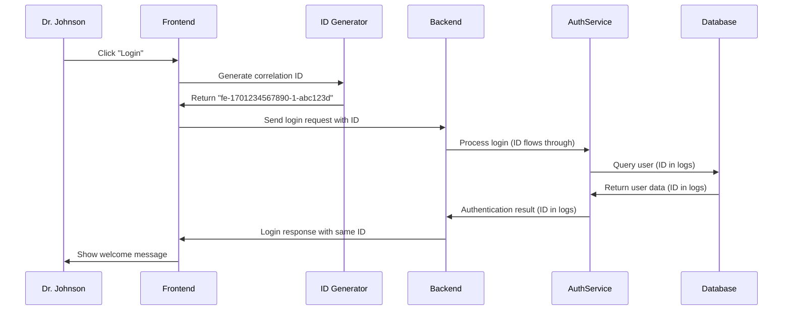

# Chapter 9: Request Tracing System

After establishing a comprehensive [Security Configuration](08_security_configuration_.md) that coordinates all our security components, we now need to explore how our application tracks and monitors every request as it flows through the system. This chapter introduces the **Request Tracing System** - a sophisticated package tracking service that follows every request from the moment it arrives until it completes, making debugging and monitoring as easy as tracking a shipped package.

## What Problem Does This Solve?

Imagine you're managing a busy hospital mail system where thousands of important documents flow between departments every day - lab results, prescription orders, patient transfer requests, and administrative forms. Without a proper tracking system, when something goes wrong, you face these problems:

- A doctor reports that a lab result never arrived, but you have no way to trace where it went
- The system crashes and you need to figure out which requests were being processed
- A patient complains about slow service, but you can't see which department is causing delays
- Security incidents occur, but you can't trace the exact sequence of events that led to the problem
- Multiple people are debugging the same issue but can't coordinate their efforts

You need a comprehensive package tracking system that:
- Assigns a unique tracking number to every document when it enters the system
- Follows that document through every department and process
- Logs exactly what happens at each step with timestamps
- Makes it easy to search and find specific documents later
- Helps identify bottlenecks and problems in the workflow

This is exactly what our Request Tracing System does for web applications! It acts like a sophisticated postal tracking service that follows every request from the frontend, through all the backend services, and back to the user, creating a complete audit trail that makes debugging and monitoring incredibly easy.

## Key Concepts Breakdown

Let's break down our tracing system into three main components that work together like different parts of a tracking service:

### 1. Correlation ID Generation - Your Unique Tracking Numbers

Every request automatically gets a unique tracking number called a correlation ID:

```javascript
function generateCorrelationId() {
  const timestamp = Date.now();
  const counter = ++correlationIdCounter;
  const random = Math.random().toString(36).substring(2, 9);
  return `fe-${timestamp}-${counter}-${random}`;
}
```

This creates tracking numbers like `fe-1701234567890-1-abc123d` that include when the request was made, a sequence number, and a random component. It's like a postal tracking number that's guaranteed to be unique and contains useful information about when and where it was created.

### 2. Cross-System ID Propagation - Your Tracking System Network

The correlation ID follows the request through every system component:

```java
@Override
public void doFilter(ServletRequest request, ServletResponse response, FilterChain chain) {
    String correlationId = httpRequest.getHeader(CORRELATION_ID_HEADER);
    MDC.put(CORRELATION_ID_MDC_KEY, correlationId);
    // ID is now available throughout the backend processing
}
```

This code ensures that the tracking ID travels with the request through every part of the backend system, like putting a barcode on a package that gets scanned at every sorting facility and delivery truck.

### 3. Comprehensive Logging - Your Package Status Updates

Every significant event in request processing gets logged with the correlation ID:

```javascript
logger.info('Login attempt initiated', {
  event: 'login_attempt',
  correlation_id: 'fe-1701234567890-1-abc123d',
  username: 'sarah.johnson'
});
```

This creates detailed status updates throughout the request journey, like getting notifications when your package is "picked up," "in transit," "out for delivery," and "delivered."

## How It All Works Together

Let's walk through what happens when Dr. Johnson tries to log into our healthcare system and how the tracing system follows her request:



## Step-by-Step Implementation

### Step 1: Creating Unique Tracking Numbers

When Dr. Johnson clicks the login button, our frontend automatically generates a unique tracking ID:

```javascript
let correlationIdCounter = 0;

function generateCorrelationId() {
  const timestamp = Date.now();              // 1701234567890 (current time)
  const counter = ++correlationIdCounter;    // 1 (sequence number)
  const random = Math.random().toString(36); // "abc123d" (random part)
  return `fe-${timestamp}-${counter}-${random}`;
}
```

This creates a tracking ID like `fe-1701234567890-1-abc123d` that includes:
- `fe-` prefix showing this came from the frontend
- Timestamp showing exactly when the request started
- Counter ensuring uniqueness even for rapid requests
- Random component for additional security and uniqueness

It's like a sophisticated package tracking system that embeds useful information right in the tracking number.

### Step 2: Attaching the Tracking ID

Our [API Communication Layer](07_api_communication_layer_.md) automatically attaches this tracking ID to every request:

```javascript
axiosInstance.interceptors.request.use((config) => {
  if (!config.headers['X-Correlation-ID']) {
    const correlationId = generateCorrelationId();
    config.headers['X-Correlation-ID'] = correlationId;
  }
  return config;
});
```

This interceptor works like an automatic labeling machine that ensures every outgoing request has a tracking sticker before it leaves the frontend. Dr. Johnson's login request now carries the tracking ID `fe-1701234567890-1-abc123d` in its headers.

### Step 3: Backend ID Reception and Propagation

When the request arrives at our backend, the correlation filter captures and propagates the tracking ID:

```java
public void doFilter(ServletRequest request, ServletResponse response, FilterChain chain) {
    String correlationId = httpRequest.getHeader("X-Correlation-ID");
    MDC.put("correlationId", correlationId);
    
    chain.doFilter(request, response);
    
    MDC.clear();
}
```

The `MDC.put()` call stores the correlation ID in a special context that makes it available to all logging throughout the request processing. It's like putting the tracking number on a clipboard that every department can see and reference.

## Under the Hood: The Complete Tracing Flow

When Dr. Johnson's login request flows through our system, here's the detailed tracing process:

1. **ID Generation**: Frontend creates unique correlation ID `fe-1701234567890-1-abc123d`
2. **Request Tagging**: ID is attached to the HTTP request headers
3. **Backend Reception**: Correlation filter extracts the ID and stores it in logging context
4. **Service Processing**: Authentication service processes login with ID available for all logs
5. **Database Operations**: Database queries are logged with the correlation ID
6. **Response Preparation**: Success/error responses include the same correlation ID
7. **Frontend Reception**: Frontend receives response with matching correlation ID
8. **Complete Audit Trail**: Every step is logged with the same tracking number

### Deep Dive: Logging Context Management

The correlation ID becomes available throughout the backend through the Mapped Diagnostic Context (MDC):

```java
// The filter puts the ID in context
MDC.put("correlationId", correlationId);

// Now any logger call automatically includes it
logger.info("Authentication attempt - username: {}", username);
// Logs: "Authentication attempt - correlationId: fe-1701234567890-1-abc123d - username: sarah.johnson"
```

The MDC works like a shared notepad that every part of the system can read. When any component writes to the log, the correlation ID is automatically included, creating a consistent trail without requiring every piece of code to manually track the ID.

### Deep Dive: Cross-Component Tracking

Let's see how the correlation ID flows through our [Authentication System](05_authentication_system_.md):

```java
public LoginResponse login(String username, String password, Long facilityId) {
    logger.info("Login attempt - username: {}", username);
    // Automatically logs with correlation ID
    
    UserAccount user = userRepository.findByUsername(username);
    logger.info("User lookup completed - found: {}", user != null);
    // Same correlation ID in this log too
    
    if (passwordEncoder.matches(password, user.getPasswordHash())) {
        logger.info("Login successful");
        // Same correlation ID tracks the success
    }
}
```

Every log entry in this authentication process will include the same correlation ID `fe-1701234567890-1-abc123d`, making it easy to trace Dr. Johnson's complete login journey from start to finish.

## Real-World Example: Debugging a Failed Login

Let's see how our request tracing system helps debug a real problem. Dr. Johnson tries to log in but gets an "Access denied" error:

### Frontend Trace

The frontend logs show the request initiation:

```javascript
logger.info('Login request initiated', {
  event: 'login_request',
  correlation_id: 'fe-1701234567890-5-xyz789',
  username: 'sarah.johnson',
  facilityId: 1
});
```

This establishes that the request started properly with correlation ID `fe-1701234567890-5-xyz789`.

### Backend Authentication Trace

The backend logs show the authentication process:

```java
// First log: Request received
logger.info("Login attempt - correlationId: fe-1701234567890-5-xyz789 - username: sarah.johnson");

// Second log: User found in database
logger.info("User found - correlationId: fe-1701234567890-5-xyz789 - userId: 123");

// Third log: Account status check
logger.warn("Account inactive - correlationId: fe-1701234567890-5-xyz789 - userId: 123");
```

The trace reveals that Dr. Johnson's account was found but is marked as inactive - that's why login failed!

### Error Response Trace

Our [Error Handling Framework](04_error_handling_framework_.md) logs the error response:

```java
logger.warn("Login failed - account inactive - correlationId: fe-1701234567890-5-xyz789");
```

### Frontend Error Reception

The frontend receives and logs the error:

```javascript
logger.error('Login failed - server response', {
  event: 'login_error',
  correlation_id: 'fe-1701234567890-5-xyz789',
  status: 403,
  message: 'Account is inactive'
});
```

By searching logs for correlation ID `fe-1701234567890-5-xyz789`, administrators can see the complete story: the request was properly formatted, the user exists, but her account is inactive and needs to be reactivated.

## Advanced Tracing Features

### Automatic Error Correlation

When errors occur, our tracing system automatically correlates them:

```javascript
axiosInstance.interceptors.response.use(null, (error) => {
  const correlationId = error.config?.headers?.['X-Correlation-ID'];
  
  logger.error('Request failed', {
    event: 'request_error',
    correlation_id: correlationId,
    status: error.response?.status,
    path: error.config?.url
  });
});
```

This ensures that even when requests fail, the correlation ID is preserved and logged, making it easy to trace failed requests back to their origin.

### Performance Tracking

Our tracing system can track request performance:

```javascript
const requestStart = performance.now();

// Make API request with correlation ID
const response = await axiosInstance.post('/api/auth/login', loginData);

const requestDuration = performance.now() - requestStart;
logger.info('Request completed', {
  event: 'request_performance',
  correlation_id: response.headers['x-correlation-id'],
  duration_ms: Math.round(requestDuration)
});
```

This helps identify slow requests and performance bottlenecks by associating timing data with specific correlation IDs.

## Integration with Security Systems

Our request tracing integrates seamlessly with our security infrastructure:

### Authentication Tracing

Every authentication event is traced with correlation IDs:

```java
// From our Authentication System
logger.info("Authentication successful - correlationId: {} - userId: {}", 
           correlationId, user.getUserAccountId());
```

### Authorization Tracing

Our [Authorization Infrastructure](06_authorization_infrastructure_.md) includes correlation IDs in all security decisions:

```java
// Role authorization logging
logger.warn("Role check failed - correlationId: {} - user: {} - required: {}", 
           correlationId, userRole, requiredRole);

// Facility access logging  
logger.warn("Facility boundary violation - correlationId: {} - userFacility: {} - requested: {}", 
           correlationId, userFacilityId, requestedFacilityId);
```

This creates a complete security audit trail where every access decision can be traced back to the original request.

## Monitoring and Alerting Integration

The correlation IDs enable sophisticated monitoring:

### Error Rate Monitoring

```java
// High-level monitoring can track error rates by correlation ID patterns
if (correlationId.startsWith("fe-")) {
  // Frontend-initiated request failed
  frontendErrorCounter.increment();
}
```

### Performance Monitoring

```java
// Track slow requests for performance optimization
if (requestDuration > 5000) {
  logger.warn("Slow request detected - correlationId: {} - duration: {}ms", 
             correlationId, requestDuration);
}
```

### Security Incident Response

When security incidents occur, correlation IDs help trace the complete attack sequence:

```java
logger.error("Security incident detected - correlationId: {} - incident: {}", 
            correlationId, "repeated_login_failures");
```

## Correlation ID Cleanup and Management

Our system includes proper cleanup to prevent memory leaks:

```java
@Override
public void doFilter(ServletRequest request, ServletResponse response, FilterChain chain) {
    try {
        String correlationId = getOrGenerateCorrelationId(request);
        MDC.put("correlationId", correlationId);
        
        chain.doFilter(request, response);
        
    } finally {
        MDC.clear();  // Always clean up, even if errors occur
    }
}
```

The `finally` block ensures that correlation IDs don't leak between requests, preventing one request's tracking information from appearing in another request's logs.

## Search and Analysis Capabilities

With correlation IDs, administrators can easily search and analyze request patterns:

### Finding Specific Requests

```bash
# Search logs for a specific correlation ID
grep "fe-1701234567890-5-xyz789" application.log
```

This returns all log entries related to that specific request, showing the complete journey from frontend to backend and back.

### Pattern Analysis

```bash
# Find all login failures in the last hour
grep "Login failed" application.log | grep "$(date +%Y-%m-%d\ %H)"
```

Correlation IDs make it easy to group related events and analyze patterns in user behavior, system performance, and security incidents.

## Key Benefits

The Request Tracing System provides our healthcare application with:

- **Complete Request Visibility**: Every request can be traced from start to finish across all system components
- **Effortless Debugging**: Correlation IDs make finding specific requests as easy as tracking a package
- **Performance Monitoring**: Request timing and bottlenecks are easily identifiable
- **Security Auditing**: Complete audit trails for compliance and incident investigation  
- **Cross-Team Collaboration**: Different teams can coordinate debugging using shared correlation IDs
- **Automated Error Correlation**: Failed requests are automatically linked to their originating actions
- **Pattern Recognition**: System-wide patterns and trends become visible through consistent tracking

## User Experience Impact

While users never see correlation IDs directly, the tracing system dramatically improves their experience:

### Faster Problem Resolution

When Dr. Johnson calls the help desk about a login problem, support staff can use the correlation ID from error messages to immediately see what went wrong, rather than asking her to repeat the steps multiple times.

### Proactive Issue Detection

System administrators can identify and fix problems before users even notice them by monitoring correlation ID patterns and performance metrics.

### Consistent Error Handling

The tracing system ensures that error messages include reference numbers (correlation IDs) that support staff can use to quickly locate the exact incident in the logs.

## Integration with External Systems

Our tracing system can extend beyond our application:

### Database Query Tracing

```java
// Database queries can include correlation IDs in comments
@Query("SELECT /* correlationId: #{correlationId} */ u FROM UserAccount u WHERE...")
```

This helps database administrators correlate slow queries with specific user requests.

### External API Integration

When our system calls external services (like lab result systems), correlation IDs can be passed along to create end-to-end tracing across multiple healthcare systems.

## Conclusion

The Request Tracing System transforms the complex challenge of monitoring and debugging a healthcare application into a manageable task by providing unique tracking numbers (correlation IDs) that follow every request through its complete journey. Like a sophisticated package tracking service, it creates comprehensive audit trails that make debugging as straightforward as following a tracking number from origin to destination.

This tracing foundation builds upon all the security and communication systems we've learned about - from [Authentication System](05_authentication_system_.md) through [Security Configuration](08_security_configuration_.md) - to create complete visibility into how our healthcare application operates. When combined with our [API Communication Layer](07_api_communication_layer_.md) and [Error Handling Framework](04_error_handling_framework_.md), it ensures that every request is tracked, every error is traceable, and every performance issue is identifiable.

For healthcare applications where reliability and quick problem resolution are critical, the Request Tracing System provides the visibility and debugging capabilities that keep systems running smoothly and healthcare workers focused on patient care rather than technical difficulties. It transforms debugging from a needle-in-a-haystack problem into a systematic, trackable process that any team member can follow and understand.

