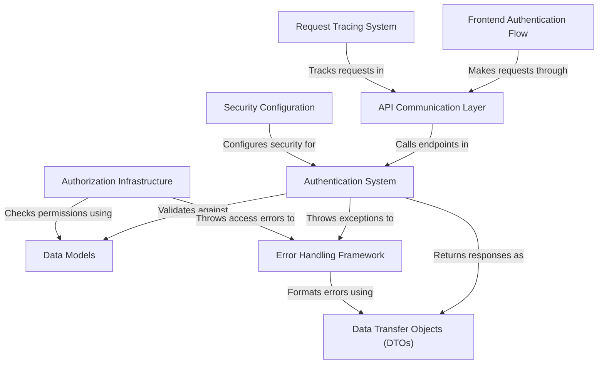

# Tutorial: testing_demo

This is a **web application authentication system** that manages user login and access control for healthcare facilities. 
The system consists of a *React frontend* and a *Spring Boot backend* that work together to verify user identities, 
enforce role-based permissions, and ensure users can only access data from their assigned facility. 
It's like a **digital security checkpoint** that protects sensitive healthcare information by making sure 
only authorized staff can log in and access appropriate resources.

**Source Repository:** [https://github.com/Girniwale16/testing_demo/tree/main](https://github.com/Girniwale16/testing_demo/tree/main)

## Chapters

1. [Frontend Authentication Flow
](01_frontend_authentication_flow_.md)
2. [Data Models
](02_data_models_.md)
3. [Data Transfer Objects (DTOs)
](03_data_transfer_objects__dtos__.md)
4. [Error Handling Framework
](04_error_handling_framework_.md)
5. [Authentication System
](05_authentication_system_.md)
6. [Authorization Infrastructure
](06_authorization_infrastructure_.md)
7. [API Communication Layer
](07_api_communication_layer_.md)
8. [Security Configuration
](08_security_configuration_.md)
9. [Request Tracing System
](09_request_tracing_system_.md)
